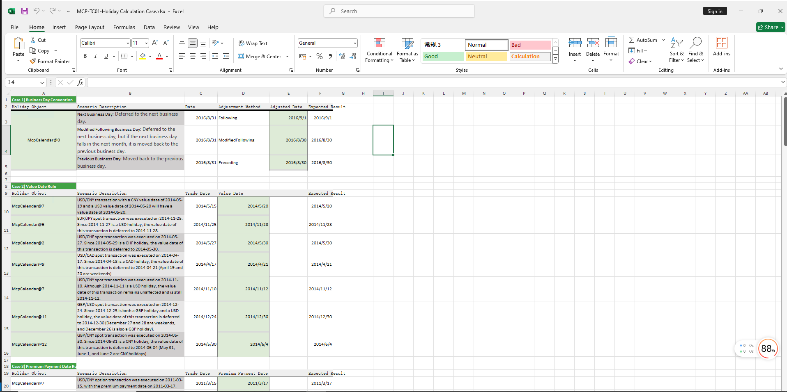

# **Holiday Calculation Case Study**
> Visit the Mathema Option Pricing System for foreign exchange options and structured product valuation!
[](https://fxo.mathema.com.cn)

The Holiday Calculation case study provides functions for constructing holiday objects, calculating value dates, option premium payment dates, expiry dates, delivery dates, adding business days and tenors, and determining near and far value dates.  
Click the image below to download the template:

[](./MCP-TC01-HolidayCalculationCase.xlsx)
---

## **Holiday Calculation Template: Function Descriptions**

### **1. Holiday Calendar Construction Functions**
   - **[McpCalendar](/latest/api/calendar.html#excel-mcpcalendar-code-dates)**: Constructs a holiday calendar object for one or more currency pairs.
   - **[McpNCalendar](/latest/api/calendar.html#excel-mcpncalendar-ccys-holidays)**: Constructs a holiday calendar object for multiple currencies.

### **2. Business Day Adjustment Functions**
   - **[CalendarAdjust](/latest/api/calendar.html#excel-calendaradjust-cal-date-rule-calendarcodes)**: Adjusts a date based on business day rules.

### **3. Value Date and Option Premium Payment Date Calculation Functions**
   - **[CalendarValueDate](/latest/api/calendar.html#excel-calendarvaluedate-cal-date-isfollowing-true-calendarcodes)**: Calculates the value date and option premium payment date.

### **4. Delivery Date Calculation Functions**
   - **[CalendarAddPeriod](/latest/api/calendar.html#excel-calendaraddperiod-cal-date-tenor-dateadjustrule-dateadjusterrule-actual-endofmonthrule-false-lastopenday-false-calendarcodes)**: Calculates the delivery date.
   - **[CalendarFXODeliveryDateFromTenor](/latest/api/calendar.html#excel-calendarfxodeliverydatefromtenor-cal-referencedate-tenor-spotdate-calendarcodes)**: Calculates the delivery date based on a tenor.

### **5. Expiry Date Calculation Functions**
   - **[CalendarFXOExpiryDate](/latest/api/calendar.html#excel-calendarfxoexpirydate-cal-date-calendarcodes)**: Calculates the expiry date from the delivery date.
   - **[CalendarFXOExpiryDateFromTenor](/latest/api/calendar.html#excel-calendarfxoexpirydatefromtenor-cal-referencedate-tenor-spotdate-calendarcodes)**: Calculates the expiry date based on a tenor.

### **6. Add Business Days Function**
   - **[CalendarAddBusinessDays](/latest/api/calendar.html#excel-calendaraddbusinessdays-cal-date-count-calendarcodes)**: Adds business days to a date.

### **7. Add Tenor Function**
   - **[CalendarAddPeriod](/latest/api/calendar.html#excel-calendaraddperiod-cal-date-tenor-dateadjustrule-dateadjusterrule-actual-endofmonthrule-false-lastopenday-false-calendarcodes)**: Adds a tenor to a date.

### **8. Check if Date is a Holiday Function**
   - **[CalendarIsBusinessDay](/latest/api/calendar.html#excel-calendarisbusinessday-cal-date-calendarcodes)**: Checks if a given date is a holiday.

### **9. Near and Far Value Date Calculation Functions**
   - **[CalendarValueDateTenor](/latest/api/calendar.html#excel-calendarvaluedatetenor-cal-date-tenor-calendarcodes-isfarleg-true)**: Calculates the near and far value dates for a given tenor.

---

## **Python Code Example**

Below is an example of Python code demonstrating the construction of holiday calendars and date calculations using the provided functions.

---

### **1. Construction Methods and Code**

#### **Prepare Holiday Data**
```python
import json
import pandas as pd
from pandas.testing import assert_frame_equal
import mcp.wrapper
from mcp.utils.enums import DateAdjusterRule
from mcp.tools import McpCalendar

# Example holiday data for USD, CNY, EUR, and JPY
usd_dates = ['2009-1-1', '2009-1-19', ...]  # Add all USD holidays
cny_dates = ['2009-1-1', '2009-1-2', ...]  # Add all CNY holidays
eur_dates = ['2009-1-1', '2009-1-26', ...]  # Add all EUR holidays
jpy_dates = ['2009-1-1', '2009-1-2', ...]  # Add all JPY holidays
```

#### **Construction Method 1: `GetCurrencyCalendar`**
- **Purpose**: Constructs a `McpCalendar` object for a specific currency using holiday data.
- **Code**:
  ```python
  def GetCurrencyCalendar(code, dates):
      args = {
          'Codes': code,
          'Dates': dates
      }
      cal = McpCalendar(args)
      return cal
  ```
- **Parameters**:
  - `code`: Currency code (e.g., `'USD'`).
  - `dates`: List of holidays for the currency.
- **Returns**: `McpCalendar` object.

---

#### **Construction Method 2: `McpNCalendar`**
- **Purpose**: Constructs a `McpCalendar` object for multiple currencies using holiday data.
- **Code**:
  ```python
  def McpNCalendar(ccys, holidays):
      cal = McpCalendar(ccys, holidays)
      return cal
  ```
- **Parameters**:
  - `ccys`: List of currency pairs (e.g., `['USD', 'CNY']`).
  - `holidays`: List of holiday lists corresponding to the currencies.
- **Returns**: `McpCalendar` object.

---

### **2. Test Cases and Code**

#### **Case 1: Business Day Adjustment**
- **Purpose**: Test date adjustment functionality (`Following`, `ModifiedFollowing`, `Preceding`).
- **Code**:
  ```python
  def test_adjust():
      date = '2016-8-31'
      expected_dates = [['2016-09-01', '2016-08-30', '2016-08-30']]
      column_names = ['Following', 'ModifiedFollowing', 'Preceding']
      cal = McpNCalendar(['EUR', 'CNY'], [eur_dates, cny_dates])
      adjust_following_date = cal.Adjust(date, DateAdjusterRule.Following)
      adjust_modified_following_date = cal.Adjust(date, DateAdjusterRule.ModifiedFollowing)
      adjust_preceding_date = cal.Adjust(date, DateAdjusterRule.Preceding)
      results = [[adjust_following_date, adjust_modified_following_date, adjust_preceding_date]]
      df1 = pd.DataFrame(results, columns=column_names)
      expected_df = pd.DataFrame(expected_dates, columns=column_names)
      assert_frame_equal(df1, expected_df, check_dtype=True)
  ```

---

#### **Case 2: Value Date Calculation**
- **Purpose**: Test value date calculation.
- **Code**:
  ```python
  def test_valuedate():
      date = '2014-5-15'
      expected_date = '2014-05-20'
      cal = McpNCalendar(['USD', 'CNY'], [usd_dates, cny_dates])
      result = cal.ValueDate(date)
      assert result == expected_date
  ```

---

#### **Case 3: Option Premium Payment Date Calculation**
- **Purpose**: Test option premium payment date calculation.
- **Code**:
  ```python
  def test_valuedate2():
      date = '2011-3-15'
      expected_date = '2011-03-17'
      cal = McpNCalendar(['USD', 'CNY'], [usd_dates, cny_dates])
      result = cal.ValueDate(date)
      assert result == expected_date
  ```

---

#### **Case 5: Expiry Date Calculation**
- **Purpose**: Test expiry date calculation.
- **Code**:
  ```python
  def test_expiredate():
      date = '2014-10-15'
      expected_date = '2014-10-13'
      cal = McpNCalendar(['EUR', 'CNY'], [eur_dates, cny_dates])
      result = cal.FXOExpiryDate(date)
      assert result == expected_date
  ```

---

#### **Case 6: Add Business Days and Tenor**
- **Purpose**: Test adding business days and tenors to a date.
- **Code**:
  ```python
  def test_add_day():
      date = '2024-11-21'
      expected_date = '2024-11-22'
      cal = McpNCalendar(['USD', 'CNY'], [usd_dates, cny_dates])
      result = cal.AddBusinessDays(date, 1)
      assert result == expected_date

  def test_add_tenor():
      date = '2022-2-18'
      expected_date = '2022-03-04'
      cal = McpNCalendar(['USD', 'CNY'], [usd_dates, cny_dates])
      result = cal.AddPeriod(date, '2W')
      assert result == expected_date
  ```

---

#### **Case 7: Calculate Expiry and Delivery Dates**
- **Purpose**: Test calculating expiry and delivery dates from a tenor.
- **Code**:
  ```python
  def test_add_tenor():
      cal = McpNCalendar(['USD', 'CNY'], [usd_dates, cny_dates])
      reference_date = '2024-6-26'
      spot_date = cal.ValueDate(reference_date)
      expire_date = cal.FXOExpiryDateFromTenor(reference_date, 'ON', spot_date)
      delivery_date = cal.FXODeliveryDateFromTenor(reference_date, 'ON', spot_date)
      expected_expire_date = '2024-06-27'
      expected_delivery_date = '2024-07-01'
      assert expire_date == expected_expire_date
      assert delivery_date == expected_delivery_date
  ```

---

#### **Case 8: Check if Date is a Holiday**
- **Purpose**: Test if a given date is a holiday.
- **Code**:
  ```python
  def test_add_tenor():
      date1 = '2009-1-1'
      date2 = '2009-1-2'
      cal = GetCurrencyCalendar('USD', usd_dates)
      result1 = cal.IsBusinessDay(date1, '')
      result2 = cal.IsBusinessDay(date2, '')
      assert result1 == False
      assert result2 == True
  ```

---

#### **Case 9: Calculate Near and Far Value Dates**
- **Purpose**: Test calculating near and far value dates from a tenor.
- **Code**:
  ```python
  def test_valuedate_tenor():
      cal = McpNCalendar(['USD', 'CNY'], [usd_dates, cny_dates])
      reference_date = '2024-6-26'
      tenor = '1M'
      near_date = cal.ValueDate(reference_date, tenor, '', False)
      far_date = cal.ValueDate(reference_date, tenor, '', True)
      expected_near_date = '2024-06-28'
      expected_far_date = '2024-07-29'
      assert near_date == expected_near_date
      assert far_date == expected_far_date
  ```

---

#### **Case 11: Calculate Day Count Fraction**
- **Purpose**: Test calculating the day count fraction.
- **Code**:
  ```python
  def test_day_counter():
      day_counter = mcp.wrapper.McpDayCounter('ACT360')
      start_date = '20240626'
      end_date = '20241230'
      result = round(day_counter.YearFraction(start_date, end_date), 6)
      expected = 0.519444
      assert result == expected
  ```

---
