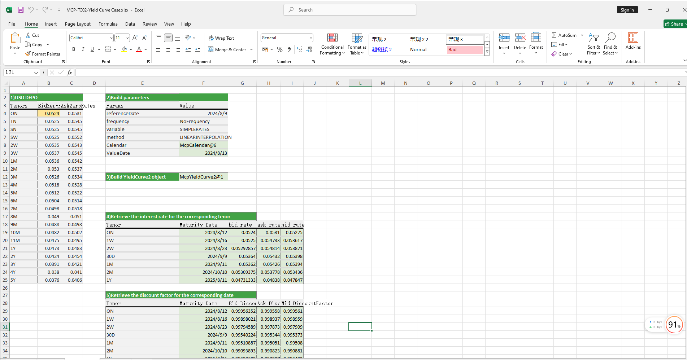

# **YieldCurve: Interest Rate Curve Case Study**

> Visit the Mathema Option Pricing System for foreign exchange options and structured product valuation!

The YieldCurve case study provides methods for constructing both single-sided and double-sided yield curves, as well as extracting interest rates and discount factors for specified maturities from the yield curve.  
Click the image below to download the template:

---

## **YieldCurve Case Study Template: Function Descriptions**

### **1. Holiday Calendar Construction Functions**
   - **[McpCalendar](/latest/api/calendar.html#excel-mcpcalendar-code-dates)**：Constructs a holiday calendar object for one or more currency pairs.
   - **[McpNCalendar](/latest/api/calendar.html#excel-mcpncalendar-ccys-holidays)**：Constructs a holiday calendar object for multiple currencies.

### **2. YieldCurve Construction Functions**
   - **[McpYieldCurve2](/latest/api/yieldcurve.html#excel-mcpyieldcurve2-args1-args2-args3-args4-args5-fmt-vp-hd)**： Constructs a double-sided YieldCurve object.
   - **[McpYieldCurve](/latest/api/yieldcurve.html#excel-mcpyieldcurve-args1-args2-args3-args4-args5-fmt-vp-hd)**：Constructs a single-sided YieldCurve object.

### **3. Maturity Date Calculation Functions**
   - **[CalendarFXOExpiryDateFromTenor](/latest/api/calendar.html#excel-calendarfxoexpirydatefromtenor-cal-referencedate-tenor-spotdate-calendarcodes)**：Calculates the expiry date based on the given tenor.

### **4. YieldCurve Interest Rate Extraction Functions**
   - **[YieldCurve2ZeroRate](/latest/api/yieldcurve.html#excel-yieldcurve2zerorate-curve-date-bidmidask)**： Retrieves the interest rate for a specified maturity date from a double-sided YieldCurve.
   - **[YieldCurveZeroRate](/latest/api/yieldcurve.html#excel-yieldcurvezerorate-curve-date)**：etrieves the interest rate for a specified maturity date from a single-sided YieldCurve.

### **5. YieldCurve Discount Factor Extraction Functions**
   - **[YieldCurve2DiscountFactor](/latest/api/yieldcurve.html#excel-yieldcurve2discountfactor-curve-date-bidmidask)**：Retrieves the discount factor for a specified maturity date from a double-sided YieldCurve.
   - **[YieldCurveDiscountFactor](/latest/api/yieldcurve.html#excel-yieldcurvediscountfactor-curve-date)**：Retrieves the discount factor for a specified maturity date from a single-sided YieldCurve.

