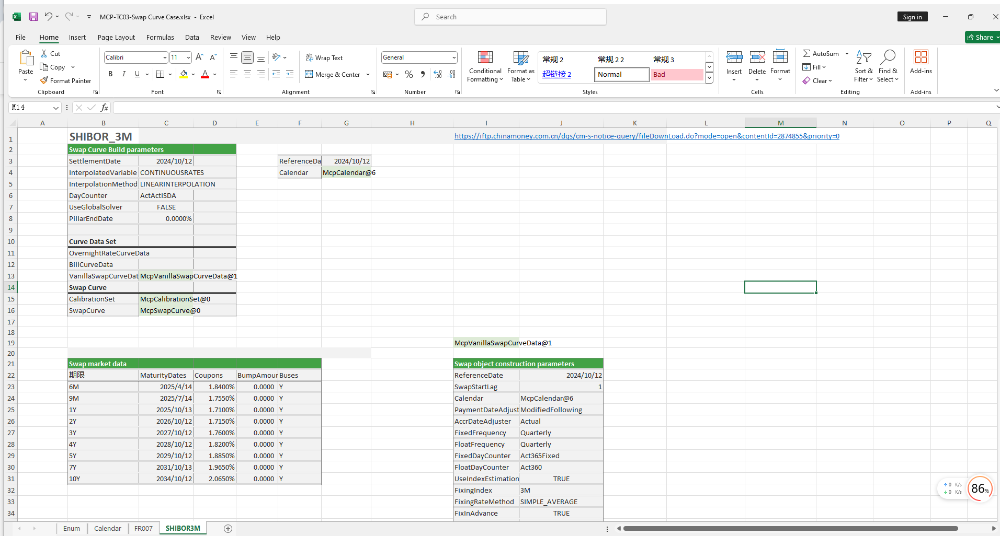

# **SwapCurve: Interest Rate Curve Case Study**


> Visit the Mathema Option Pricing System for foreign exchange options and structured product valuation!
[](https://fxo.mathema.com.cn)

The SwapCurve case study provides methods for constructing SwapCurve objects such as FR007 and SHIBOR3M, as well as extracting zero-coupon rates and discount factors for specified maturities from the SwapCurve.  
Click the image below to download the template:

[](./MCP-TC03-SwapCurveCase.xlsx)
---

## **SwapCurve Case Study Template: Function Descriptions**

### **1. Holiday Calendar Construction Functions**
- **[McpCalendar](/latest/api/calendar.html#excel-mcpcalendar-code-dates)**: Constructs a holiday calendar object for one or more currency pairs.
- **[McpNCalendar](/latest/api/calendar.html#excel-mcpncalendar-ccys-holidays)**: Constructs a holiday calendar object for multiple currencies.

### **2. SwapCurve Construction Functions**
- **[McpVanillaSwapCurveData](/latest/api/yieldcurve.html#excel-mcpvanillaswapcurvedata-args-data)**: Constructs a Vanilla Swap Curve object.
- **[McpSwapCurve](/latest/api/yieldcurve.html#excel-mcpswapcurve-args1-args2-args3-args4-args5-fmt-vp)**: Constructs a Swap Curve object.

### **3. Product Storage Functions**
- **[McpCalibrationSet](/latest/api/bondcurve.html#excel-mcpcalibrationset-args)**: Used to store different products (e.g., Depo, Swap, Bond) when building an interest rate curve and calibrate the curve using the bootstrapping method.

### **4. Date Calculation Functions**
- **[CalendarValueDateTenor](/latest/api/calendar.html#excel-calendarvaluedatetenor-cal-date-tenor-calendarcodes-isfarleg-true)**: Calculates the maturity date.

### **5. Discount Factor Extraction Functions**
- **[SwapCurveDiscountFactor](/latest/api/yieldcurve.html#excel-swapcurvediscountfactor-curve-date)**: Retrieves the discount factor for a specified maturity date from a SwapCurve object.

### **6. Interest Rate Extraction Functions**
- **[SwapCurveZeroRate](/latest/api/yieldcurve.html#excel-swapcurvezerorate-curve-date)**: Retrieves the zero-coupon rate for a specified maturity date from a SwapCurve object.
- **[SwapCurveZeroRates]/latest/api/yieldcurve.html#excel-swapcurvezerorates-curve-dates-fmt-v)**: Retrieves zero-coupon rates for multiple maturity dates from a SwapCurve object.

### **7. Forward Rate Extraction Functions**
- **[YieldCurveForwardRate](/latest/api/yieldcurve.html#excel-yieldcurveforwardrate-curve-startdate-enddate-daycounter-daycounter-act365fixed-compounding-false-frequency-frequency-nofrequency)**: Retrieves the forward rate from a YieldCurve object.

## **Python Code Example**

Below is an example of a SwapCurve implementation.

---

### **SwapCurve Example**

This example code demonstrates how to use the `mcp` library to build and test SwapCurves (interest rate curves). The code includes two main test functions: `test_swap_curve_shibor3m` and `test_swap_curve_fr007`, which test the interest rate curves based on SHIBOR 3M and FR007, respectively.

#### **1. `test_swap_curve_shibor3m`**

This function tests the interest rate curve based on SHIBOR 3M. Below is the code snippet:

```python
def test_swap_curve_shibor3m():
    referenceDate = '2024-10-12'
    cal_usd = GetCurrencyCalendar('USD', usd_dates)
    vsc_data_args = {
        "ReferenceDate": referenceDate,
        "SwapStartLag": 1,
        "Calendar": cal_usd,
        "PaymentDateAdjuster": "ModifiedFollowing",
        "AccrDateAdjuster": "Actual",
        "FixedFrequency": "Quarterly",
        "FloatFrequency": "Quarterly",
        "FixedDayCounter": "Act365Fixed",
        "FloatDayCounter": "Act360",
        "UseIndexEstimation": True,
        "FixingIndex": "3M",
        "FixingRateMethod": "SIMPLE_AVERAGE",
        "FixInAdvance": True,
        "FixDaysBackward": 1,
        "Margin": 0,
        "MaturityDates": ['2025-4-14', '2025-7-14', '2025-10-13', '2026-10-12', '2027-10-12', '2028-10-12',
                          '2029-10-12', '2031-10-13', '2034-10-12'],
        "Coupons": [0.0184, 0.01755, 0.0171, 0.01715, 0.0176, 0.0182, 0.01885, 0.01965, 0.02065],
        "BumpAmounts": [0.0000, 0.0000, 0.0000, 0.0000, 0.0000, 0.0000, 0.0000, 0.0000, 0.0000],
        "Buses": [1, 1, 1, 1, 1, 1, 1, 1, 1]
    }
    vsc_data_args_curve: mcp.MVanillaSwapCurveData = McpVanillaSwapCurveData(vsc_data_args)
    c_set = wrapper.McpCalibrationSet()
    c_set.addData(vsc_data_args_curve.getHandler())
    c_set.addEnd()
    fixed_sc_args = {"ReferenceDate": referenceDate,
                     'CalibrationSet': c_set,
                     'InterpolatedVariable': 'CONTINUOUSRATES',
                     'InterpolationMethod': 'LINEARINTERPOLATION',
                     'DayCounter': 'ActActISDA'
                     }

    swap_curve: mcp.MSwapCurve = McpSwapCurve(fixed_sc_args)
```

#### **2. `test_swap_curve_fr007`**

This function tests the interest rate curve based on FR007. Below is the code snippet:

```python
def test_swap_curve_fr007():
    referenceDate = '2024-9-21'
    cal_usd = GetCurrencyCalendar('USD', usd_dates)
    vsc_data_args = {
        "ReferenceDate": referenceDate,
        "SwapStartLag": 1,
        "Calendar": cal_usd,
        "PaymentDateAdjuster": "ModifiedFollowing",
        "AccrDateAdjuster": "Actual",
        "FixedFrequency": "Quarterly",
        "FloatFrequency": "Quarterly",
        "FixedDayCounter": "Act365Fixed",
        "FloatDayCounter": "Act365Fixed",
        "UseIndexEstimation": True,
        "FixingIndex": "7D",
        "FixingRateMethod": "COMPOUNDING",
        "FixInAdvance": True,
        "FixDaysBackward": 1,
        "Margin": 0,
        "MaturityDates": ['2025-3-21', '2025-6-23', '2025-9-22', '2026-9-21', '2027-9-21', '2028-9-21', '2029-9-21',
                          '2031-9-22', '2034-9-21'],
        "Coupons": [0.0184, 0.01755, 0.0171, 0.01715, 0.0176, 0.0182, 0.01885, 0.01965, 0.02065],
        "BumpAmounts": [0.0000, 0.0000, 0.0000, 0.0000, 0.0000, 0.0000, 0.0000, 0.0000, 0.0000],
        "Buses": [1, 1, 1, 1, 1, 1, 1, 1, 1]
    }
    vsc_data_args_curve: mcp.MVanillaSwapCurveData = McpVanillaSwapCurveData(vsc_data_args)
    c_set = wrapper.McpCalibrationSet()
    c_set.addData(vsc_data_args_curve.getHandler())
    c_set.addEnd()
    fixed_sc_args = {"ReferenceDate": referenceDate,
                     'CalibrationSet': c_set,
                     'InterpolatedVariable': 'CONTINUOUSRATES',
                     'InterpolationMethod': 'LINEARINTERPOLATION',
                     'DayCounter': 'ActActISDA'
                     }

    swap_curve: mcp.MSwapCurve = McpSwapCurve(fixed_sc_args)
```