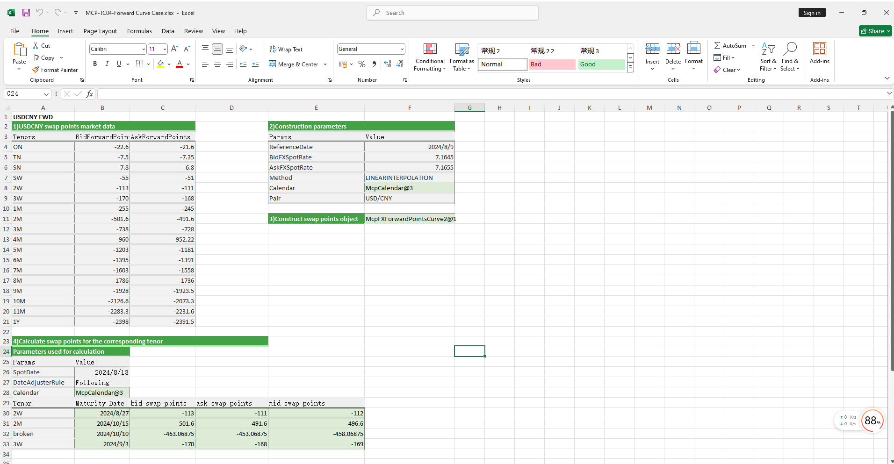

# **Forward Curve Case Study**


> Visit the Mathema Option Pricing System for foreign exchange options and structured product valuation!
[](https://fxo.mathema.com.cn)

The Forward Curve case study provides methods for constructing forward curve objects, including both single-sided and double-sided approaches, as well as extracting swap points and forward prices for specified maturities from the forward curve.  
Click the image below to download the template:

[](./MCP-TC04-ForwardCurveCase.xlsx)
---

## **Forward Curve Case Study Template: Function Descriptions**

### **1. Holiday Calendar Construction Functions**
   - **[McpCalendar](/latest/api/calendar.html#excel-mcpcalendar-code-dates)**: Constructs a holiday calendar object for one or more currency pairs.
   - **[McpNCalendar](/latest/api/calendar.html#excel-mcpncalendar-ccys-holidays)**: Constructs a holiday calendar object for multiple currencies.

### **2. Maturity Date Calculation Functions**
   - **[CalendarAddPeriod](/latest/api/calendar.html#excel-calendaraddperiod-cal-date-tenor-dateadjustrule-dateadjusterrule-actual-endofmonthrule-false-lastopenday-false-calendarcodes)**: Calculates the maturity date.

### **3. Forward Curve Construction Functions**
   - **[McpFXForwardPointsCurve2](/latest/api/fxforwardratecurve.html#excel-mcpfxforwardpointscurve2-args1-args2-args3-args4-args5-fmt-vp)**: Constructs a double-sided forward curve object.
   - **[McpFXForwardPointsCurve](/latest/api/fxforwardratecurve.html#excel-mcpfxforwardpointscurve-args1-args2-args3-args4-args5-fmt-vp)**: Constructs a single-sided forward curve object.

### **4. Forward Curve Data Extraction Functions**
   - **[Fxfpc2FXForwardPoints](/latest/api/fxforwardratecurve.html#excel-fxfpc2fxforwardpoints-curve-date-bidmidask)**：Retrieves swap points from a double-sided forward curve object.
   - **[Fxfpc2FXForwardOutright](/latest/api/fxforwardratecurve.html#excel-fxfpc2fxforwardoutright-curve-date-bidmidask)**：Retrieves forward prices from a double-sided forward curve object.
   - **[FxfpcFXForwardPoints](/latest/api/fxforwardratecurve.html#excel-fxfpcfxforwardpoints-curve-date)**：Retrieves swap points from a single-sided forward curve object.
   - **[FxfpcFXForwardOutright](/latest/api/fxforwardratecurve.html#excel-fxfpcfxforwardoutright-curve-date)**：Retrieves forward prices from a single-sided forward curve object.
   
## **Python Code Example**

Below is an example of a forward curve implementation.

---

### **Forward Curve Example**

This example demonstrates how to use the `McpFXForwardPointsCurve2` class from the `mcp.tool.tools_main` module to build a forward points curve. It calculates forward points and forward prices for different tenors and compares the results with expected values.

#### **Dependencies**

- `pandas`: Used for data manipulation and comparison.
- `example.calendar.calendar_demo`: Used for calendar-related functionalities.
- `mcp.enums`: Used for date adjustment rules.
- `mcp.tool.tools_main`: Used for the `McpFXForwardPointsCurve2` class.

#### **Example Overview**

The example performs the following steps:

1. **Calendar Initialization**: Initializes the calendar using USD and CNY dates.
2. **Forward Points Curve Construction**: Builds the forward points curve using the `McpFXForwardPointsCurve2` class with specified parameters.
3. **Forward Points and Prices Calculation**: Calculates the bid, ask, and mid forward points and forward prices for specified tenors.
4. **Data Comparison**: Uses `pandas.DataFrame` to compare the calculated results with expected values.

#### **Code Explanation**

##### **Import Statements**

```python
import pandas as pd
from pandas._testing import assert_frame_equal
from example.calendar.calendar_demo import McpNCalendar, usd_dates, cny_dates
from mcp.enums import DateAdjusterRule
from mcp.tool.tools_main import McpFXForwardPointsCurve2
```

##### **Function**: **`Forward Points Curve Construction and Calculation`**

This example tests the construction and calculation of the forward points curve.

```python
def test_forward_points_curve2_with_bidask():
    cal = McpNCalendar(['USD', 'CNY'], [usd_dates, cny_dates])
    args = {
        'ReferenceDate': '2024-8-9',
        'Tenors': ['ON', 'TN', 'SN', 'SW', '2W', '3W', '1M', '2M', '3M', '4M', '5M', '6M', '7M', '8M', '9M', '10M',
                   '11M', '1Y'],
        'BidForwardPoints': [-22.6, -7.5, -7.8, -55, -113, -170, -255, -501.6, -738, -960, -1203, -1395, -1603, -1786,
                             -1928, -2126.6, -2283.3, -2398],
        'AskForwardPoints': [-21.6, -7.35, -6.8, -51, -111, -168, -245, -491.6, -728, -952.22, -1181, -1391, -1558,
                             -1736, -1923.5, -2073.3, -2231.6, -2391.5],
        "BidFXSpotRate": 7.1645,
        "AskFXSpotRate": 7.1655,
        "Method": 'LINEARINTERPOLATION',
        "Pair": 'USD/CNY',
        'Calendar': cal,
    }
    curve = McpFXForwardPointsCurve2(args)
    spot_date = cal.ValueDate('2024-8-9')
    tenors = ['2W', '2M', 'broken', '3W']
    expire_dates = []
    bid_points = []
    ask_points = []
    mid_points = []
    bid_pxs = []
    ask_pxs = []
    mid_pxs = []
    for tenor in tenors:
        if tenor == 'broken':
            ex_date = '2024-10-10'
        else:
            ex_date = cal.AddPeriod(spot_date, tenor, DateAdjusterRule.Following)
        expire_dates.append(ex_date)
        bid_point = curve.FXForwardPoints(ex_date, 'BID')
        ask_point = curve.FXForwardPoints(ex_date, 'ASK')
        mid_point = curve.FXForwardPoints(ex_date, 'MID')
        bid_points.append(bid_point)
        ask_points.append(ask_point)
        mid_points.append(mid_point)
        bid_px = curve.FXForwardOutright(ex_date, 'BID')
        ask_px = curve.FXForwardOutright(ex_date, 'ASK')
        mid_px = curve.FXForwardOutright(ex_date, 'MID')
        bid_pxs.append(bid_px)
        ask_pxs.append(ask_px)
        mid_pxs.append(mid_px)
    column_names = ['tenor', 'expire_date', 'bidpoints', 'askpoints', 'midpoints', 'bidpx', 'askpx', 'midpx']
    p_data = [tenors, expire_dates, bid_points, ask_points, mid_points, bid_pxs, ask_pxs, mid_pxs]
    r_dic = {}
    for key, val in zip(column_names, p_data):
        r_dic[key] = val
    df = pd.DataFrame(r_dic)
    expected_data = [
        tenors,
        ['2024-08-27', '2024-10-15', '2024-10-10', '2024-09-03'],
        [-113, -501.6, -463.06875, -170],
        [-111, -491.6, -453.06875, -168],
        [-112, -496.6, -458.06875, -169],
        [7.1532, 7.11434, 7.118193125, 7.1475],
        [7.1544, 7.11634, 7.120193125, 7.1487],
        [7.1538, 7.11534, 7.119193125, 7.1481]
    ]
    e_dic = {}
    for key, val in zip(column_names, expected_data):
        e_dic[key] = val
    expected_df = pd.DataFrame(e_dic)
    assert_frame_equal(df, expected_df, check_dtype=True)
```

##### **Expected Output**

The example compares the calculated forward points and prices with the following expected values:

| Tenor  | Expire Date | Bid Forward Points | Ask Forward Points | Mid Forward Points | Bid Price   | Ask Price   | Mid Price   |
|--------|-------------|--------------------|--------------------|--------------------|-------------|-------------|-------------|
| 2W     | 2024-08-27  | -113               | -111               | -112               | 7.1532      | 7.1544      | 7.1538      |
| 2M     | 2024-10-15  | -501.6             | -491.6             | -496.6             | 7.11434     | 7.11634     | 7.11534     |
| broken | 2024-10-10  | -463.06875         | -453.06875         | -458.06875         | 7.118193125 | 7.120193125 | 7.119193125 |
| 3W     | 2024-09-03  | -170               | -168               | -169               | 7.1475      | 7.1487      | 7.1481      |