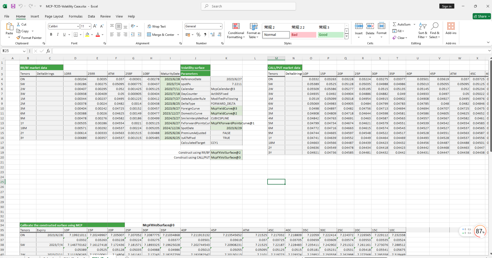

# **Volatility Case Study**


> Visit the Mathema Option Pricing System for foreign exchange options and structured product valuation!
[](https://fxo.mathema.com.cn)

The Volatility case study provides methods for constructing volatility objects, including both single-sided and double-sided approaches, as well as extracting ATM volatility, interest rates, swap points, forward prices, and volatility for specified maturities from the volatility surface.  
Click the image below to download the template:

[](./MCP-TC05-VolatilityCase.xlsx)
---

## **Volatility Case Study Template: Function Descriptions**

### **1. Holiday Calendar Construction Functions**
   - **[McpCalendar](/latest/api/calendar.html#excel-mcpcalendar-code-dates)**: Constructs a holiday calendar object for one or more currency pairs.
   - **[McpNCalendar](/latest/api/calendar.html#excel-mcpncalendar-ccys-holidays)**: Constructs a holiday calendar object for multiple currencies.

### **2. Maturity Date Calculation Functions**
   - **[CalendarFXOExpiryDateFromTenor](/latest/api/calendar.html#excel-calendarfxoexpirydatefromtenor-cal-referencedate-tenor-spotdate-calendarcodes)**: Calculates the expiry date based on the given tenor.

### **3. Double-Sided Construction Methods**
   - **Yield Curve Object**
     - **[McpYieldCurve2](/latest/api/yieldcurve.html#excel-mcpyieldcurve2-args1-args2-args3-args4-args5-fmt-vp-hd)**: Constructs a yield curve object.
   - **Forward Curve Object**
     - **[McpFXForwardPointsCurve2](/latest/api/fxforwardratecurve.html#excel-mcpfxforwardpointscurve2-args1-args2-args3-args4-args5-fmt-vp)**: Constructs a forward curve object.
   - **Volatility Surface Object**
     - **[McpFXVolSurface2](/latest/api/fxvolsurface.html#excel-mcpfxvolsurface2-args1-args2-args3-args4-args5-fmt-vp)**: Constructs a volatility surface object.
   - **Volatility Surface Data Extraction**
     - **[FXVolSurface2GetReferenceDate](/latest/api/fxvolsurface.html#excel-fxvolsurface2getreferencedate-vs)**: Retrieves the reference date of the volatility surface.
     - **[FXVolSurface2GetSpotDate](/latest/api/fxvolsurface.html#excel-fxvolsurface2getspotdate-vs)**: Retrieves the spot date of the volatility surface.
     - **[FXVolSurface2GetSpot](/latest/api/fxvolsurface.html#excel-fxvolsurface2getspot-vs-bidmidask)**: Retrieves the spot price from the volatility surface.
     - **[FXVolSurface2GetStrike](/latest/api/fxvolsurface.html#excel-fxvolsurface2getstrike-vs-deltastring-tenor-bidmidask)**: Retrieves the strike for a given tenor and DeltaString.
     - **[FXVolSurface2GetVolatility](/latest/api/fxvolsurface.html#excel-fxvolsurface2getvolatility-vs-strike-expirydate-bidmidask-midforward-0-0-bidinputdeltavolpair-askinputdeltavolpair)**: Retrieves the volatility for a given strike and expiry date.
     - **[FXVolSurface2GetATMVol](/latest/api/fxvolsurface.html#excel-fxvolsurface2getatmvol-vs-expirydate-bidmidask)**: Retrieves the ATM volatility for a given expiry date.
     - **[FXVolSurface2GetForeignRate](/latest/api/fxvolsurface.html#excel-fxvolsurface2getforeignrate-vs-expiryordeliverydate-isdeliverydate-bidmidask)**: Retrieves the CCY1 interest rate for a given expiry date.
     - **[FXVolSurface2GetDomesticRate](/latest/api/fxvolsurface.html#excel-fxvolsurface2getdomesticrate-vs-expiryordeliverydate-isdeliverydate-bidmidask)**: Retrieves the CCY2 interest rate for a given expiry date.
     - **[FXVolSurface2GetForwardPoint](/latest/api/fxvolsurface.html#excel-fxvolsurface2getforwardpoint-vs-expiryordeliverydate-isdeliverydate-bidmidask)**: Retrieves the swap points for a given expiry date.
     - **[FXVolSurface2GetForward](/latest/api/fxvolsurface.html#excel-fxvolsurface2getforward-vs-expiryordeliverydate-isdeliverydate-bidmidask)**: Retrieves the forward price for a given expiry date.

### **4. Single-Sided Construction Methods**
   - **Yield Curve Object**
     - **[McpYieldCurve](/latest/api/yieldcurve.html#excel-mcpyieldcurve-args1-args2-args3-args4-args5-fmt-vp-hd)**: Constructs a yield curve object.
   - **Forward Curve Object**
     - **[McpFXForwardPointsCurve](/latest/api/fxforwardratecurve.html#excel-mcpfxforwardpointscurve-args1-args2-args3-args4-args5-fmt-vp)**: Constructs a forward curve object.
   - **Volatility Surface Object**
     - **[McpFXVolSurface](/latest/api/fxvolsurface.html#excel-mcpfxvolsurface-args1-args2-args3-args4-args5-fmt-dt-vp-hd)**: Constructs a volatility surface object.
   - **Volatility Surface Data Extraction**
     - **[FXVolSurfaceGetStrike](/latest/api/fxvolsurface.html#excel-fxvolsurfacegetstrike-vs-deltastring-tenor)**: Retrieves the strike for a given tenor and DeltaString.
     - **[FXVolSurfaceGetVolatility](/latest/api/fxvolsurface.html#excel-fxvolsurfacegetvolatility-vs-strike-expirydate-forward-0-0-inputdeltavolpair)**: Retrieves the volatility for a given strike and expiry date.
     - **[FXVolSurfaceGetReferenceDate](/latest/api/fxvolsurface.html#excel-fxvolsurfacegetreferencedate-vs)**: Retrieves the reference date of the volatility surface.
     - **[FXVolSurfaceGetSpotDate](/latest/api/fxvolsurface.html#excel-fxvolsurfacegetspotdate-vs)**: Retrieves the spot date of the volatility surface.
     - **[FXVolSurfaceGetSpot](/latest/api/fxvolsurface.html#excel-fxvolsurfacegetspot-vs)**: Retrieves the spot price from the volatility surface.
     - **[FXVolSurfaceGetATMVol](/latest/api/fxvolsurface.html#excel-fxvolsurfacegetatmvol-vs-expirydate)**: Retrieves the ATM volatility for a given expiry date.
     - **[FXVolSurfaceGetForeignRate](/latest/api/fxvolsurface.html#excel-fxvolsurfacegetforeignrate-vs-expiryordeliverydate-isdeliverydate)**: Retrieves the CCY1 interest rate for a given expiry date.
     - **[FXVolSurfaceGetDomesticRate](/latest/api/fxvolsurface.html#excel-fxvolsurfacegetdomesticrate-vs-expiryordeliverydate-isdeliverydate)**: Retrieves the CCY2 interest rate for a given expiry date.
     - **[FXVolSurfaceGetForwardPoint](/latest/api/fxvolsurface.html#excel-fxvolsurfacegetforwardpoint-vs-expiryordeliverydate-isdeliverydate)**: Retrieves the swap points for a given expiry date.
     - **[FXVolSurfaceGetForward](/latest/api/fxvolsurface.html#excel-fxvolsurfacegetforward-vs-expiryordeliverydate-isdeliverydate)**: Retrieves the forward price for a given expiry date.
## **Python Code Example**

Below is an example of a volatility surface implementation.

---
### **Volatility Surface Example Code**

This example code demonstrates how to use the `mcp` library to build and test a volatility surface. The code includes the `test_mkt_vol_surface2` function, which tests the volatility surface based on the US Dollar (USD) and Chinese Yuan (CNY).

#### **1. `test_mkt_vol_surface2`**

This function tests the volatility surface based on USD and CNY. Below are the main steps of the code:

##### **1.1 Create Calendar Objects**

First, calendar objects for USD and CNY are created:

```python
cal = McpNCalendar(['USD', 'CNY'], [usd_dates, cny_dates])
cal_usd = GetCurrencyCalendar('USD', 'USD', usd_dates)
cal_cny = GetCurrencyCalendar('CNY', 'CNY', usd_dates)
```

##### **1.2 Build Yield Curves**

Next, yield curves for USD and CNY are constructed:

```python
yc_args_usd = {
    'ReferenceDate': '2024-12-13',
    'Tenors': ['ON', 'TN', 'SN', 'SW', '2W', '3W', '1M', '2M', '3M', '4M', '5M', '6M', '7M', '8M', '9M', '10M', '11M', '1Y', '2Y', '3Y', '4Y', '5Y'],
    'BidZeroRates': [0.0458, 0.0439, 0.045, 0.0439, 0.0433, 0.046, 0.0433, 0.0433, 0.0433, 0.0435, 0.0435, 0.0433, 0.0434, 0.0434, 0.0433, 0.0433, 0.0433, 0.0433, 0.044, 0.043, 0.042, 0.042],
    'AskZeroRates': [0.0459, 0.0451, 0.0457, 0.0451, 0.0458, 0.0553, 0.0458, 0.0458, 0.0458, 0.046, 0.046, 0.0458, 0.0459, 0.0459, 0.0458, 0.0458, 0.0458, 0.0458, 0.0465, 0.046, 0.045, 0.045],
    'Calendar': cal_usd,
    'ShortName': 'USDSofrSnapYldCurve',
    'Symbol': 'USD',
    'DayCount': None,
    'Frequency': '-1',
    'Variable': 'SIMPLERATES',
    'InterpolationMethod': None
}

yc_args_cny = {
    'ReferenceDate': '2024-12-13',
    'Tenors': ['ON', '1W', '2W', '1M', '3M', '6M', '9M', '1Y'],
    'BidZeroRates': [0.01404, 0.01758, 0.0187, 0.0171, 0.01735, 0.01744, 0.01759, 0.01774],
    'AskZeroRates': [0.01404, 0.01758, 0.0187, 0.0171, 0.01735, 0.01744, 0.01759, 0.01774],
    'Calendar': cal_cny,
    'ShortName': 'CNYShibor3mSnapYldCurve',
    'Symbol': 'CNY',
    'DayCount': None,
    'Frequency': '-1',
    'Variable': 'SIMPLERATES',
    'InterpolationMethod': None
}

yc1 = McpYieldCurve2(yc_args_usd)
yc2 = McpYieldCurve2(yc_args_cny)
```

##### **1.3 Build Forward Points Curve**

Then, the forward points curve for USD/CNY is constructed:

```python
fw_args = {
    'ReferenceDate': '2024-12-13',
    'Tenors': ['SW', '2W', '3W', '1M', '2M', '3M', '4M', '5M', '6M', '7M', '8M', '9M', '10M', '11M', '1Y', '18M', '2Y', '3Y', '4Y', '5Y'],
    'BidForwardPoints': [-39.5, -77.0, -116.0, -177.0, -360.35, -522.77, -709.23, -922.0, -1124.52, -1328.0, -1531.0, -1749.28, -1940.0, -2145.0, -2388.0, -3450.0, -4330.0, -5696.61, -6000.0, -8050.0],
    'AskForwardPoints': [-35.5, -75.2, -114.0, -167.0, -348.43, -509.23, -704.0, -915.0, -1105.48, -1283.0, -1486.0, -1724.72, -1896.6, -2103.3, -2358.0, -2860.0, -4230.0, -5463.39, -4900.0, -7550.0],
    'BidFXSpotRate': 7.2768,
    'AskFXSpotRate': 7.277,
    'Pair': 'USD/CNY',
    'Calendar': cal,
    'ShortName': 'USDCNYFwdSnapCurve',
    'Symbol': 'USD/CNY',
    'InterpolationMethod': 'LINEARINTERPOLATION'
}

fc = McpFXForwardPointsCurve2(fw_args)
```

##### **1.4 Build Volatility Surface**

The volatility surface for USD/CNY is then constructed:

```python
vol_args = {
    'ShortName': 'USDCNYRSnapVolSurface',
    'Symbol': 'USD/CNY',
    'DayCounter': 'Act365Fixed',
    'DateAdjusterRule': 'ModifiedFollowing',
    'DeltaType': 'FORWARD_DELTA',
    'UndCurve': 'USDSofrSnapYldCurve',
    'AccCurve2': yc2,
    'SmileInterpMethod': 'CUBICSPLINE',
    'FxForwardPointsCurve': 'USDCNYFwdSnapCurve',
    'PremiumAdjusted': 'FALSE',
    'IsATMFwd': 'TRUE',
    'CalculatedTarget': 'CCY1',
    'ReferenceDate': '2024-12-13',
    'DeltaStrings': ['10DPUT', '15DPUT', '20DPUT', '25DPUT', '30DPUT', '35DPUT', '40DPUT', '45DPUT', 'ATM', '45DCAL', '40DCAL', '35DCAL', '30DCAL', '25DCAL', '20DCAL', '15DCAL', '10DCAL'],
    'Tenors': ['SW', '2W', '3W', '1M', '2M', '3M', '4M', '5M', '6M', '9M', '1Y', '18M', '2Y'],
    'BidVolatilities': '0.05131,0.04998,0.04866,0.04734,0.04603,0.04478,0.04361,0.04258,0.04175,0.04108,0.04062,0.04035,0.04026,0.04034,0.04058,0.04092,0.04131;...',
    'AskVolatilities': '0.06631,0.06498,0.06366,0.06234,0.06103,0.05978,0.05861,0.05758,0.05675,0.05608,0.05562,0.05535,0.05526,0.05534,0.05558,0.05592,0.05631;...',
    'FxForwardPointsCurve2': fc,
    'UndCurve2': yc1,
    'Calendar': cal
}

mkt_vol: MMktVolSurface2 = McpMktVolSurface2(vol_args)
```

##### **1.5 Retrieve Foreign Rates**

Finally, foreign rates for a specified expiry date are retrieved:

```python
expiryDate = '2024-12-18'
strike = 7
ForeignRate = mkt_vol.GetForeignRate(expiryDate, False, 'BID')
DomesticRate = mkt_vol.GetDomesticRate(expiryDate, False, 'BID')
```	 