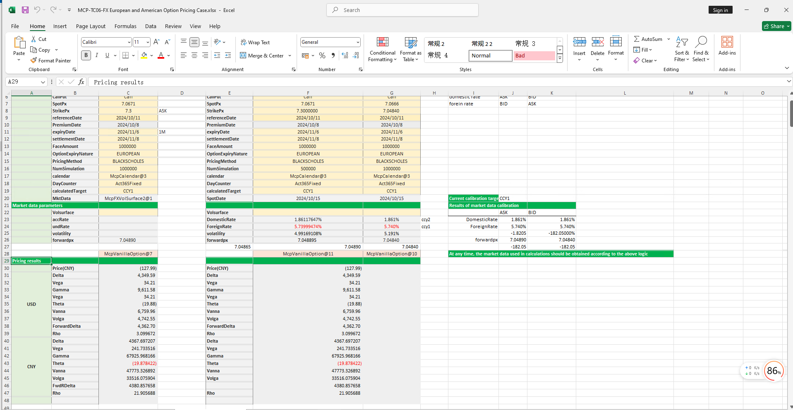

# **FX European and American Option Pricing Case Study**


> Visit the Mathema Option Pricing System for foreign exchange options and structured product valuation!
[](https://fxo.mathema.com.cn)

The FX European and American Option Pricing template provides a comprehensive workflow for holiday management, yield curve construction, volatility surface construction, European and American option object creation, date calculation, option pricing, and Greek value calculation. It enables precise modeling, pricing, and risk analysis of European and American options.  
Click the image below to download the template:

[](./MCP-TC06-FXEuropeanandAmericanOptionPricingCase.xlsx)
---

## **FX European and American Option Pricing Template: Function Descriptions**

### **1. Holiday Calendar Construction Functions**
   - **[McpCalendar](/latest/api/calendar.html#excel-mcpcalendar-code-dates)**：Constructs a holiday calendar object for one or more currency pairs.
   - **[McpNCalendar](/latest/api/calendar.html#excel-mcpncalendar-ccys-holidays)**：Constructs a holiday calendar object for multiple currencies.

### **2. Yield Curve Construction Functions**
   - **[McpYieldCurve2](/latest/api/yieldcurve.html#excel-mcpyieldcurve2-args1-args2-args3-args4-args5-fmt-vp-hd)**: Constructs a yield curve object.

### **3. Forward Curve Construction Functions**
   - **[McpFXForwardPointsCurve2](/latest/api/fxforwardratecurve.html#excel-mcpfxforwardpointscurve2-args1-args2-args3-args4-args5-fmt-vp)**: Constructs a forward curve object.

### **4. Volatility Surface Construction Functions**
   - **[McpFXVolSurface2](/latest/api/fxvolsurface.html#excel-mcpfxvolsurface2-args1-args2-args3-args4-args5-fmt-vp)**: Constructs a volatility surface object.

### **5. Option Object Construction Functions**
   - **[McpVanillaOption](/latest/api/vanillaoption.html#excel-mcpvanillaoption-args1-args2-args3-args4-args5-fmt)**: Constructs a VanillaOption object.

### **6. Volatility Surface Related Functions**
   - **[FXVolSurface2GetForeignRate](/latest/api/fxvolsurface.html#excel-fxvolsurface2getforeignrate-vs-expiryordeliverydate-isdeliverydate-bidmidask)**：Retrieves the CCY1 interest rate for a given expiry date from the volatility surface.
   - **[FXVolSurface2GetDomesticRate](/latest/api/fxvolsurface.html#excel-fxvolsurface2getdomesticrate-vs-expiryordeliverydate-isdeliverydate-bidmidask)**：Retrieves the CCY2 interest rate for a given expiry date from the volatility surface.
   - **[FXVolSurface2GetForward](/latest/api/fxvolsurface.html#excel-fxvolsurface2getforward-vs-expiryordeliverydate-isdeliverydate-bidmidask)**：Retrieves the forward price for a given expiry date from the volatility surface.
   - **[FXVolSurface2GetVolatility](/latest/api/fxvolsurface.html#excel-fxvolsurface2getvolatility-vs-strike-expirydate-bidmidask-midforward-0-0-bidinputdeltavolpair-askinputdeltavolpair)**：Retrieves the volatility for a given strike and expiry date from the volatility surface.

### **7. Interest Rate Calculation Functions**
   - **[Forward2ImpliedBaseRate](/latest/api/vanillaoption.html#excel-forward2impliedbaserate-pair-forward-spot-termrate-spotdate-deliverydate)**：Calculates the CCY1 interest rate when CCY1 is the target.
   - **[Forward2ImpliedTermRate](/latest/api/vanillaoption.html#excel-forward2impliedtermrate-pair-forward-spot-baserate-spotdate-deliverydate)**： Calculates the CCY2 interest rate when CCY2 is the target.

### **8. Forward Price and Swap Points Calculation Functions**
   - **[ImpliedForward](/latest/api/vanillaoption.html#excel-impliedforward-pair-baserate-termrate-spot-spotdate-deliverydate)**：Calculates the forward price.
   - **[ImpliedFwdPoints](/latest/api/vanillaoption.html#excel-impliedfwdpoints-pair-baserate-termrate-spot-spotdate-deliverydate)**：Calculates the swap points.

### **9. Option Premium Calculation Functions**
    - **[McpPrice](/latest/api/vanillaoption.html#excel-mcpprice-obj-isamount-true)** Calculates the option premium.

### **10. Greek Value Calculation Functions**
   - **[McpDelta](/latest/api/vanillaoption.html#excel-mcpdelta-obj-isccy2-false-isamount-true-pricingmethod-1-isclosedformmethod-true)**: Calculates Delta.
   - **[McpVega](/latest/api/vanillaoption.html#excel-mcpvega-obj-isccy2-false-isamount-true-pricingmethod-1-isclosedformmethod-true)**: CalculatesVega。
   - **[McpGamma](/latest/api/vanillaoption.html#excel-mcpgamma-obj-isccy2-false-isamount-true-pricingmethod-1-isclosedformmethod-true)**: Calculates Gamma。
   - **[McpTheta](/latest/api/vanillaoption.html#excel-mcptheta-obj-isccy2-false-isamount-true-pricingmethod-1-isclosedformmethod-true)**: Calculates Theta。
   - **[McpVanna](/latest/api/vanillaoption.html#excel-mcpvanna-obj-isccy2-false-isamount-true-pricingmethod-1-isclosedformmethod-true)**: Calculates Vanna。
   - **[McpVolga](/latest/api/vanillaoption.html#excel-mcpvolga-obj-isccy2-false-isamount-true-pricingmethod-1-isclosedformmethod-true)**: Calculates Volga。
   - **[McpForwardDelta](/latest/api/vanillaoption.html#excel-mcpforwarddelta-obj-isccy2-false-isamount-true-pricingmethod-1-isclosedformmethod-true)**: Calculates Forward Delta。
   - **[McpRho](/latest/api/vanillaoption.html#excel-mcprho-obj-isccy2-false-isamount-true-pricingmethod-1-isclosedformmethod-true)**: Calculates Rho。
   
## **Python Code Example**

Below is an example of Python code demonstrating the construction of holiday calendars and date calculations using the provided functions.

---   
# Vanilla Option Demo

This Python script demonstrates the usage of the `McpVanillaOption` class for pricing vanilla options using market data, including yield curves, forward points, and volatility surfaces. The script also shows how to calculate option prices, deltas, and other intermediate results.

## Dependencies

- `pandas`: For data manipulation and display.
- `mcp.forward.fwd_wrapper`: For the `McpVanillaOption` class.
- `example.calendar.calendar_demo`: For calendar-related functionalities.
- `mcp.mcp`: For the `MMktVolSurface2` class.
- `mcp.tool.tools_main`: For classes like `McpYieldCurve2`, `McpFXForwardPointsCurve2`, `McpMktVolSurface2`, and `McpVanillaOption`.
- `mcp.wrapper`: For various forward curve-related calculations.

## Script Overview

The script performs the following tasks:

1. **Market Data Generation**: Generates market data, including yield curves, forward points, and volatility surfaces.
2. **Vanilla Option Pricing**: Prices vanilla options using the `McpVanillaOption` class with market data.
3. **Delta Calculation**: Calculates the delta of the option for both USD and CNY.
4. **Intermediate Results**: Displays intermediate results such as spot price, strike price, expiry date, and more.

## Code Explanation

### Market Data Generation

The `gen_mkt_vol()` function generates market data, including yield curves for USD and CNY, forward points, and a volatility surface.

```python
def gen_mkt_vol():
    # Yield curve arguments for USD and CNY
    yc_args_usd = {...}
    yc_args_cny = {...}
    
    # Forward points arguments
    fw_args = {...}
    
    # Volatility surface arguments
    vol_args = {...}
    
    # Create yield curves, forward points curve, and volatility surface
    yc1 = McpYieldCurve2(yc_args_usd)
    yc2 = McpYieldCurve2(yc_args_cny)
    fc = McpFXForwardPointsCurve2(fw_args)
    mkt_vol = McpMktVolSurface2(vol_args)
    
    return mkt_vol
```

### Vanilla Option Pricing

The `test_vanilla_option_with_vol_surface()` function prices a vanilla option using the generated market data.

```python
def test_vanilla_option_with_vol_surface():
    mkt_vol = gen_mkt_vol()
    vo_args = {...}
    vo = McpVanillaOption(vo_args)
    
    # Calculate option price and deltas
    price = vo.Price(True)
    deltaUSD = vo.Delta(False, True, 1)
    deltaCNY = vo.Delta(True, True, 1)
    
    print(f'price = {price}, deltaUSD={deltaUSD}, deltaCNY={deltaCNY}')
    
    # Display intermediate results
    fields = [...]
    legs = vo.legs()
    result = [...]
    print(f'{result}')
```

### Direct Rate Usage

The `test_vanilla_option_with_rate()` function prices a vanilla option using direct rates instead of market data.

```python
def test_vanilla_option_with_rate():
    vo_args = {...}
    vo = McpVanillaOption(vo_args)
    
    # Calculate option price and deltas
    price = vo.Price(True)
    deltaUSD = vo.Delta(False, True, 1)
    deltaCNY = vo.Delta(True, True, 1)
    
    print(f'price = {price}, deltaUSD={deltaUSD}, deltaCNY={deltaCNY}')
    
    # Display intermediate results
    fields = [...]
    legs = vo.legs()
    result = [...]
    print(f'{result}')
```

### Market Side Determination

The `get_mkt_side()` function determines the market side (BID or ASK) based on the option's buy/sell and call/put attributes.

```python
def get_mkt_side(side, buy_sell, call_put):
    # Determine market side based on option attributes
    ...
    return spot_side, vol_side, domestic_rate_side, forein_rate_side
```

### Solver Test

The `test_slover()` function tests the solver for calculating implied rates and forward points.

```python
def test_slover():
    client_args = {...}
    und_rates = [...]
    acc_rates = [...]
    fwd_rates = [...]
    spot_rates = [...]
    
    # Determine market side
    spot_side, vol_side, domestic_rate_side, forein_rate_side = get_mkt_side(...)
    
    # Calculate implied rates and forward points
    ...
    print(side_raw)
```

## Conclusion

This script demonstrates how to price vanilla options using market data or direct rates, calculate deltas, and display intermediate results. It also includes functionality to determine market sides and test solvers for implied rates and forward points.