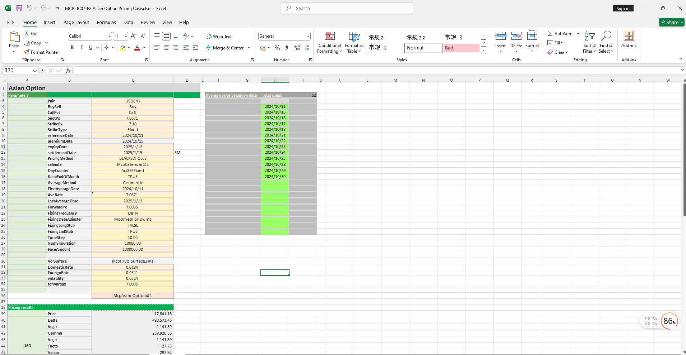

# **FX Asian Option Pricing Case Study**

> Visit the Mathema Option Pricing System for foreign exchange options and structured product valuation!

The FX Asian Option Pricing template provides a comprehensive workflow for holiday management, yield curve construction, volatility surface construction, Asian option object creation, date calculation, option pricing, and Greek value calculation. It enables precise modeling, pricing, and risk analysis of Asian options.  
Click the image below to download the template:

---

## **FX Asian Option Pricing Template: Function Descriptions**

### **1. Holiday Calendar Construction Functions**
   - **[McpCalendar](/latest/api/calendar.html#excel-mcpcalendar-code-dates)**: Constructs a holiday calendar object for one or more currency pairs.
   - **[McpNCalendar](/latest/api/calendar.html#excel-mcpncalendar-ccys-holidays)**: Constructs a holiday calendar object for multiple currencies.

### **2. Yield Curve Construction Functions**
   - **[McpYieldCurve2](/latest/api/yieldcurve.html#excel-mcpyieldcurve2-args1-args2-args3-args4-args5-fmt-vp-hd)**: Constructs a yield curve object.

### **3. Forward Curve Construction Functions**
   - **[McpFXForwardPointsCurve2](/latest/api/fxforwardratecurve.html#excel-mcpfxforwardpointscurve2-args1-args2-args3-args4-args5-fmt-vp)**: Constructs a forward curve object.

### **4. Volatility Surface Construction Functions**
   - **[McpFXVolSurface2](/latest/api/fxvolsurface.html#excel-mcpfxvolsurface2-args1-args2-args3-args4-args5-fmt-vp)**: Constructs a volatility surface object.

### **5. Asian Option Construction Functions**
   - **[McpAsianOption](/latest/api/asianoption.html#excel-mcpasianoption-args1-args2-args3-args4-args5-fmt-vp)**: Constructs an Asian option object.

### **6. Volatility Surface Related Functions**
   - **[FXVolSurface2GetForeignRate](/latest/api/fxvolsurface.html#excel-fxvolsurface2getforeignrate-vs-expiryordeliverydate-isdeliverydate-bidmidask)**: Retrieves the CCY1 interest rate for a given expiry date from the volatility surface.
   - **[FXVolSurface2GetDomesticRate](/latest/api/fxvolsurface.html#excel-fxvolsurface2getdomesticrate-vs-expiryordeliverydate-isdeliverydate-bidmidask)**: Retrieves the CCY2 interest rate for a given expiry date from the volatility surface.
   - **[FXVolSurface2GetForward](/latest/api/fxvolsurface.html#excel-fxvolsurface2getforward-vs-expiryordeliverydate-isdeliverydate-bidmidask)**: Retrieves the forward price for a given expiry date from the volatility surface.
   - **[FXVolSurface2GetVolatility](/latest/api/fxvolsurface.html#excel-fxvolsurface2getvolatility-vs-strike-expirydate-bidmidask-midforward-0-0-bidinputdeltavolpair-askinputdeltavolpair)**: Retrieves the volatility for a given strike and expiry date from the volatility surface.

### **7. Date Calculation Functions**
   - **[CalendarValueDate](/latest/api/calendar.html#excel-calendarvaluedate-cal-date-isfollowing-true-calendarcodes)**: Calculates the option premium payment date.
   - **[CalendarFXOExpiryDateFromTenor](/latest/api/calendar.html#excel-calendarfxoexpirydatefromtenor-cal-referencedate-tenor-spotdate-calendarcodes)**: Calculates the expiry date.
   - **[CalendarFXODeliveryDateFromTenor](/latest/api/calendar.html#excel-calendarfxodeliverydatefromtenor-cal-referencedate-tenor-spotdate-calendarcodes)**: Calculates the delivery date.
   - **[AOFixingSchedule](/latest/api/asianoption.html#excel-aofixingschedule-obj-fmt-v)**: Retrieves the fixing dates for average price calculation.

### **8. Option Premium Calculation Functions**
   - **[McpPrice](/latest/api/asianoption.html#excel-mcpprice-obj-isamount)**: Calculates the option premium.

### **9. Greek Value Calculation Functions**
   - **[McpDelta](/latest/api/asianoption.html#excel-mcpdelta-obj-isccy2-false-isamount-true-pricingmethod-1-isclosedformmethod-true)**: Calculates Delta.
   - **[McpVega](/latest/api/asianoption.html#excel-mcpvega-obj-isccy2-false-isamount-true-pricingmethod-1-isclosedformmethod-true)**: Calculates Vega.
   - **[McpGamma](/latest/api/asianoption.html#excel-mcpgamma-obj-isccy2-false-isamount-true-pricingmethod-1-isclosedformmethod-true)**: Calculates Gamma.
   - **[McpTheta](/latest/api/asianoption.html#excel-mcptheta-obj-isccy2-false-isamount-true-pricingmethod-1-isclosedformmethod-true)**: Calculates Theta.
   - **[McpVanna](/latest/api/asianoption.html#excel-mcpvanna-obj-isccy2-false-isamount-true-pricingmethod-1-isclosedformmethod-true)**: Calculates Vanna.
   - **[McpVolga](/latest/api/asianoption.html#excel-mcpvolga-obj-isccy2-false-isamount-true-pricingmethod-1-isclosedformmethod-true)**: Calculates Volga.
   - **[McpForwardDelta](/latest/api/asianoption.html#excel-mcpforwarddelta-obj-isccy2-false-isamount-true-pricingmethod-1-isclosedformmethod-true)**: Calculates Forward Delta.
   - **[McpRho](/latest/api/asianoption.html#excel-mcprho-obj-isccy2-false-isamount-true-pricingmethod-1-isclosedformmethod-true)**: Calculates Rho.