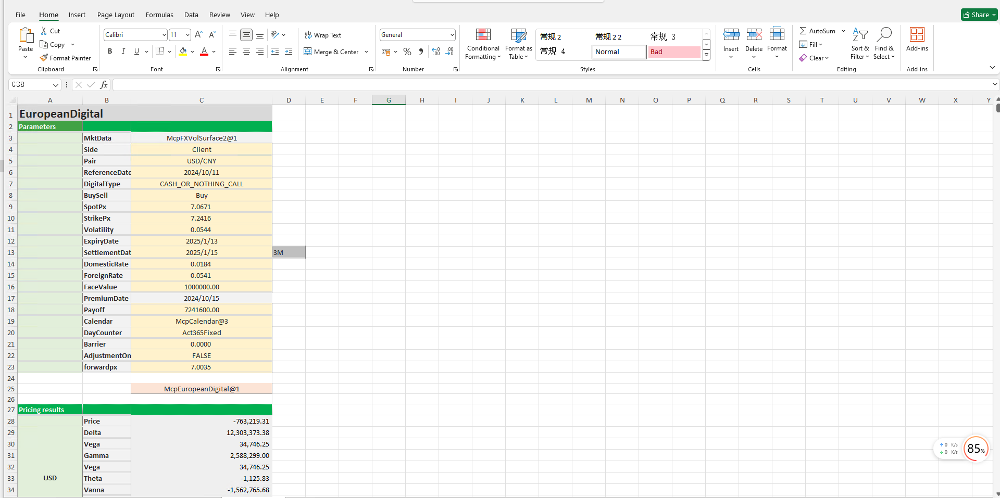

# **FX Digital Option Pricing Case Study**


> Visit the Mathema Option Pricing System for foreign exchange options and structured product valuation!
[](https://fxo.mathema.com.cn)

The FX Digital Option Pricing template provides a comprehensive workflow for holiday management, yield curve construction, volatility surface construction, digital option object creation, date calculation, option pricing, and Greek value calculation. It enables precise modeling, pricing, and risk analysis of digital options.  
Click the image below to download the template:

[](./MCP-TC09-FXDigitalOptionPricingCase.xlsx)
---

## **FX Digital Option Pricing Template: Function Descriptions**

### **1. Holiday Calendar Construction Functions**
- **[McpCalendar](/latest/api/calendar.html#excel-mcpcalendar-code-dates)**: Constructs a holiday calendar object for one or more currency pairs.
- **[McpNCalendar](/latest/api/calendar.html#excel-mcpncalendar-ccys-holidays)**: Constructs a holiday calendar object for multiple currency pairs.

### **2. Yield Curve Construction Functions**
- **[McpYieldCurve2](/latest/api/yieldcurve.html#mcpyieldcurve2-args1-args2-args3-args4-args5-fmt-vp-hd)**: Constructs a yield curve object.

### **3. Forward Curve Construction Functions**
- **[McpFXForwardPointsCurve2](/latest/api/fxforwardratecurve.html#excel-mcpfxforwardpointscurve2-args1-args2-args3-args4-args5-fmt-vp)**: Constructs a forward curve object.

### **4. Volatility Surface Construction Functions**
- **[McpFXVolSurface2](/latest/api/fxvolsurface.html#excel-mcpfxvolsurface2-args1-args2-args3-args4-args5-fmt-vp)**: Constructs a volatility surface object.

### **5. Digital Option Construction Functions**
- **[McpEuropeanDigital](/latest/api/europeandigital.html#excel-mcpeuropeandigital-args1-args2-args3-args4-args5-fmt-vp)**: Constructs a digital option object.

### **6. Volatility Surface Related Functions**
- **[FXVolSurface2GetForeignRate](/latest/api/fxvolsurface.html#excel-fxvolsurface2getforeignrate-vs-expiryordeliverydate-isdeliverydate-bidmidask)**: Retrieves the CCY1 interest rate for a given expiry date from the volatility surface.
- **[FXVolSurface2GetDomesticRate](/latest/api/fxvolsurface.html#excel-fxvolsurface2getdomesticrate-vs-expiryordeliverydate-isdeliverydate-bidmidask)**: Retrieves the CCY2 interest rate for a given expiry date from the volatility surface.
- **[FXVolSurface2GetForward](/latest/api/fxvolsurface.html#excel-fxvolsurface2getforward-vs-expiryordeliverydate-isdeliverydate-bidmidask)**: Retrieves the forward price for a given expiry date from the volatility surface.

### **7. Date Calculation Functions**
- **[CalendarValueDate](/latest/api/calendar.html#excel-calendarvaluedate-cal-date-isfollowing-true-calendarcodes)**: Calculates the option premium payment date.
- **[CalendarFXOExpiryDateFromTenor](/latest/api/calendar.html#excel-calendarfxoexpirydatefromtenor-cal-referencedate-tenor-spotdate-calendarcodes)**: Calculates the expiry date.
- **[CalendarFXODeliveryDateFromTenor](/latest/api/calendar.html#excel-calendarfxodeliverydatefromtenor-cal-referencedate-tenor-spotdate-calendarcodes)**: Calculates the delivery date.

### **8. Option Pricing Functions**
- **[McpPrice](/latest/api/europeandigital.html#excel-mcpprice-obj-isamount)**: Calculates the option premium.

### **9. Greek Value Calculation Functions**
- **[McpDelta](/latest/api/europeandigital.html#excel-mcpdelta-obj-isccy2-false-isamount-true-pricingmethod-1-isclosedformmethod-true)**: Calculates Delta.
- **[McpVega](/latest/api/europeandigital.html#excel-mcpvega-obj-isccy2-false-isamount-true-pricingmethod-1-isclosedformmethod-true)**: Calculates Vega.
- **[McpGamma](/latest/api/europeandigital.html#excel-mcpgamma-obj-isccy2-false-isamount-true-pricingmethod-1-isclosedformmethod-true)**: Calculates Gamma.
- **[McpTheta](/latest/api/europeandigital.html#excel-mcptheta-obj-isccy2-false-isamount-true-pricingmethod-1-isclosedformmethod-true)**: Calculates Theta.
- **[McpVanna](/latest/api/europeandigital.html#excel-mcpvanna-obj-isccy2-false-isamount-true-pricingmethod-1-isclosedformmethod-true)**: Calculates Vanna.
- **[McpVolga](/latest/api/europeandigital.html#excel-mcpvolga-obj-isccy2-false-isamount-true-pricingmethod-1-isclosedformmethod-true)**: Calculates Volga.
- **[McpForwardDelta](/latest/api/europeandigital.html#excel-mcpforwarddelta-obj-isccy2-false-isamount-true-pricingmethod-1-isclosedformmethod-true)**: Calculates Forward Delta.
- **[McpRho](/latest/api/europeandigital.html#excel-mcprho-obj-isccy2-false-isamount-true-pricingmethod-1-isclosedformmethod-true)**: Calculates Rho.

---

## **Python Code Example**
Below is a simple Python code example for testing the pricing of a digital option. It assumes the use of the `McpEuropeanDigital` function to construct a digital option object and the `McpPrice` function to calculate the option premium. The code simulates some parameter values and outputs the option premium.

---

### **Digital Option Pricing**

```python
# Assume we have a digital option pricing library containing McpEuropeanDigital and McpPrice functions
# The following code is for illustration purposes only; replace with actual library and functions in practice

# Import the hypothetical pricing library
from pricing_library import McpEuropeanDigital, McpPrice

# Define the parameters for the digital option
reference_date = "2023-10-01"  # Trade date or valuation date
spot_px = 100.0  # Spot price
strike_px = 105.0  # Strike price
expiry_date = "2023-12-31"  # Expiry date
settlement_date = "2024-01-02"  # Settlement date
volatility = 0.2  # Volatility
acc_rate = 0.02  # CCY2 interest rate
und_rate = 0.01  # CCY1 interest rate
face_value = 1.0  # Notional amount
payoff = 10.0  # Payoff amount
digital_type = "CASH_OR_NOTHING_CALL"  # Digital option type

# Construct the digital option object
digital_option = McpEuropeanDigital(
    reference_date=reference_date,
    spot_px=spot_px,
    strike_px=strike_px,
    expiry_date=expiry_date,
    settlement_date=settlement_date,
    volatility=volatility,
    acc_rate=acc_rate,
    und_rate=und_rate,
    face_value=face_value,
    payoff=payoff,
    digital_type=digital_type
)

# Calculate the option premium
option_price = McpPrice(digital_option)

# Output the result
print(f"The option premium for the digital option is: {option_price}")
```

---

### **Code Explanation**
1. **Parameter Definition**:
   - `reference_date`: Trade date or valuation date.
   - `spot_px`: Spot price.
   - `strike_px`: Strike price.
   - `expiry_date`: Expiry date.
   - `settlement_date`: Settlement date.
   - `volatility`: Volatility.
   - `acc_rate`: CCY2 interest rate.
   - `und_rate`: CCY1 interest rate.
   - `face_value`: Notional amount.
   - `payoff`: Payoff amount.
   - `digital_type`: Digital option type (e.g., cash-or-nothing call).

2. **Construct Digital Option Object**:
   - Use the `McpEuropeanDigital` function to construct the digital option object.

3. **Calculate Option Premium**:
   - Use the `McpPrice` function to calculate the option premium.

4. **Output Result**:
   - Print the calculated option premium.

---

### **Sample Output**
Assuming the simulated `McpPrice` function returns an option premium of `5.0`, the output will be:
```
The option premium for the digital option is: 5.0
```

---
