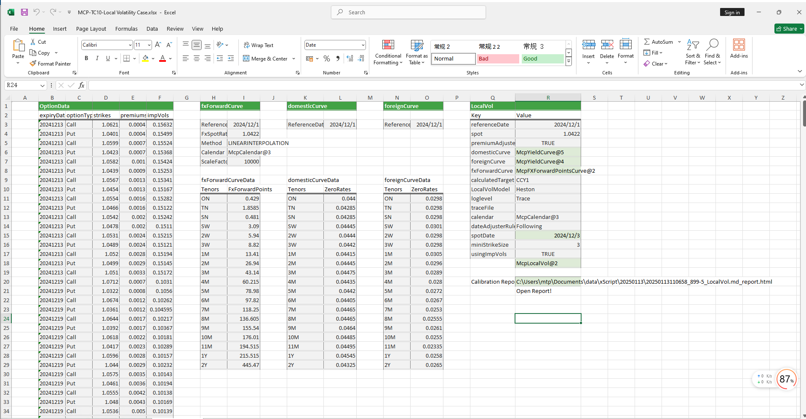

# **Local Volatility Case Study**

> Visit the Mathema Option Pricing System for foreign exchange options and structured product valuation!

The Local Volatility template provides functions for holiday management, yield curve construction, forward curve construction, and the creation of local volatility surface objects using the Dupire and Heston pricing models.  
Click the image below to download the template:

---

## **Local Volatility Template: Function Descriptions**

### **1. Holiday Calendar Construction Functions**
   - **[McpCalendar](/latest/api/calendar.html#excel-mcpcalendar-code-dates)**: Constructs a holiday calendar object for one or more currency pairs.
   - **[McpNCalendar](/latest/api/calendar.html#excel-mcpncalendar-ccys-holidays)**: Constructs a holiday calendar object for multiple currencies.

### **2. Yield Curve Construction Functions**
   - **[McpYieldCurve](/latest/api/yieldcurve.html#excel-mcpyieldcurve-args1-args2-args3-args4-args5-fmt-vp-hd)**: Constructs a yield curve object.

### **3. Forward Curve Construction Functions**
   - **[McpFXForwardPointsCurve](/latest/api/fxforwardratecurve.html#excel-mcpfxforwardpointscurve-args1-args2-args3-args4-args5-fmt-vp)**: Constructs a forward curve object.

### **4. Local Volatility Surface Construction Functions**
   - **[McpLocalVol](/latest/api/localvol.html#excel-mcplocalvol-args1-args2-args3-args4-args5-fmt-dt-vp-hd)**: Constructs a local volatility surface object.