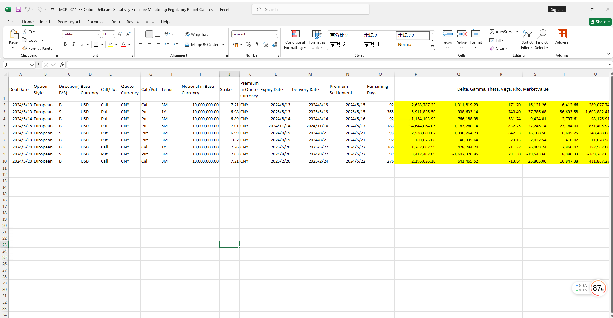

# **Option Delta and Sensitivity Exposure Monitoring Regulatory Report Case Study**

> Visit the Mathema Option Pricing System for foreign exchange options and structured product valuation!

The FX Option Delta and Sensitivity Exposure Monitoring Regulatory Report template provides functions for holiday management, yield curve construction, forward curve construction, FX volatility surface object creation, Greek value calculation, and regulatory report generation.  
Click the image below to download the template:

---

## **FX Option Delta and Sensitivity Exposure Monitoring Regulatory Report Template: Function Descriptions**

### **1. Holiday Calendar Construction Functions**
   - **[McpCalendar](/latest/api/calendar.html#excel-mcpcalendar-code-dates)**: Constructs a holiday calendar object for one or more currency pairs.
   - **[McpNCalendar](/latest/api/calendar.html#excel-mcpncalendar-ccys-holidays)**: Constructs a holiday calendar object for multiple currencies.

### **2. Yield Curve Construction Functions**
   - **[McpYieldCurve2](/latest/api/yieldcurve.html#excel-mcpyieldcurve2-args1-args2-args3-args4-args5-fmt-vp-hd)**: Constructs a yield curve object.

### **3. Forward Curve Construction Functions**
   - **[McpFXForwardPointsCurve2](/latest/api/fxforwardratecurve.html#excel-mcpfxforwardpointscurve2-args1-args2-args3-args4-args5-fmt-vp)**: Constructs a forward points curve object.

### **4. Volatility Surface Construction Functions**
   - **[McpFXVolSurface2](/latest/api/fxvolsurface.html#excel-mcpfxvolsurface2-args1-args2-args3-args4-args5-fmt-vp)**: Constructs an FX volatility surface object.

### **5. Greek Metrics Calculation Functions**
   - **[McpVoGreeks](../abc)**: Calculates Greek metrics.

### **6. Regulatory Report Generation Functions**
   - **[McpVoReport4](../abc)**: Generates regulatory reports.
