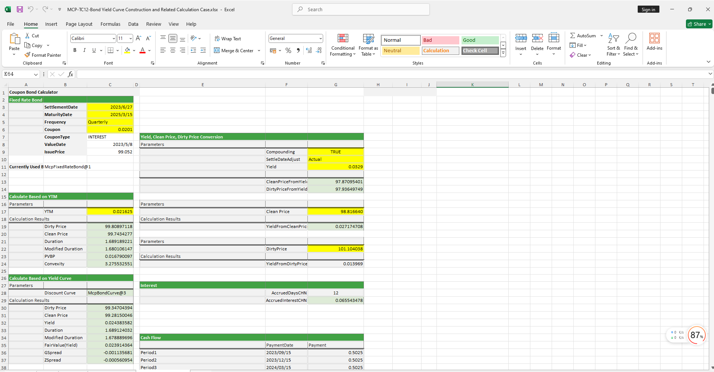

# **Bond Yield Curve Construction and Related Calculations Case Study**

> Visit the Mathema Option Pricing System for foreign exchange options and structured product valuation!

The Bond Yield Curve Construction and Related Calculations template provides functions for holiday management, BondCurve construction, FixedRateBondCurve object creation, parameter curve construction, yield-to-price conversion, and calculation of metrics such as duration, convexity, and spread.  
Click the image below to download the template:

---

## **Bond Yield Curve Construction and Related Calculations Template: Function Descriptions**

### **1. Holiday Calendar Construction Functions**
- **[McpCalendar](/latest/api/calendar.html#excel-mcpcalendar-code-dates)**: Constructs a holiday calendar object for one or more currency pairs.
- **[McpNCalendar](/latest/api/calendar.html#excel-mcpncalendar-ccys-holidays)**: Constructs a holiday calendar object for multiple currencies.

### **2. FixedRateBondCurve Construction Functions**
- **[McpFixedRateBondCurveData](/latest/api/bondcurve.html#excel-mcpfixedratebondcurvedata-args1-args2-args3-args4-args5-fmt-vp-hd)**: Constructs a FixedRateBondCurve object.

### **3. BondCurve Construction Functions**
- **[McpBondCurve2](/latest/api/bondcurve.html#excel-mcpbondcurve2-args1-args2-args3-args4-args5)**: Constructs a BondCurve object.

### **4. Curve Calibration Construction Functions**
- **[McpCalibrationSet](/latest/api/bondcurve.html#excel-mcpcalibrationset-args)**: Constructs a calibration set for storing different products (e.g., Depo, Swap, Bond) during curve calibration.

### **5. Parametric Curve Construction Functions**
- **[McpParametricCurve](/latest/api/bondcurve.html#excel-mcpparametriccurve-args1-args2-args3-args4-args5-fmt-vp-hd)**: Constructs parametric curves such as NSS, NS, and CIR.

### **6. Zero-Coupon Rate Functions**
- **[YieldCurveZeroRate](/latest/api/bondcurve.html#excel-yieldcurvezerorate-curve-date)**: Retrieves the zero-coupon rate for a given maturity date from the curve.

### **7. FixedRateBond Construction Functions**
- **[McpFixedRateBond](/latest/api/fixedratebond.html#excel-mcpfixedratebond-args1-args2-args3-args4-args5-fmt-vp)**: Constructs a FixedRateBond object.

### **8. Price Calculation Functions**
- **[FrbCleanPriceFromYieldCHN](/latest/api/fixedratebond.html#excel-frbcleanpricefromyieldchn-bond-yld-compounding-settledateadjust)**: Calculates the clean price based on the FixedRateBond object and yield.
- **[FrbDirtyPriceFromYieldCHN](/latest/api/fixedratebond.html#excel-frbdirtypricefromyieldchn-bond-yld-compounding)**: Calculates the dirty price based on the FixedRateBond object and yield.
- **[FrbPrice](/latest/api/fixedratebond.html#excel-frbprice-bond-curve)**: Calculates the dirty price based on the FixedRateBond object and BondCurve object.

### **9. Duration and Convexity Calculation Functions**
- **[FrbDurationCHN](/latest/api/fixedratebond.html#excel-frbdurationchn-bond-yld)**: Calculates the Macaulay duration based on the FixedRateBond object and yield.
- **[FrbMDurationCHN](/latest/api/fixedratebond.html#excel-frbmdurationchn-bond-yld)**: Calculates the modified duration based on the FixedRateBond object and yield.
- **[FrbConvexityCHN](/latest/api/fixedratebond.html#excel-frbconvexitychn-bond-yld)**: Calculates the convexity based on the FixedRateBond object and yield.

### **10. PVBP Calculation Functions**
- **[FrbPVBPCHN](/latest/api/fixedratebond.html#excel-frbpvbpchn-bond-yld)**: Calculates the PVBP (Price Value of a Basis Point) based on the FixedRateBond object and yield.

### **11. Yield Calculation Functions**
- **[FrbYieldFromDirtyPriceCHN](/latest/api/fixedratebond.html#excel-frbyieldfromdirtypricechn-bond-dirtyprice-compounding)**: Calculates the yield based on the FixedRateBond object and dirty price.

### **12. Fair Value Calculation Functions**
- **[FrbFairValue](/latest/api/fixedratebond.html#excel-frbfairvalue-bond-curve)**: Calculates the fair value (yield) based on the FixedRateBond object and BondCurve object.

### **13. Spread Calculation Functions**
- **[FrbGSpread](/latest/api/fixedratebond.html#excel-frbgspread-bond-yld-curve)**: Calculates the G-Spread.
- **[FrbZSpread](/latest/api/fixedratebond.html#excel-frbzspread-bond-yld-curve)**: Calculates the Z-Spread.
