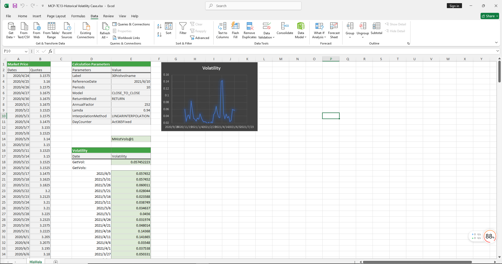

# **Historical Volatility Case Study**

> Visit the Mathema Option Pricing System for foreign exchange options and structured product valuation!

The Historical Volatility case study provides functions for constructing historical volatility objects and retrieving volatility values for specified dates. Historical volatility is a crucial tool for assessing asset risk, guiding investment decisions, and managing risk.  
Click the image below to download the template:

---

## **Historical Volatility Case Study Template: Function Descriptions**

### **1. Historical Volatility Construction Functions**
- **[McpHistVols](/latest/api/histvol.html#excel-mcphistvols-args1-args2-args3-args4-args5-fmt-vp-hd)**: Constructs a historical volatility object.

### **2. Volatility Retrieval Functions**
- **[HvsGetVol](/latest/api/histvol.html#excel-hvsgetvol-hv-referencedate)**: Retrieves the volatility for a specified date from the historical volatility object.
- **[HvsGetVols](/latest/api/histvol.html#excel-hvsgetvols-hv-referencedates-format-v)**: Retrieves volatility values for a set of dates from the historical volatility object.
