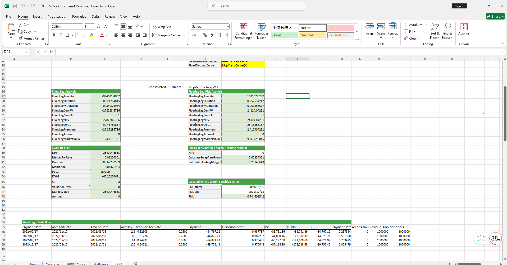

# **Interest Rate Swap (IRS) Case Study**

> Visit the Mathema Option Pricing System for foreign exchange options and structured product valuation!

The Interest Rate Swap (IRS) case study provides functions for holiday management, valuation and discount curve construction, IRS object creation, fixed and floating leg analysis, and swap result analysis.  
Click the image below to download the template:

---

## **Interest Rate Swap Case Study Template: Function Descriptions**

### **1. Holiday Calendar Construction Functions**
- **[McpCalendar](/latest/api/calendar.html#excel-mcpcalendar-code-dates)**: Constructs a holiday calendar object.

### **2. Curve Construction Functions**
- **[McpYieldCurve](/latest/api/yieldcurve.html#excel-mcpyieldcurve-args1-args2-args3-args4-args5-fmt-vp-hd)**: Constructs valuation and discount curves.

### **3. IRS Construction Functions**
- **[McpVanillaSwap](/latest/api/vanillaswap.html#excel-mcpvanillaswap-args1-args2-args3-args4-args5-fmt-vp)**: Constructs an IRS object.

### **4. Fixed Leg Analysis Functions**
- **[SwapFixedLegAnnuity](/latest/api/vanillaswap.html#excel-swapfixedlegannuity-vanillaswap)**: Calculates the annuity.
- **[SwapFixedLegDuration](/latest/api/vanillaswap.html#excel-swapfixedlegduration-vanillaswap)**: Calculates the duration.
- **[SwapFixedLegMDuration](/latest/api/vanillaswap.html#excel-swapfixedlegmduration-vanillaswap)**: Calculates the modified duration.
- **[SwapFixedLegCumPV](/latest/api/vanillaswap.html#excel-swapfixedlegcumpv-vanillaswap)**: Calculates the cumulative present value.
- **[SwapFixedLegCumCF](/latest/api/vanillaswap.html#excel-swapfixedlegcumcf-vanillaswap)**: Calculates the cumulative cash flow.
- **[SwapFixedLegNPV](/latest/api/vanillaswap.html#excel-swapfixedlegnpv-vanillaswap)**: Calculates the net present value (NPV).
- **[SwapFixedLegDV01](/latest/api/vanillaswap.html#excel-swapfixedlegdv01-vanillaswap)**: Calculates the DV01.
- **[SwapFixedLegPremium](/latest/api/vanillaswap.html#excel-swapfixedlegpremium-vanillaswap)**: Calculates the premium.
- **[SwapFixedLegAccrued](/latest/api/vanillaswap.html#excel-swapfixedlegaccrued-vanillaswap)**: Calculates the accrued interest.
- **[SwapFixedLegMarketValue](/latest/api/vanillaswap.html#excel-swapfixedlegmarketvalue-vanillaswap)**: Calculates the market value.

### **5. Floating Leg Analysis Functions**
- **[SwapFloatingLegAnnuity](/latest/api/vanillaswap.html#excel-swapfloatinglegannuity-vanillaswap)**: Calculates the annuity.
- **[SwapFloatingLegDuration](/latest/api/vanillaswap.html#excel-swapfloatinglegduration-vanillaswap)**: Calculates the duration.
- **[SwapFloatingLegMDuration](/latest/api/vanillaswap.html#excel-swapfloatinglegmduration-vanillaswap)**: Calculates the modified duration.
- **[SwapFloatingLegCumPV](/latest/api/vanillaswap.html#excel-swapfloatinglegcumpv-vanillaswap)**: Calculates the cumulative present value.
- **[SwapFloatingLegCumCF](/latest/api/vanillaswap.html#excel-swapfloatinglegcumcf-vanillaswap)**: Calculates the cumulative cash flow.
- **[SwapFloatingLegNPV](/latest/api/vanillaswap.html#excel-swapfloatinglegnpv-vanillaswap)**: Calculates the net present value (NPV).
- **[SwapFloatingLegDV01](/latest/api/vanillaswap.html#excel-swapfloatinglegdv01-vanillaswap)**: Calculates the DV01.
- **[SwapFloatingLegPremium](/latest/api/vanillaswap.html#excel-swapfloatinglegpremium-vanillaswap)**: Calculates the premium.
- **[SwapFloatingLegAccrued](/latest/api/vanillaswap.html#excel-swapfloatinglegaccrued-vanillaswap)**: Calculates the accrued interest.
- **[SwapFloatingLegMarketValue](/latest/api/vanillaswap.html#excel-swapfloatinglegmarketvalue-vanillaswap)**: Calculates the market value.

### **6. Swap Result Functions**
- **[SwapNPV](/latest/api/vanillaswap.html#excel-swapnpv-vanillaswap)**: Calculates the net present value (NPV).
- **[SwapMarketParRate](/latest/api/vanillaswap.html#excel-swapmarketparrate-vanillaswap)**: Calculates the Par Rate/Yield.
- **[SwapDuration](/latest/api/vanillaswap.html#excel-swapduration-vanillaswap)**: Calculates the duration.
- **[SwapMDuration](/latest/api/vanillaswap.html#excel-swapmduration-vanillaswap)**: Calculates the modified duration.
- **[SwapPV01](/latest/api/vanillaswap.html#excel-swappv01-vanillaswap)**: Calculates the PVBP.
- **[SwapDV01](/latest/api/vanillaswap.html#excel-swapdv01-vanillaswap)**: Calculates the DV01.
- **[SwapCF](/latest/api/vanillaswap.html#excel-swapcf-vanillaswap)**: Calculates the cash flow.
- **[SwapValuationDayCF](/latest/api/vanillaswap.html#excel-swapvaluationdaycf-vanillaswap)**: Calculates the valuation day cash flow.
- **[SwapMarketValue](/latest/api/vanillaswap.html#excel-swapmarketvalue-vanillaswap)**: Calculates the market value.
- **[SwapAccrued](/latest/api/vanillaswap.html#excel-swapaccrued-vanillaswap)**: Calculates the accrued interest.
- **[SwapPNL](/latest/api/vanillaswap.html#excel-swappnl-vanillaswap-start-end)**: Calculates the P&L.

### **7. Pricing Functions**
- **[SwapCalculateSwapRateFromNPV](/latest/api/vanillaswap.html#excel-swapcalculateswapratefromnpv-vanillaswap-npv)**: Derives the fixed leg rate from the NPV.
- **[SwapCalculateFloatingMarginFromNPV](/latest/api/vanillaswap.html#excel-swapcalculatefloatingmarginfromnpv-vanillaswap-npv)**: Derives the floating leg margin from the NPV.
- **[SwapFixedLegs](/latest/api/vanillaswap.html#excel-swapfixedlegs-vanillaswap-fields)**: Calculates the fixed leg cash flows.
- **[SwapFloatingLegs](/latest/api/vanillaswap.html#excel-swapfloatinglegs-vanillaswap-fields)**: Calculates the floating leg cash flows.

### **8. Fixing Frequency and Fixing Price Functions**
- **[SwapFloatingQuotes](/latest/api/vanillaswap.html#excel-swapfloatingquotes-vanillaswap-fields)**: Calculates the floating leg fixing frequency and fixing price.
- **[SwapFloatingQuoteLegs](/latest/api/vanillaswap.html#excel-swapfloatingquotelegs-vanillaswap-fields)**: Calculates the floating leg fixing frequency and fixing price.

### **9. FRTB Sensitivity Indicator Functions**
- **[SwapFrtbGirrDeltas](/latest/api/vanillaswap.html#excel-swapfrtbgirrdeltas-swap-ccylocrate-1-0-fmt-v)**: Calculates FRTB sensitivity indicators.