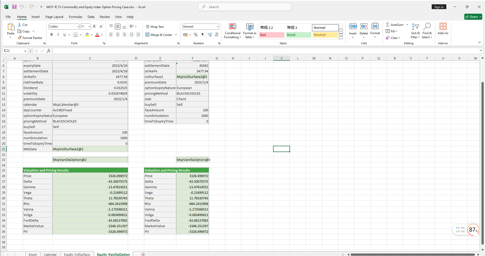

# **Commodity and Equity Index Option Pricing Case Study**

> Visit the Mathema Option Pricing System for foreign exchange options and structured product valuation!

The Commodity and Equity Index Option Pricing template provides functions for holiday management, risk-free rate curve construction, commodity and equity index volatility surface construction, option object creation, option pricing, and Greek value calculation. It enables precise modeling, pricing, and risk analysis of commodity and equity index options.  
Click the image below to download the template:

---

## **Commodity and Equity Index Option Pricing Template: Function Descriptions**

### **1. Holiday Calendar Construction Functions**
- **[McpCalendar](/latest/api/calendar.html#excel-mcpcalendar-code-dates)**: Constructs a holiday calendar object for one or more currency pairs.
- **[McpNCalendar](/latest/api/calendar.html#excel-mcpncalendar-ccys-holidays)**: Constructs a holiday calendar object for multiple currencies.

### **2. Risk-Free Rate Curve Construction Functions**
- **[McpYieldCurve2](/latest/api/yieldcurve.html#excel-mcpyieldcurve2-args1-args2-args3-args4-args5-fmt-vp-hd)**: Constructs a risk-free rate curve object.

### **3. Volatility Surface Construction Functions**
- **[McpVolSurface2](/latest/api/volsurface.html#excel-mcpvolsurface2-args1-args2-args3-args4-args5-fmt-vp)**: Constructs a commodity and equity index volatility surface object.

### **4. Volatility Surface Information Retrieval Functions**
- **[VolSurface2GetReferenceDate](/latest/api/volsurface.html#excel-volsurface2getreferencedate-vs)**: Retrieves the reference date from the volatility surface.
- **[VolSurface2GetSpotDate](/latest/api/volsurface.html#excel-volsurface2getspotdate-vs)**: Retrieves the spot date from the volatility surface.
- **[VolSurface2GetForward](/latest/api/volsurface.html#excel-volsurface2getforward-vs-expiryordeliverydate-isdeliverydate-bidmidask)**: Retrieves the forward price for a specified expiry date from the volatility surface.
- **[VolSurface2Strikes](/latest/api/volsurface.html#excel-volsurface2strikes-vs-bidmidask-fmt-v)**: Retrieves the strikes from the volatility surface.
- **[VolSurface2ExpiryDates](/latest/api/volsurface.html#excel-volsurface2expirydates-vs-bidmidask-fmt-v)**: Retrieves the expiry dates from the volatility surface.
- **[VolSurface2GetVolatility](/latest/api/volsurface.html#excel-volsurface2getvolatility-vs-strike-maturitydate-bidmidask-midforward)**: Retrieves the volatility for a specified strike and maturity date from the volatility surface.

### **5. Option Object Construction Functions**
- **[McpVanillaOption](/latest/api/vanillaoption.html#excel-mcpvanillaoption-args1-args2-args3-args4-args5-fmt)**: Constructs a VanillaOption object.

### **6. Option Calculation Functions**
- **[McpPrice](/latest/api/vanillaoption.html#excel-mcpprice-obj-isamount-true)**: Calculates the option premium.
- **[McpDelta](/latest/api/vanillaoption.html#excel-mcpdelta-obj-isccy2-false-isamount-true-pricingmethod-1-isclosedformmethod-true)**: Calculates the Delta of the option.
- **[McpVega](/latest/api/vanillaoption.html#excel-mcpvega-obj-isccy2-false-isamount-true-pricingmethod-1-isclosedformmethod-true)**: Calculates the Vega of the option.
- **[McpGamma](/latest/api/vanillaoption.html#excel-mcpgamma-obj-isccy2-false-isamount-true-pricingmethod-1-isclosedformmethod-true)**: Calculates the Gamma of the option.
- **[McpTheta](/latest/api/vanillaoption.html#excel-mcptheta-obj-isccy2-false-isamount-true-pricingmethod-1-isclosedformmethod-true)**: Calculates the Theta of the option.
- **[McpVanna](/latest/api/vanillaoption.html#excel-mcpvanna-obj-isccy2-false-isamount-true-pricingmethod-1-isclosedformmethod-true)**: Calculates the Vanna of the option.
- **[McpVolga](/latest/api/vanillaoption.html#excel-mcpvolga-obj-isccy2-false-isamount-true-pricingmethod-1-isclosedformmethod-true)**: Calculates the Volga of the option.
- **[McpForwardDelta](/latest/api/vanillaoption.html#excel-mcpforwarddelta-obj-isccy2-false-isamount-true-pricingmethod-1-isclosedformmethod-true)**: Calculates the Forward Delta of the option.
- **[McpRho](/latest/api/vanillaoption.html#excel-mcprho-obj-isccy2-false-isamount-true-pricingmethod-1-isclosedformmethod-true)**: Calculates the Rho of the option.
- **[McpMarketValue](/latest/api/vanillaoption.html#excel-mcpmarketvalue-obj-isamount-true)**: Calculates the market value of the option.
- **[McpPV](/latest/api/vanillaoption.html#excel-mcppv-obj-isamount-true)**: Calculates the present value (PV) of the option.

