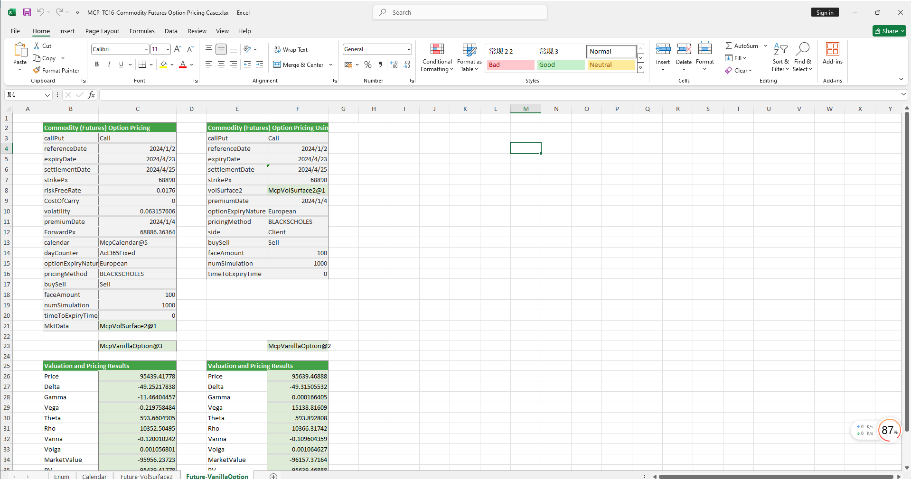

# **Commodity Futures Option Pricing Case**

> Visit the Mathema Option Pricing System for foreign exchange options and structured product valuation!

The commodity futures option pricing template provides a full-process functionality, including holiday management, risk-free interest rate curve construction, forward curve construction, commodity futures volatility surface construction, commodity futures option object creation, option pricing, and Greek value calculation. It is designed to achieve precise modeling, pricing, and risk analysis of commodity futures options.

Click the image below to download the template:

---

## **Commodity Futures Option Pricing Template Function Description**

### **1. Holiday Constructor Functions**
- **[McpCalendar](/latest/api/calendar.html#excel-mcpcalendar-code-dates)**: Constructs a holiday object for one or more currency pairs.
- **[McpNCalendar](/latest/api/calendar.html#excel-mcpncalendar-ccys-holidays)**: Constructs holiday objects for multiple currencies.

### **2. Risk-Free Interest Rate Curve Constructor**
- **[McpYieldCurve2](/latest/api/yieldcurve.html#excel-mcpyieldcurve2-args1-args2-args3-args4-args5-fmt-vp-hd)**: Constructs a risk-free interest rate curve object.

### **3. Forward Curve Constructor**
- **[McpForwardCurve2](/latest/api/forwardratecurve.html#excel-mcpforwardcurve2-args1-args2-args3-args4-args5-fmt-vp-hd)**: Constructs a forward curve object.

### **4. Commodity Futures Volatility Surface Constructor**
- **[McpVolSurface2](/latest/api/volsurface.html#excel-mcpvolsurface2-args1-args2-args3-args4-args5-fmt-vp)**: Constructs a commodity futures volatility surface object.

### **5. Volatility Surface Information Retrieval Functions**
- **[VolSurface2GetReferenceDate](/latest/api/volsurface.html#excel-volsurface2getreferencedate-vs)**: Retrieves the ReferenceDate from the volatility surface.
- **[VolSurface2GetSpotDate](/latest/api/volsurface.html#excel-volsurface2getspotdate-vs)**: Retrieves the SpotDate from the volatility surface.
- **[VolSurface2GetForward](/latest/api/volsurface.html#excel-volsurface2getforward-vs-expiryordeliverydate-isdeliverydate-bidmidask)**: Retrieves the Forward for a specified expiry or delivery date from the volatility surface.
- **[VolSurface2Strikes](/latest/api/volsurface.html#excel-volsurface2strikes-vs-bidmidask-fmt-v)**: Retrieves the Strikes from the volatility surface.
- **[VolSurface2ExpiryDates](/latest/api/volsurface.html#excel-volsurface2expirydates-vs-bidmidask-fmt-v)**: Retrieves the ExpiryDates from the volatility surface.
- **[VolSurface2GetVolatility](/latest/api/volsurface.html#excel-volsurface2getvolatility-vs-strike-maturitydate-bidmidask-midforward)**: Retrieves the volatility from the volatility surface.

### **6. Option Object Constructor**
- **[McpVanillaOption](/latest/api/vanillaoption.html#excel-mcpvanillaoption-args1-args2-args3-args4-args5-fmt)**: Constructs a VanillaOption object.

### **7. Option Premium Calculation Function**
- **[McpPrice](/latest/api/vanillaoption.html#excel-mcpprice-obj-isamount-true)**: Calculates the option premium.

### **8. Greek Value Calculation Functions**
- **[McpDelta](/latest/api/vanillaoption.html#excel-mcpdelta-obj-isccy2-false-isamount-true-pricingmethod-1-isclosedformmethod-true)**: Calculates the Delta value of the option.
- **[McpVega](/latest/api/vanillaoption.html#excel-mcpvega-obj-isccy2-false-isamount-true-pricingmethod-1-isclosedformmethod-true)**: Calculates the Vega value of the option.
- **[McpGamma](/latest/api/vanillaoption.html#excel-mcpgamma-obj-isccy2-false-isamount-true-pricingmethod-1-isclosedformmethod-true)**: Calculates the Gamma value of the option.
- **[McpTheta](/latest/api/vanillaoption.html#excel-mcptheta-obj-isccy2-false-isamount-true-pricingmethod-1-isclosedformmethod-true)**: Calculates the Theta value of the option.
- **[McpVanna](/latest/api/vanillaoption.html#excel-mcpvanna-obj-isccy2-false-isamount-true-pricingmethod-1-isclosedformmethod-true)**: Calculates the Vanna value of the option.
- **[McpVolga](/latest/api/vanillaoption.html#excel-mcpvolga-obj-isccy2-false-isamount-true-pricingmethod-1-isclosedformmethod-true)**: Calculates the Volga value of the option.
- **[McpForwardDelta](/latest/api/vanillaoption.html#excel-mcpforwarddelta-obj-isccy2-false-isamount-true-pricingmethod-1-isclosedformmethod-true)**: Calculates the ForwardDelta value of the option.
- **[McpRho](/latest/api/vanillaoption.html#excel-mcprho-obj-isccy2-false-isamount-true-pricingmethod-1-isclosedformmethod-true)**: Calculates the Rho value of the option.

### **9. Market Value and Present Value Calculation Functions**
- **[McpMarketValue](/latest/api/vanillaoption.html#excel-mcpmarketvalue-obj-isamount-true)**: Calculates the MarketValue of the option.
- **[McpPV](/latest/api/vanillaoption.html#excel-mcppv-obj-isamount-true)**: Calculates the PV (Present Value) of the option.
