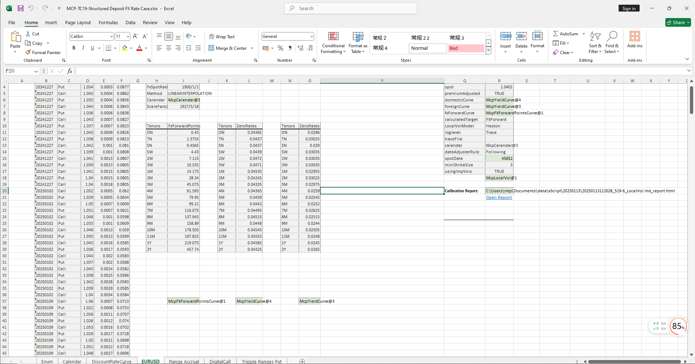

# **Structured Deposit FX Case**

> Visit the Mathema Option Pricing System for foreign exchange options and structured product valuation!

The structured deposit FX case template provides a full-process functionality, including holiday management, risk-free interest rate curve construction, forward curve construction, volatility surface construction, structured product definition, XScrip object creation, structured product pricing, and Greek value calculation. It is designed to achieve precise modeling, pricing, and risk analysis of structured deposit FX products.

Click the image below to download the template:

---

## **Structured Deposit FX Case Template Function Description**

### **1. Holiday Constructor Functions**
- **[McpCalendar](/latest/api/calendar.html#excel-mcpcalendar-code-dates)**: Constructs a holiday object for one or more currency pairs.
- **[McpNCalendar](/latest/api/calendar.html#excel-mcpncalendar-ccys-holidays)**: Constructs holiday objects for multiple currencies.

### **2. Discount Curve and Interest Rate Curve Constructor**
- **[McpYieldCurve](/latest/api/yieldcurve.html#excel-mcpyieldcurve-args1-args2-args3-args4-args5-fmt-vp-hd)**: Constructs discount curve and interest rate curve objects.

### **3. Forward Curve Constructor**
- **[McpFXForwardPointsCurve](/latest/api/fxforwardratecurve.html#excel-mcpfxforwardpointscurve-args1-args2-args3-args4-args5-fmt-vp)**: Constructs a forward curve object.

### **4. Volatility Surface Constructor**
- **[McpLocalVol](/latest/api/localvol.html#excel-mcplocalvol-args1-args2-args3-args4-args5-fmt-dt-vp-hd)**: Constructs a Local volatility surface object.

### **5. Report Generation Function**
- **[HmReport](/latest/api/localvol.html#excel-hmreport-obj)**: Generates a Local report.

### **6. Product Structure Definition Function**
- **[McpStructureDef](/latest/api/xscriptstructure.html#excel-mcpstructuredef-packagename-structure-schedule1-payoff-schedule2)**: Defines the product structure.

### **7. XScrip Object Constructor**
- **[McpXScriptStructure](/latest/api/xscriptstructure.html#excel-mcpxscriptstructure-args1-args2-args3-args4-args5-fmt-vp-hd)**: Constructs an XScrip object.

### **8. Option Premium Calculation Function**
 **[XssPrice](/latest/api/xscriptstructure.html#excel-xssprice-obj-isamount-true)**: Calculates the option premium.

### **9. Greek Value Calculation Functions**
- **[XssDelta](/latest/api/xscriptstructure.html#excel-xssdelta-obj-isccy2-true-isamount-true)**: Calculates the Delta value.
- **[XssVega](/latest/api/xscriptstructure.html#excel-xssvega-obj-isccy2-true-isamount-true)**: Calculates the Vega value.
- **[XssGamma](/latest/api/xscriptstructure.html#excel-xssgamma-obj-isccy2-true-isamount-true)**: Calculates the Gamma value.
- **[XssTheta](/latest/api/xscriptstructure.html#excel-xsstheta-obj-isccy2-true-isamount-true)**: Calculates the Theta value.
- **[XssVanna](/latest/api/xscriptstructure.html#excel-xssvanna-obj-isccy2-true-isamount-true)**: Calculates the Vanna value.
- **[XssVolga](/latest/api/xscriptstructure.html#excel-xssvolga-obj-isccy2-true-isamount-true)**: Calculates the Volga value.
- **[XssForwardDelta](/latest/api/xscriptstructure.html#excel-xssforwarddelta-obj-isccy2-true-isamount-true)**: Calculates the Forward Delta value.
- **[XssRho](/latest/api/xscriptstructure.html#excel-xssrho-obj-isccy2-true-isamount-true)**: Calculates the Rho value.

### **10. Market Value and Present Value Calculation Functions**
- **[XssMarketValue](/latest/api/xscriptstructure.html#excel-xssmarketvalue-obj-isamount-true)**: Calculates the MarketValue.
- **[XssPV](/latest/api/xscriptstructure.html#excel-xsspv-obj-isamount-true)**: Calculates the PV (Present Value).

### **11. Yield Calculation Function**
- **[XssAnnualizedPrice](/latest/api/xscriptstructure.html#excel-xssannualizedprice-obj)**: Calculates the Return%.

### **12. Payoff Event Output Function**
- **[McpProductEvents](/latest/api/xscriptstructure.html#excel-mcpproductevents-prod)**: Outputs Payoff events.

### **13. Option Premium Back-Calculation Function**
- **[SolverFromPremium](/latest/api/xscriptstructure.html#excel-solverfrompremium-priceobj-premium-targetfield-x0-1-0-bracket-100-100-method-bisect-options-maxiter-50-xtol-1e-6-isannualized-false)**: Back-calculates based on the option premium.