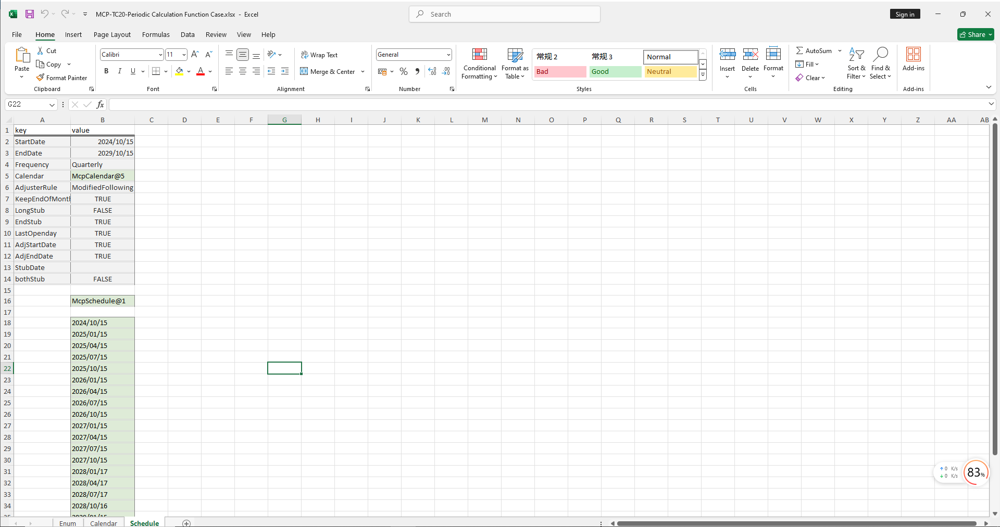

# **Schedule Calculation Function Case**

> Visit the Mathema Option Pricing System for foreign exchange options and structured product valuation!

The Schedule calculation function case template provides functionality for holiday management, Schedule object construction, and retrieving corresponding Dates from Schedule objects.

Click the image below to download the template:

---

## **Schedule Calculation Function Case Template Function Description**

### **1. Holiday Constructor Functions**
- **[McpCalendar](/latest/api/calendar.html#excel-mcpcalendar-code-dates)**: Constructs a holiday object for one or more currency pairs.
- **[McpNCalendar](/latest/api/calendar.html#excel-mcpncalendar-ccys-holidays)**: Constructs holiday objects for multiple currencies.

### **2. Schedule Constructor Function**
- **[McpSchedule](/latest/api/schedule.html#excel-mcpschedule-args1-args2-args3-args4-args5-fmt-vp)**: Constructs a Schedule object.

### **3. Schedule Object Operation Function**
- **[ScheduleDates](/latest/api/schedule.html#excel-scheduledates-obj)**: Retrieves corresponding Dates from the Schedule object.