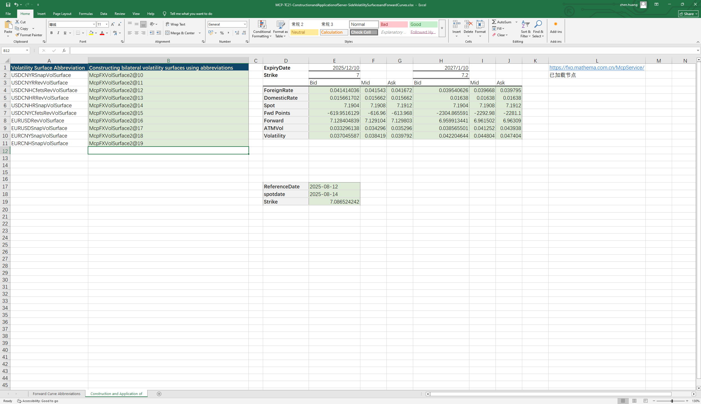

# **Example of Server-Side Forward Curve and Volatility Surface Construction**

> Visit the Mathema Option Pricing System for foreign exchange options and structured product valuation!

The server-side constructs objects using the abbreviation of the forward curve and the abbreviation of the volatility surface, retrieving the corresponding maturity's swap points and forward prices from the forward curve, and obtaining the corresponding maturity's ATMVol, interest rate, swap points, forward prices, and volatility from the volatility surface
Click the image below to download the template：

---

---

## **The server-side constructs a bilateral forward curve object using the abbreviation of the forward curve**

### **1. Server-side Forward Curve Constructor**
   - **[McpFXForwardPointsCurves2](/latest/api/fxforwardratecurve.html#excel-mcpfxforwardpointscurves2-identifiers-refdate)**：The server creates a bilateral forward curve object from the forward curve abbreviation.

### **2. Forward Curve Data Extraction Function**
   - **[Fxfpc2FXForwardPoints](/latest/api/fxforwardratecurve.html#excel-fxfpc2fxforwardpoints-curve-date-bidmidask)**：从双边远期曲线对象上取掉期点。
   - **[Fxfpc2FXForwardOutright](/latest/api/fxforwardratecurve.html#excel-fxfpc2fxforwardoutright-curve-date-bidmidask)**：从双边远期曲线对象上取掉远期价格。

### **3. Server-side Construction of Volatility Surfaces**
   - **[McpVolSurfaces](/latest/api/fxvolsurface.html#excel-mcpvolsurfaces-identifiers)**：The server-side constructs a bilateral volatility surface object using the abbreviation of the volatility surface。

### **4. Volatility Surface Data Extraction**
   - **[FXVolSurface2GetReferenceDate](/latest/api/fxvolsurface.html#excel-fxvolsurface2getreferencedate-vs)**：Retrieves the reference date of the volatility surface.
   - **[FXVolSurface2GetSpotDate](/latest/api/fxvolsurface.html#excel-fxvolsurface2getspotdate-vs)**：Retrieves the spot date of the volatility surface.
   - **[FXVolSurface2GetSpot](/latest/api/fxvolsurface.html#excel-fxvolsurface2getspot-vs-bidmidask)**： Retrieves the spot price from the volatility surface.
   - **[FXVolSurface2GetStrike](/latest/api/fxvolsurface.html#excel-fxvolsurface2getstrike-vs-deltastring-tenor-bidmidask)**： Retrieves the strike for a given tenor and DeltaString.
   - **[FXVolSurface2GetVolatility](/latest/api/fxvolsurface.html#excel-fxvolsurface2getvolatility-vs-strike-expirydate-bidmidask-midforward-0-0-bidinputdeltavolpair-askinputdeltavolpair)**：Retrieves the volatility for a given strike and expiry date.
   - **[FXVolSurface2GetATMVol](/latest/api/fxvolsurface.html#excel-fxvolsurface2getatmvol-vs-expirydate-bidmidask)**：Retrieves the ATM volatility for a given expiry date.
   - **[FXVolSurface2GetForeignRate](/latest/api/fxvolsurface.html#excel-fxvolsurface2getforeignrate-vs-expiryordeliverydate-isdeliverydate-bidmidask)**：Retrieves the CCY1 interest rate for a given expiry date.
   - **[FXVolSurface2GetDomesticRate](/latest/api/fxvolsurface.html#excel-fxvolsurface2getdomesticrate-vs-expiryordeliverydate-isdeliverydate-bidmidask)**：Retrieves the CCY2 interest rate for a given expiry date.
   - **[FXVolSurface2GetForwardPoint](/latest/api/fxvolsurface.html#excel-fxvolsurface2getforwardpoint-vs-expiryordeliverydate-isdeliverydate-bidmidask)**：Retrieves the swap points for a given expiry date.
   - **[FXVolSurface2GetForward](/latest/api/fxvolsurface.html#excel-fxvolsurface2getforward-vs-expiryordeliverydate-isdeliverydate-bidmidask)**：Retrieves the forward price for a given expiry date.

  
