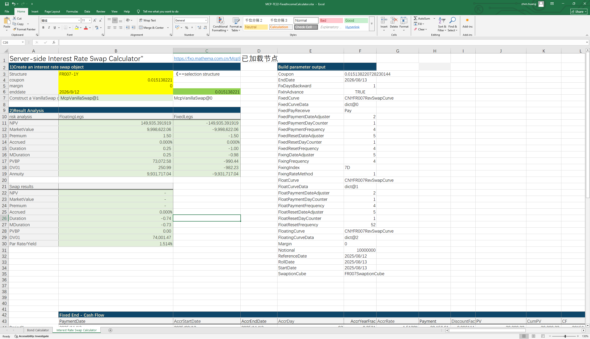

# **Server-side Bond and Interest Rate Swap Calculator Case Study**

> Visit the Mathema Option Pricing System for foreign exchange options and structured product valuation!

Server-side bond object construction and related functions for calculating yield, clean price, dirty price, duration, convexity, spread, and other metrics; server-side interest rate swap object construction, fixed-leg analysis, floating-leg analysis, and swap result analysis.
Click the image below to download the template:

---

---

## **Server-Side Construction of Bond Objects and Interest Rate Swap Objects Using Bond Codes and Structure Abbreviations, Along with Application Function Descriptions**

### **1. Server-side bond object construction and function to retrieve the latest transaction price**
   - **[McpFixedRateBonds2](/latest/api/fixedratebond.html#excel-mcpfixedratebonds2-identifiers-settlement-date)**：Constructor function for the server-side bond object。
   - **[McpGet1](/latest/api/fixedratebond.html#excel-mcpget1-identifiers-key)**：The server retrieves the latest transaction price for the specified bond code。

### **2. Price Calculation Functions**
- **[FrbCleanPriceFromYieldCHN](/latest/api/fixedratebond.html#excel-frbcleanpricefromyieldchn-bond-yld-compounding-settledateadjust)**：Calculates the clean price based on the FixedRateBond object and yield.
- **[FrbDirtyPriceFromYieldCHN](/latest/api/fixedratebond.html#excel-frbdirtypricefromyieldchn-bond-yld-compounding)**：Calculates the dirty price based on the FixedRateBond object and yield.
- **[FrbPrice](/latest/api/fixedratebond.html#excel-frbprice-bond-curve)**：Calculates the dirty price based on the FixedRateBond object and BondCurve object.

### **3. Duration and Convexity Calculation Functions**
- **[FrbDurationCHN](/latest/api/fixedratebond.html#excel-frbdurationchn-bond-yld)**：Calculates the Macaulay duration based on the FixedRateBond object and yield.
- **[FrbMDurationCHN](/latest/api/fixedratebond.html#excel-frbmdurationchn-bond-yld)**：Calculates the modified duration based on the FixedRateBond object and yield.
- **[FrbConvexityCHN](/latest/api/fixedratebond.html#excel-frbconvexitychn-bond-yld)**：Calculates the convexity based on the FixedRateBond object and yield.

### **4. PVBP Calculation Functions**
- **[FrbPVBPCHN](/latest/api/fixedratebond.html#excel-frbpvbpchn-bond-yld)**：Calculates the PVBP (Price Value of a Basis Point) based on the FixedRateBond object and yield.

### **5. Yield Calculation Functions**
- **[FrbYieldFromDirtyPriceCHN](/latest/api/fixedratebond.html#excel-frbyieldfromdirtypricechn-bond-dirtyprice-compounding)**：Calculates the yield based on the FixedRateBond object and dirty price.

### **6.Server-side Interest Rate Swap Object Constructor**
   - **[McpVanillaSwaps2](/latest/api/vanillaswap.html#excel-mcpvanillaswaps2-identifiers-enddate-swaprate-point)**：The server implements a VanillaSwap object via an IRS (Interest Rate Swap) framework.

### **7. Fixed Leg Analysis Functions**
- **[SwapFixedLegAnnuity](/latest/api/vanillaswap.html#excel-swapfixedlegannuity-vanillaswap)**：Calculates the annuity.
- **[SwapFixedLegDuration](/latest/api/vanillaswap.html#excel-swapfixedlegduration-vanillaswap)**：Calculates the duration.
- **[SwapFixedLegMDuration](/latest/api/vanillaswap.html#excel-swapfixedlegmduration-vanillaswap)**：Calculates the modified duration.
- **[SwapFixedLegNPV](/latest/api/vanillaswap.html#excel-swapfixedlegnpv-vanillaswap)**：Calculates the net present value (NPV).
- **[SwapFixedLegDV01](/latest/api/vanillaswap.html#excel-swapfixedlegdv01-vanillaswap)**：Calculates the DV01.
- **[SwapFixedLegPremium](/latest/api/vanillaswap.html#excel-swapfixedlegpremium-vanillaswap)**：Calculates the premium.
- **[SwapFixedLegAccrued](/latest/api/vanillaswap.html#excel-swapfixedlegaccrued-vanillaswap)**：Calculates the accrued interest.
- **[SwapFixedLegMarketValue](/latest/api/vanillaswap.html#excel-swapfixedlegmarketvalue-vanillaswap)**：Calculates the market value.

### **8. Floating Leg Analysis Functions**
- **[SwapFloatingLegAnnuity](/latest/api/vanillaswap.html#excel-swapfloatinglegannuity-vanillaswap)**：Calculates the annuity.
- **[SwapFloatingLegDuration](/latest/api/vanillaswap.html#excel-swapfloatinglegduration-vanillaswap)**：Calculates the duration.
- **[SwapFloatingLegMDuration](/latest/api/vanillaswap.html#excel-swapfloatinglegmduration-vanillaswap)**：Calculates the modified duration.
- **[SwapFloatingLegNPV](/latest/api/vanillaswap.html#excel-swapfloatinglegnpv-vanillaswap)**：Calculates the net present value (NPV).
- **[SwapFloatingLegDV01](/latest/api/vanillaswap.html#excel-swapfloatinglegdv01-vanillaswap)**：Calculates the DV01.
- **[SwapFloatingLegPremium](/latest/api/vanillaswap.html#excel-swapfloatinglegpremium-vanillaswap)**：Calculates the premium.
- **[SwapFloatingLegAccrued](/latest/api/vanillaswap.html#excel-swapfloatinglegaccrued-vanillaswap)**：Calculates the accrued interest.
- **[SwapFloatingLegMarketValue](/latest/api/vanillaswap.html#excel-swapfloatinglegmarketvalue-vanillaswap)**：Calculates the market value.

### **9. Swap Result Functions**
- **[SwapNPV](/latest/api/vanillaswap.html#excel-swapnpv-vanillaswap)**： Calculates the net present value (NPV).
- **[SwapMarketParRate](/latest/api/vanillaswap.html#excel-swapmarketparrate-vanillaswap)**：Calculates the Par Rate/Yield.
- **[SwapDuration](/latest/api/vanillaswap.html#excel-swapduration-vanillaswap)**：Calculates the duration.
- **[SwapMDuration](/latest/api/vanillaswap.html#excel-swapmduration-vanillaswap)**：Calculates the modified duration.
- **[SwapPV01](/latest/api/vanillaswap.html#excel-swappv01-vanillaswap)**：Calculates the PVBP.
- **[SwapDV01](/latest/api/vanillaswap.html#excel-swapdv01-vanillaswap)**：Calculates the DV01.
- **[SwapMarketValue](/latest/api/vanillaswap.html#excel-swapmarketvalue-vanillaswap)**：Calculates the market value.
- **[SwapAccrued](/latest/api/vanillaswap.html#excel-swapaccrued-vanillaswap)**：Calculates the accrued interest.

### **10. Pricing Functions**
- **[SwapFixedLegs](/latest/api/vanillaswap.html#excel-swapfixedlegs-vanillaswap-fields)**：Calculates the fixed leg cash flows.
- **[SwapFloatingLegs](/latest/api/vanillaswap.html#excel-swapfloatinglegs-vanillaswap-fields)**：Calculates the floating leg cash flows.

### **11. Fixing Frequency and Fixing Price Functions**
- **[SwapFloatingQuotes](/latest/api/vanillaswap.html#excel-swapfloatingquotes-vanillaswap-fields)**：Calculates the floating leg fixing frequency and fixing price.
- **[SwapFloatingQuoteLegs](/latest/api/vanillaswap.html#excel-swapfloatingquotelegs-vanillaswap-fields)**：Calculates the floating leg fixing frequency and fixing price.

  
