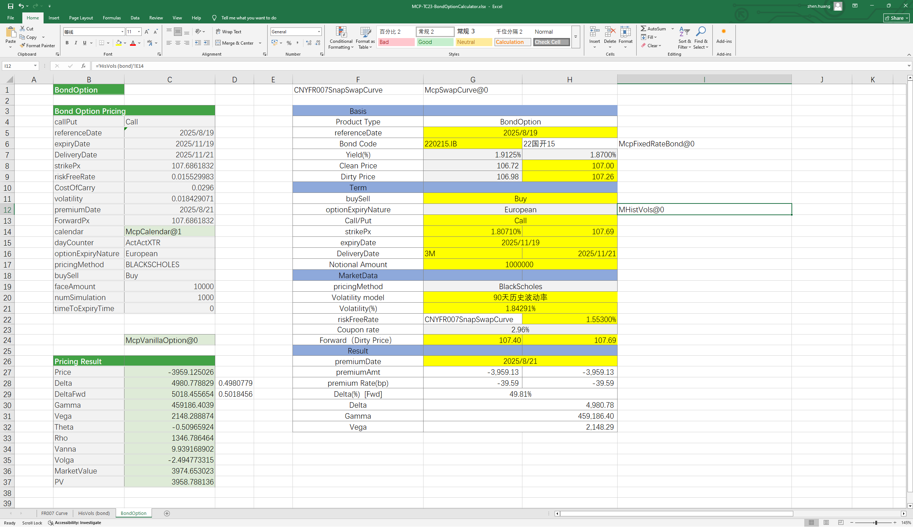

# ****Bond Option Calculator Case Study****

> Visit the Mathema Option Pricing System for foreign exchange options and structured product valuation!

Bond Option Calculator: Provides calculations for bond pricing and Greeks, analysis of historical volatility (constructed using the clean price of bonds), computation of payoff charts, and mutual conversion between yield, clean price, and full price.
Click the image below to download the template:

---

---

## **Bond Option Calculator Case Template Function Description**

### **1.Holiday Constructor**
- **[McpCalenders](/latest/api/calendar.html#excel-mcpcalenders-ccy)**：Construct one or more holiday objects for currency pairs.

### **2.SwapCurve constructor**
- **[McpVanillaSwapCurveData](/latest/api/yieldcurve.html#excel-mcpvanillaswapcurvedata-args-data)**：Constructs a Vanilla Swap Curve object.
- **[McpSwapCurve](/latest/api/yieldcurve.html#excel-mcpswapcurve-args1-args2-args3-args4-args5-fmt-vp)**： Constructs a Swap Curve object.

### **3.Product Storage Functions**
- **[McpCalibrationSet](/latest/api/bondcurve.html#excel-mcpcalibrationset-args)**：Used to store different products (e.g., Depo, Swap, Bond) when building an interest rate curve and calibrate the curve using the bootstrapping method.

### **4.Historical Volatility Construction Functions**
- **[McpHistVols](/latest/api/histvol.html#excel-mcphistvols-args1-args2-args3-args4-args5-fmt-vp-hd)**：Constructs a historical volatility object.

### **5.Option Object Construction Functions**
   - **[McpVanillaOption](/latest/api/vanillaoption.html#excel-mcpvanillaoption-args1-args2-args3-args4-args5-fmt)**：Constructs a VanillaOption object.

### **6.Option Premium Calculation Functions**
   - **[McpPrice](/latest/api/vanillaoption.html#excel-mcpprice-obj-isamount-true)**：Calculates the option premium

### **7.Greek Value Calculation Functions**
   - **[McpDelta](/latest/api/vanillaoption.html#excel-mcpdelta-obj-isccy2-false-isamount-true-pricingmethod-1-isclosedformmethod-true)**：Calculates Delta。
   - **[McpVega](/latest/api/vanillaoption.html#excel-mcpvega-obj-isccy2-false-isamount-true-pricingmethod-1-isclosedformmethod-true)**：Calculates Vega。
   - **[McpGamma](/latest/api/vanillaoption.html#excel-mcpgamma-obj-isccy2-false-isamount-true-pricingmethod-1-isclosedformmethod-true)**：Calculates Gamma。
   - **[McpTheta](/latest/api/vanillaoption.html#excel-mcptheta-obj-isccy2-false-isamount-true-pricingmethod-1-isclosedformmethod-true)**：Calculates Theta。
   - **[McpVanna](/latest/api/vanillaoption.html#excel-mcpvanna-obj-isccy2-false-isamount-true-pricingmethod-1-isclosedformmethod-true)**：Calculates Vanna。
   - **[McpVolga](/latest/api/vanillaoption.html#excel-mcpvolga-obj-isccy2-false-isamount-true-pricingmethod-1-isclosedformmethod-true)**：Calculates Volga。
   - **[McpForwardDelta](/latest/api/vanillaoption.html#excel-mcpforwarddelta-obj-isccy2-false-isamount-true-pricingmethod-1-isclosedformmethod-true)**：Calculates Forward Delta。
   - **[McpMarketValue](/latest/api/vanillaoption.html#excel-mcpmarketvalue-obj-isamount-true)**：Calculates MarketValue。
   - **[McpPV](/latest/api/vanillaoption.html#excel-mcppv-obj-isamount-true)**：Calculates PV。

