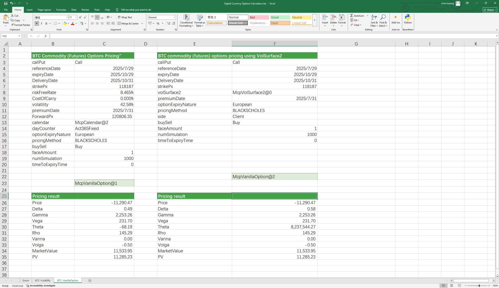

# **Digital Currency Option Pricing Case Study**

> Visit the Mathema Option Pricing System for foreign exchange options and structured product valuation!

Digital Currency Option Calculator: Provides pricing for major cryptocurrencies such as BTC/ETH, including simple European, American, Asian, barrier, and common combination options (e.g., risk reversal, butterfly, straddle, strangle, seagull, etc.), with calculations for option premiums and Greeks. Utilizes various pricing models such as Black-Scholes and Monte Carlo to ensure more accurate pricing.
Click the image below to download the template:

---

---

## **Instructions for Using the Digital Currency Option Pricing Template Functions**

### **1.Holiday Constructor**
- **[McpCalendar](/latest/api/calendar.html#excel-mcpcalendar-code-dates)**: Constructs a holiday object for one or more currency pairs.

### **2. Risk-Free Interest Rate Curve Constructor**
- **[McpYieldCurve2](/latest/api/yieldcurve.html#excel-mcpyieldcurve2-args1-args2-args3-args4-args5-fmt-vp-hd)**：Constructs a risk-free interest rate curve object.

### **3. Forward Curve Constructor**
- **[McpForwardCurve2](/latest/api/forwardratecurve.html#excel-mcpforwardcurve2-args1-args2-args3-args4-args5-fmt-vp-hd)**: Constructs a forward curve object.

### **4. Commodity Futures Volatility Surface Constructor**
- **[McpVolSurface2](/latest/api/volsurface.html#excel-mcpvolsurface2-args1-args2-args3-args4-args5-fmt-vp)**: Constructs a commodity futures volatility surface object.

### **5. Option Object Constructor**
- **[McpVanillaOption](/latest/api/vanillaoption.html#excel-mcpvanillaoption-args1-args2-args3-args4-args5-fmt)**: Constructs a VanillaOption object.

### **6. Option Premium Calculation Function**
- **[McpPrice](/latest/api/vanillaoption.html#excel-mcpprice-obj-isamount-true)**: Calculates the option premium.

### **7. Greek Value Calculation Functions**
- **[McpDelta](/latest/api/vanillaoption.html#excel-mcpdelta-obj-isccy2-false-isamount-true-pricingmethod-1-isclosedformmethod-true)**: Calculates the Delta value of the option.
- **[McpVega](/latest/api/vanillaoption.html#excel-mcpvega-obj-isccy2-false-isamount-true-pricingmethod-1-isclosedformmethod-true)**: Calculates the Vega value of the option.
- **[McpGamma](/latest/api/vanillaoption.html#excel-mcpgamma-obj-isccy2-false-isamount-true-pricingmethod-1-isclosedformmethod-true)**: Calculates the Gamma value of the option.
- **[McpTheta](/latest/api/vanillaoption.html#excel-mcptheta-obj-isccy2-false-isamount-true-pricingmethod-1-isclosedformmethod-true)**: Calculates the Theta value of the option.
- **[McpVanna](/latest/api/vanillaoption.html#excel-mcpvanna-obj-isccy2-false-isamount-true-pricingmethod-1-isclosedformmethod-true)**: Calculates the Vanna value of the option.
- **[McpVolga](/latest/api/vanillaoption.html#excel-mcpvolga-obj-isccy2-false-isamount-true-pricingmethod-1-isclosedformmethod-true)**: Calculates the Volga value of the option.
- **[McpForwardDelta](/latest/api/vanillaoption.html#excel-mcpforwarddelta-obj-isccy2-false-isamount-true-pricingmethod-1-isclosedformmethod-true)**: Calculates the ForwardDelta value of the option.
- **[McpRho](/latest/api/vanillaoption.html#excel-mcprho-obj-isccy2-false-isamount-true-pricingmethod-1-isclosedformmethod-true)**: Calculates the Rho value of the option.

### **8. Market Value and Present Value Calculation Functions**
- **[McpMarketValue](/latest/api/vanillaoption.html#excel-mcpmarketvalue-obj-isamount-true)**: Calculates the MarketValue of the option.
- **[McpPV](/latest/api/vanillaoption.html#excel-mcppv-obj-isamount-true)**: Calculates the PV (Present Value) of the option.
