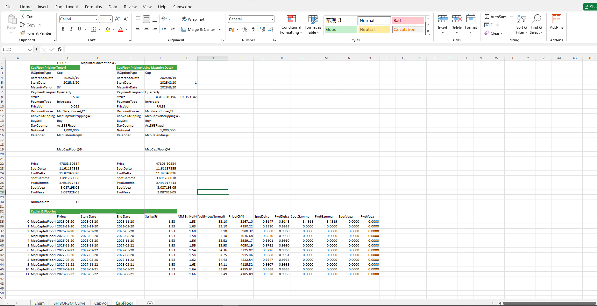

# **Interest Rate Cap and Floor Option Case Study**

> Visit the Mathema Option Pricing System for foreign exchange options and structured product valuation!

Interest Rate Option Calculator: Provides premium and Greeks calculation for interest rate cap options, floor options, and swaptions related to structures such as FROO7 and SHIBOR3M. For interest rate cap and floor options, it includes analysis functions for Caplet & Floorlet as well as curve analysis.
Click the image below to download the template:

---

---

## **Interest Rate Cap and Floor Option Case Template Function Usage Description**

### **1.  Holiday Calendar Construction Functions**
- **[McpCalenders](/latest/api/calendar.html#excel-mcpcalenders-ccy)**：Constructs a holiday calendar object.

### **2. SwapCurve Construction Functions**
- **[McpVanillaSwapCurveData](/latest/api/yieldcurve.html#excel-mcpvanillaswapcurvedata-args-data)**：Constructs a Vanilla Swap Curve object.
- **[McpSwapCurve](/latest/api/yieldcurve.html#excel-mcpswapcurve-args1-args2-args3-args4-args5-fmt-vp)**：Constructs a Swap Curve object.

### **3. Related Functions**
- **[McpCapVolStripping](/latest/api/Interestrateoption.html#excel-mcpcapvolstripping-marketquotes-args)**：Constructs a CapVol object.
- **[McpRateConvention](/latest/api/vanillaswap.html#excel-mcprateconvention-conventionname)**：Retrieves structure-related parameters.
- **[McpCapFloor](/latest/api/Interestrateoption.html#excel-mcpcapfloor-args1-args2-args3-args4-args5-fmt-vp)**：Constructs a CapFloor object.
- **[CvsATMRate](/latest/api/Interestrateoption.html#excel-cvsatmrate-cvs-expirydate)**：Calculates the ATMRate.
- **[CvsYieldVolAtTandK](/latest/api/Interestrateoption.html#excel-cvsyieldvolattandk-cvs-capletexpiry-strike)**：Calculates the Vol.

### **4. Calculation-Related Functions**
- **[CapFloorPrice](/latest/api/Interestrateoption.html#excel-capfloorprice-obj)**：Calculates the Price.
- **[CapFloorSpotDelta](/latest/api/Interestrateoption.html#excel-capfloorspotdelta-obj)**：Calculates the SpotDelta。
- **[CapFloorFwdDelta](/latest/api/Interestrateoption.html#excel-capfloorfwddelta-obj)**：Calculates the FwdDelta。
- **[CapFloorSpotGamma](/latest/api/Interestrateoption.html#excel-capfloorspotgamma-obj)**：Calculates the SpotGamma。
- **[CapFloorFwdGamma](/latest/api/Interestrateoption.html#excel-capfloorfwdgamma-obj)**：Calculates the FwdGamma。
- **[CapFloorSpotVega](/latest/api/Interestrateoption.html#excel-capfloorspotvega-obj)**：Calculates the SpotVega。
- **[CapFloorFwdVega](/latest/api/Interestrateoption.html#excel-capfloorfwdvega-obj)**：Calculates the FwdVega。
- **[CapFloorGetCaplet](/latest/api/Interestrateoption.html#excel-capfloorgetcaplet-obj-idx)**：Extracts the pricing information or related parameters of a specific Caplet (or Floorlet) from a complete Cap (or Floor) contract.
- **[CapfloorletFixingDate](/latest/api/Interestrateoption.html#excel-capfloorletfixingdate-obj)**：Retrieves the Fixing Date.
- **[CapfloorletCalcStartDate](/latest/api/Interestrateoption.html#excel-capfloorletcalcstartdate-obj)**：Retrieves the Start Date.
- **[CapfloorletCalcEndDate](/latest/api/Interestrateoption.html#excel-capfloorletcalcenddate-obj)**：Retrieves the End Date.
- **[CapfloorletPrice](/latest/api/Interestrateoption.html#excel-capfloorletprice-obj)**： Calculates the Price.
- **[CapFloorletSpotDelta](/latest/api/Interestrateoption.html#excel-capfloorletspotdelta-obj)**：Calculates the SpotDelta。
- **[CapFloorletFwdDelta](/latest/api/Interestrateoption.html#excel-capfloorletfwddelta-obj)**：Calculates the FwdDelta。
- **[CapFloorletSpotGamma](/latest/api/Interestrateoption.html#excel-capfloorletspotgamma-obj)**：Calculates the SpotGamma。
- **[CapFloorletFwdGamma](/latest/api/Interestrateoption.html#excel-capfloorletfwdgamma-obj)**：Calculates the FwdGamma。
- **[CapFloorletSpotVega](/latest/api/Interestrateoption.html#excel-capfloorletspotvega-obj)**：Calculates the SpotVega。
- **[CapFloorletFwdVega](/latest/api/Interestrateoption.html#excel-capfloorletfwdvega-obj)**：计算FwdVega。

