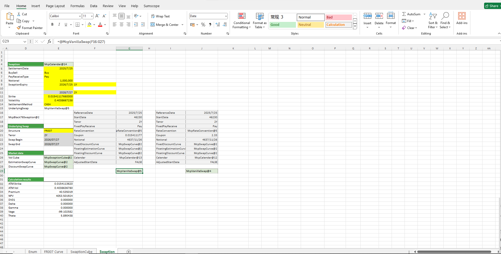

# **Option on Interest Rate Swap Case**

> Visit the Mathema Option Pricing System for foreign exchange options and structured product valuation!

"Interest Rate Option Calculator: Provides calculation functions for option premiums and Greeks of interest rate cap options, interest rate floor options, and interest rate swap options with related structures such as FROO7 and SHIBOR3M. For interest rate cap options and interest rate floor options, it includes analysis functions for Caplets & Floorlets as well as curve analysis."
Click the image below to download the template:

---

---

## **Interest Rate Swap Option Case Template Function Description**

### **1.  Holiday Calendar Construction Functions**
- **[McpCalenders](/latest/api/calendar.html#excel-mcpcalenders-ccy)**：Constructs a holiday calendar object.

### **2. SwapCurve Construction Functions**
- **[McpVanillaSwapCurveData](/latest/api/yieldcurve.html#excel-mcpvanillaswapcurvedata-args-data)**：Constructs a Vanilla Swap Curve object.
- **[McpSwapCurve](/latest/api/yieldcurve.html#excel-mcpswapcurve-args1-args2-args3-args4-args5-fmt-vp)**：Constructs a Swap Curve object.

### **3. IRS Construction Functions**
- **[McpVanillaSwap](/latest/api/vanillaswap.html#excel-mcpvanillaswap-args1-args2-args3-args4-args5-fmt-vp)**：Constructs an IRS object.

### **4. Related Construction Functions**
- **[McpSwaptionCube1](/latest/api/Interestrateoption.html#excel-mcpswaptioncube1-strikeorspreads-atmvols-args)**：Constructs a SwaptionCube1 object.
- **[McpSwaption](/latest/api/Interestrateoption.html#excel-mcpswaption-args1-args2-args3-args4-args5-fmt-vp)**：Constructs a Swaption object.

### **5. Calculation-Related Functions**
- **[McpGetStartDate](/latest/api/vanillaswap.html#excel-mcpgetstartdate-obj)**： Retrieves the start date of the interest rate swap.
- **[McpGetEndDate](/latest/api/vanillaswap.html#excel-mcpgetenddate-obj)**：Retrieves the end date of the interest rate swap.
- **[ScAtmStrike](/latest/api/Interestrateoption.html#excel-scatmstrike-sc-expirydate-maturity)**：Calculates the AtmStrike.
- **[ScAtmVol](/latest/api/Interestrateoption.html#excel-scatmvol-sc-expirydate-maturity)**：Calculates the ATM Vol.
- **[SwaptionPrice1](/latest/api/Interestrateoption.html#excel-swaptionprice1-obj)**： Calculates the Price.
- **[SwaptionNPV](/latest/api/Interestrateoption.html#excel-swaptionnpv-obj)**：Calculates the NPV.
- **[SwaptionDV01](/latest/api/Interestrateoption.html#excel-swaptiondv01-obj)**：Calculates the DV01。
- **[SwaptionDelta](/latest/api/Interestrateoption.html#excel-swaptiondelta-obj)**：Calculates the Delta。
- **[SwaptionGamma](/latest/api/Interestrateoption.html#excel-swaptiongamma-obj)**：Calculates the Gamma。
- **[SwaptionVega](/latest/api/Interestrateoption.html#excel-swaptionvega-obj)**：Calculates the Vega。
- **[SwaptionTheta](/latest/api/Interestrateoption.html#excel-swaptiontheta-obj)**：Calculates the Theta。

