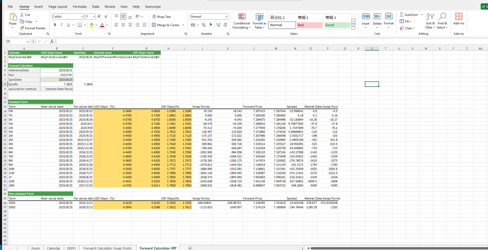

# **Case of Foreign Exchange Interest Rate Parity Calculator**

> Visit the Mathema Option Pricing System for foreign exchange options and structured product valuation!

Providing the functionality to calculate swap points and forward prices for both standard and non-standard tenors in bulk using two different methods—swap points and interest rate parity—as well as calculating the worst bid and ask prices and their corresponding dates within an optional period.
Click the image below to download the template:

---

---

## **FX and Interest Rate Parity Calculator Case Template Function Description**

### **1.  Holiday Calendar Construction Functions**
   - **[McpCalendar](/latest/api/calendar.html#excel-mcpcalendar-code-dates)**： Constructs holiday calendar objects for one or more currency pairs.
   - **[McpNCalendar](/latest/api/calendar.html#excel-mcpncalendar-ccys-holidays)**：Constructs holiday calendar objects for multiple currencies.

### **3. Interest Rate Curve and Forward Curve Construction Functions**
   - **[McpYieldCurve2](/latest/api/yieldcurve.html#excel-mcpyieldcurve2-args1-args2-args3-args4-args5-fmt-vp-hd)**：Interest Rate Curve and Forward Curve Construction Functions
   - **[McpFXForwardPointsCurve2](/latest/api/fxforwardratecurve.html#excel-mcpfxforwardpointscurve2-args1-args2-args3-args4-args5-fmt-vp)**：Constructs a bilateral forward curve object.

### **4. Calculation-Related Functions**
   - **[YieldCurve2ZeroRate](/latest/api/yieldcurve.html#excel-yieldcurve2zerorate-curve-date-bidmidask)**：Retrieves the interest rate for a specified maturity date from a bilateral YieldCurve.
   - **[Fxfpc2FXForwardPoints](/latest/api/fxforwardratecurve.html#excel-fxfpc2fxforwardpoints-curve-date-bidmidask)**：Retrieves swap points from a bilateral forward curve object.
   - **[Fxfpc2FXForwardOutright](/latest/api/fxforwardratecurve.html#excel-fxfpc2fxforwardoutright-curve-date-bidmidask)**：Retrieves the forward outright price from a bilateral forward curve object.
   - **[Fxfpc2TOForwardOutright](/latest/api/fxforwardratecurve.html#excel-fxfpc2toforwardoutright-curve-startdate-enddate-findmax-bidmidask)**：Calculates the worst price within a time option period.
   - **[Fxfpc2TimeOptionDate](/latest/api/fxforwardratecurve.html#excel-fxfpc2timeoptiondate-curve-startdate-enddate-findmax-bidmidask)**：Calculates the date corresponding to the worst price within a time option period.
   - **[ImpliedFwdPoints](/latest/api/fxforwardratecurve.html#excel-impliedfwdpoints-pair-baserate-termrate-spot-spotdate-deliverydate)**：Calculates swap points using interest rates.
   - **[ImpliedForward](/latest/api/fxforwardratecurve.html#excel-impliedforward-pair-baserate-termrate-spot-spotdate-deliverydate)**：Calculates the forward price using interest rates.
 
 
