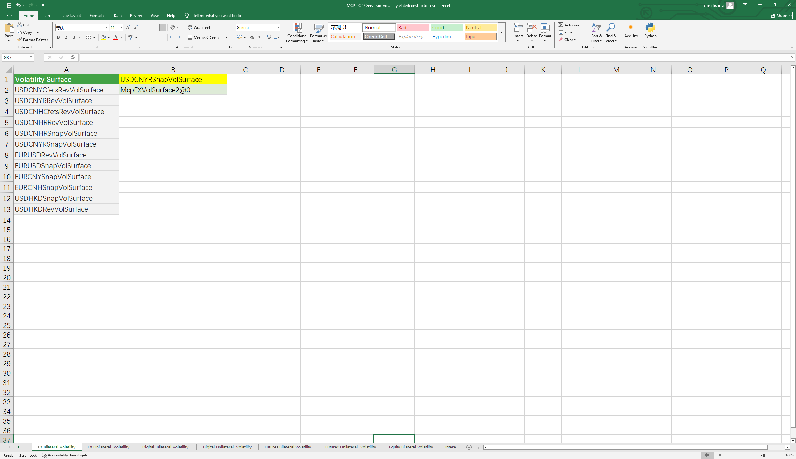

# **Case studies of functions related to server-side volatility construction**

> Visit the Mathema Option Pricing System for foreign exchange options and structured product valuation!

The server-side provides constructors for related volatility measures such as foreign exchange, futures, indices, digital options, interest rate volatility, and CapFloor volatility.
Click the image below to download the template:

---

---

## **Server-Side Object Construction via Forward Curve Short Names and Volatility Surface Short Names and Application Function Descriptions**

### **1.  Server-Side Foreign Exchange Volatility Constructor Functions**
   - **[McpFXVolSurface2ByName](/latest/api/Serverside.html#excel-mcpfxvolsurface2byname-identifiers)**：Constructs a bilateral volatility surface on the server side using a volatility surface short name.
   - **[McpFXVolSurfaceByName](/latest/api/Serverside.html#excel-mcpfxvolsurfacebyname-identifiers)**：Constructs a unilateral volatility surface on the server side using a volatility surface short name.

### **2. Server-Side Futures and Digital Currency Volatility Constructor Functions**
   - **[McpVolSurface2ByName](/latest/api/Serverside.html#excel-mcpvolsurface2byname-identifiers-flag-false)**：Constructs a bilateral volatility surface on the server side using an UNDERLYING identifier.
   - **[McpVolSurfaceByName](/latest/api/Serverside.html#excel-mcpvolsurface2byname-identifiers-flag-false)**：Constructs a unilateral volatility surface on the server side using an UNDERLYING identifier.

### **3. Server-Side Commodity Index Volatility Surface Constructor Functions**
   - **[McpVolSurface2Equity](/latest/api/Serverside.html#excel-mcpvolsurface2equity-identifiers)**：Constructs a bilateral volatility surface on the server side using an UNDERLYING identifier.

### **4. Server-Side Interest Rate Volatility and CapFloor Volatility Constructor Functions**
   - **[McpSwaptionCubes](/latest/api/Serverside.html#excel-mcpswaptioncubes-identifiers)**：Constructs an interest rate volatility surface on the server side using a volatility short name.
   - **[McpCapVolSurface](/latest/api/Serverside.html#excel-mcpcapvolsurface-identifiers)**：Constructs a CapFloor volatility surface on the server side using a volatility short name.
  
