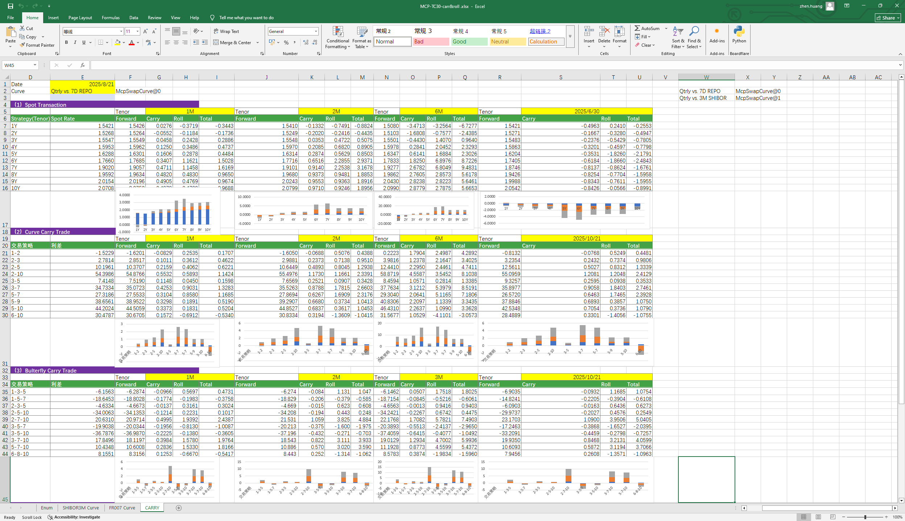

# **Carry & Roll Case**

> Visit the Mathema Option Pricing System for foreign exchange options and structured product valuation!

Providing calculations for interest rates, spreads, carry, roll, forward rates, and related indicators associated with spot trading, curve spread trading, butterfly spread trading, and forward trading.
Click the image below to download the template:

---

---

## **Carry&Roll Case Template Function Description**

### **1.  Holiday Calendar Construction Functions**
- **[McpCalenders](/latest/api/calendar.html#excel-mcpcalenders-ccy)**：Constructs a holiday calendar object.

### **2. SwapCurve Construction Functions**
- **[McpVanillaSwapCurveData](/latest/api/yieldcurve.html#excel-mcpvanillaswapcurvedata-args-data)**：Constructs a Vanilla Swap Curve object.
- **[McpSwapCurve](/latest/api/yieldcurve.html#excel-mcpswapcurve-args1-args2-args3-args4-args5-fmt-vp)**：Constructs a Swap Curve object.

### **3. Functions for Handling Different Products**
- **[McpCalibrationSet](/latest/api/bondcurve.html#excel-mcpcalibrationset-args)**：Used during the construction of an interest rate curve to incorporate different products (such as Depos, Swaps, Bonds, etc.) and calibrate the curve using the bootstrapping method.

### **4.Calculation-Related Functions**
- **[SwapCurveParSwapRate](/latest/api/yieldcurve.html#excel-swapcurveparswaprate-curve-start-end)**：Calculates the par swap rate.
- **[SwapCurveCarry](/latest/api/yieldcurve.html#excel-swapcurvecarry-curve-horizon-maturityperiod)**：Calculates the Carry.
- **[SwapCurveRoll](/latest/api/yieldcurve.html#excel-swapcurveroll-curve-horizon-maturityperiod)**：Calculates the Roll.

