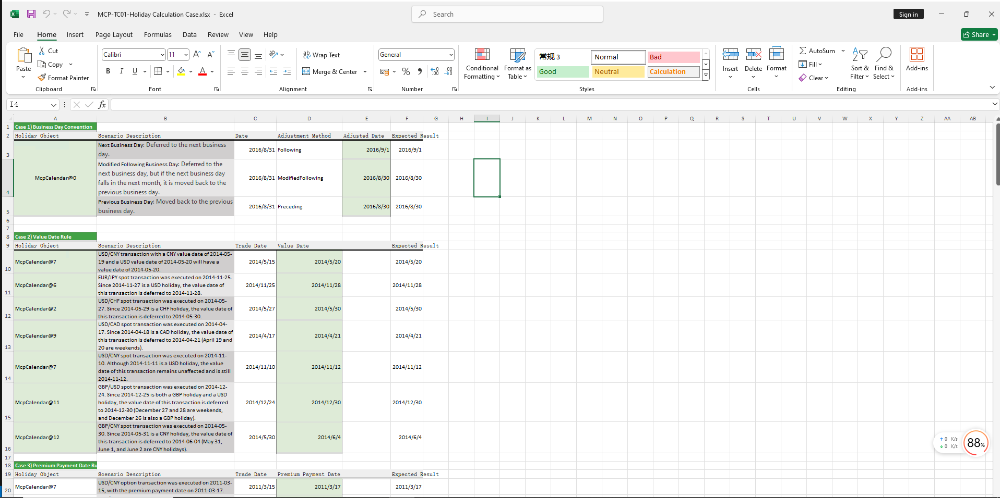

# **节假日计算案例**


> 访问猛犸期权定价系统，支持外汇期权和结构化产品定价估值！
[](https://fxo.mathema.com.cn)

节假日计算案例提供节假日对象构造，起息日、期权费支付日期、到期日、交割日、增加工作日及期限、近端起息日及远端起息日等日期相关的计算。
点击下面图片下载模板：

---
[](./MCP-TC01-HolidayCalculationCase.xlsx)
---

## **节假日计算模板使用函数说明**

### **1. 节假日构造函数**
   - **[McpCalendar](/zh/latest/api/calendar.html#excel-mcpcalendar-code-dates)**：构造一个或多个货币对的节假日对象。
   - **[McpNCalendar](/zh/latest/api/calendar.html#excel-mcpncalendar-ccys-holidays)**：构造多个货币的节假日对象。

### **2. 营业日调整函数**
   - **[CalendarAdjust](/zh/latest/api/calendar.html#excel-calendaradjust-cal-date-rule-calendarcodes)**：营业日调整。

### **3. 起息日和期权费支付日计算函数**
   - **[CalendarValueDate](/zh/latest/api/calendar.html#excel-calendarvaluedate-cal-date-isfollowing-true-calendarcodes)**：计算起息日和期权费支付日。

### **4. 交割日计算函数**
   - **[CalendarAddPeriod](/zh/latest/api/calendar.html#excel-calendaraddperiod-cal-date-tenor-dateadjustrule-dateadjusterrule-actual-endofmonthrule-false-lastopenday-false-calendarcodes)**：计算交割日。
   - **[CalendarFXODeliveryDateFromTenor](/zh/latest/api/calendar.html#excel-calendarfxodeliverydatefromtenor-cal-referencedate-tenor-spotdate-calendarcodes)**：根据期限计算交割日。

### **5. 到期日计算函数**
   - **[CalendarFXOExpiryDate](/zh/latest/api/calendar.html#excel-calendarfxoexpirydate-cal-date-calendarcodes)**：通过交割日计算到期日。
   - **[CalendarFXOExpiryDateFromTenor](/zh/latest/api/calendar.html#excel-calendarfxoexpirydatefromtenor-cal-referencedate-tenor-spotdate-calendarcodes)**：根据期限计算到期日。

### **6. 增加工作日函数**
   - **[CalendarAddBusinessDays](/zh/latest/api/calendar.html#excel-calendaraddbusinessdays-cal-date-count-calendarcodes)**：增加工作日。

### **7. 增加期限函数**
   - **[CalendarAddPeriod](/zh/latest/api/calendar.html#excel-calendaraddperiod-cal-date-tenor-dateadjustrule-dateadjusterrule-actual-endofmonthrule-false-lastopenday-false-calendarcodes)**：增加期限。

### **8. 判断日期是否是节假日的函数**
   - **[CalendarIsBusinessDay](/zh/latest/api/calendar.html#excel-calendarisbusinessday-cal-date-calendarcodes)**：判断给定日期是否是节假日。

### **9. 近端和远期起息日计算函数**
   - **[CalendarValueDateTenor](/zh/latest/api/calendar.html#excel-calendarvaluedatetenor-cal-date-tenor-calendarcodes-isfarleg-true)**：计算给定期限的近端和远期起息日。

## **python代码示例**

下面是节假日相关的构造函数、以及如何使用节假日进行日期计算的函数示例

---

### **1. 构造方法解释及代码**

#### **准备节假日数据**
  ```python
import json

import pandas as pd
from pandas.testing import assert_frame_equal

import mcp.wrapper
from mcp.utils.enums import DateAdjusterRule

# 节假日测试数据
from mcp.tools import McpCalendar

usd_dates = ['2009-1-1', '2009-1-19', '2009-2-16', '2009-5-25', '2009-7-3', '2009-9-7', '2009-10-12', '2009-11-11',
             '2009-11-26', '2009-12-25', '2010-1-1', '2010-1-18', '2010-2-15', '2010-5-31', '2010-7-5', '2010-9-6',
             '2010-10-11', '2010-11-11', '2010-11-25', '2011-1-17', '2011-2-21', '2011-5-30', '2011-7-4', '2011-9-5',
             '2011-10-10', '2011-11-11', '2011-11-24', '2011-12-26', '2012-1-2', '2012-1-16', '2012-2-20', '2012-5-28',
             '2012-7-4', '2012-9-3', '2012-10-8', '2012-11-12', '2012-11-22', '2012-12-25', '2013-1-1', '2013-1-21',
             '2013-2-18', '2013-5-27', '2013-7-4', '2013-9-2', '2013-10-14', '2013-11-11', '2013-11-28', '2013-12-25',
             '2014-1-1', '2014-1-20', '2014-2-17', '2014-5-19', '2014-7-4', '2014-9-1', '2014-10-13', '2014-11-11',
             '2014-11-27', '2014-12-25', '2015-1-1', '2015-1-19', '2015-2-16', '2015-5-25', '2015-9-7', '2015-10-12',
             '2015-11-11', '2015-11-26', '2015-12-25', '2016-1-1', '2016-1-18', '2016-2-15', '2016-5-30', '2016-7-4',
             '2016-9-5', '2016-10-10', '2016-11-11', '2016-11-24', '2016-12-26', '2017-1-2', '2017-1-16', '2017-2-20',
             '2017-5-29', '2017-7-4', '2017-9-4', '2017-10-9', '2017-11-23', '2017-12-25', '2018-1-1', '2018-1-15',
             '2018-2-19', '2018-5-28', '2018-7-4', '2018-9-3', '2018-10-8', '2018-11-12', '2018-11-22', '2018-12-25',
             '2019-1-1', '2019-1-21', '2019-2-18', '2019-5-27', '2019-7-4', '2019-9-2', '2019-10-14', '2019-11-11',
             '2019-11-28', '2019-12-25', '2020-1-1', '2020-1-20', '2020-2-17', '2020-5-25', '2020-9-7', '2020-10-12',
             '2020-11-11', '2020-11-26', '2020-12-25', '2021-1-1', '2021-1-18', '2021-2-15', '2021-5-31', '2021-7-5',
             '2021-9-6', '2021-10-11', '2021-11-11', '2021-11-25', '2022-1-17', '2022-2-21', '2022-5-30', '2022-6-20',
             '2022-7-4', '2022-9-5', '2022-10-10', '2022-11-11', '2022-11-24', '2022-12-26', '2023-1-2', '2023-1-16',
             '2023-2-20', '2023-5-29', '2023-6-19', '2023-7-4', '2023-9-4', '2023-10-9', '2023-11-23', '2023-12-25',
             '2024-1-1', '2024-1-15', '2024-2-19', '2024-5-27', '2024-6-19', '2024-7-4', '2024-9-2', '2024-10-14',
             '2024-11-11', '2024-11-28', '2024-12-25', '2025-1-1', '2025-1-20', '2025-2-17', '2025-5-26', '2025-7-4',
             '2025-9-1', '2025-10-13', '2025-11-11', '2025-11-27', '2025-12-25', '2026-1-1', '2026-1-19', '2026-2-16',
             '2026-5-25', '2026-9-7', '2026-10-12', '2026-11-11', '2026-11-26', '2026-12-25', '2027-1-1', '2027-1-18',
             '2027-2-15', '2027-5-31', '2027-7-5', '2027-9-6', '2027-10-11', '2027-11-11', '2027-11-25', '2028-1-17',
             '2028-2-21', '2028-5-29', '2028-7-4', '2028-9-4', '2028-10-9', '2028-11-23', '2028-12-25', '2029-1-1',
             '2029-1-15', '2029-2-19', '2029-5-28', '2029-7-4', '2029-9-3', '2029-10-8', '2029-11-12', '2029-11-22',
             '2029-12-25', '2030-1-1', '2030-1-21', '2030-2-18', '2030-5-27', '2030-7-4', '2030-9-2', '2030-10-14',
             '2030-11-11', '2030-11-28', '2030-12-25']
cny_dates = ['2009-1-1', '2009-1-2', '2009-1-26', '2009-1-27', '2009-1-28', '2009-1-29', '2009-1-30', '2009-4-6',
             '2009-5-1', '2009-5-28', '2009-5-29', '2009-10-1', '2009-10-2', '2009-10-5', '2009-10-6', '2009-10-7',
             '2009-10-8', '2010-1-1', '2010-2-15', '2010-2-16', '2010-2-17', '2010-2-18', '2010-2-19', '2010-4-5',
             '2010-5-3', '2010-6-14', '2010-6-15', '2010-6-16', '2010-9-22', '2010-9-23', '2010-9-24', '2010-10-1',
             '2010-10-4', '2010-10-5', '2010-10-6', '2010-10-7', '2011-1-3', '2011-2-2', '2011-2-3', '2011-2-4',
             '2011-2-7', '2011-2-8', '2011-4-4', '2011-4-5', '2011-5-2', '2011-6-6', '2011-9-12', '2011-10-3',
             '2011-10-4', '2011-10-5', '2011-10-6', '2011-10-7', '2012-1-2', '2012-1-3', '2012-1-23', '2012-1-24',
             '2012-1-25', '2012-1-26', '2012-1-27', '2012-4-2', '2012-4-3', '2012-4-4', '2012-4-30', '2012-5-1',
             '2012-6-22', '2012-10-1', '2012-10-2', '2012-10-3', '2012-10-4', '2012-10-5', '2013-1-1', '2013-1-2',
             '2013-1-3', '2013-2-11', '2013-2-12', '2013-2-13', '2013-2-14', '2013-2-15', '2013-4-4', '2013-4-5',
             '2013-4-29', '2013-4-30', '2013-5-1', '2013-6-10', '2013-6-11', '2013-6-12', '2013-9-19', '2013-9-20',
             '2013-10-1', '2013-10-2', '2013-10-3', '2013-10-4', '2013-10-7', '2014-1-1', '2014-1-31', '2014-2-3',
             '2014-2-4', '2014-2-5', '2014-2-6', '2014-4-7', '2014-5-31', '2014-6-1', '2014-6-2', '2014-9-8',
             '2014-10-1', '2014-10-2', '2014-10-3', '2014-10-6', '2014-10-7', '2015-1-1', '2015-1-2', '2015-2-18',
             '2015-2-19', '2015-2-20', '2015-2-23', '2015-2-24', '2015-4-6', '2015-5-1', '2015-6-22', '2015-9-3',
             '2015-9-4', '2015-10-1', '2015-10-2', '2015-10-5', '2015-10-6', '2015-10-7', '2016-1-1', '2016-2-8',
             '2016-2-9', '2016-2-10', '2016-2-11', '2016-2-12', '2016-4-4', '2016-5-2', '2016-6-9', '2016-6-10',
             '2016-9-15', '2016-9-16', '2016-10-3', '2016-10-4', '2016-10-5', '2016-10-6', '2016-10-7', '2017-1-2',
             '2017-1-27', '2017-1-30', '2017-1-31', '2017-2-1', '2017-2-2', '2017-4-3', '2017-4-4', '2017-5-1',
             '2017-5-29', '2017-5-30', '2017-10-2', '2017-10-3', '2017-10-4', '2017-10-5', '2017-10-6', '2018-1-1',
             '2018-2-15', '2018-2-16', '2018-2-19', '2018-2-20', '2018-2-21', '2018-4-5', '2018-4-6', '2018-4-30',
             '2018-5-1', '2018-6-18', '2018-9-24', '2018-10-1', '2018-10-2', '2018-10-3', '2018-10-4', '2018-10-5',
             '2018-12-31', '2019-1-1', '2019-2-4', '2019-2-5', '2019-2-6', '2019-2-7', '2019-2-8', '2019-4-5',
             '2019-5-1', '2019-5-2', '2019-5-3', '2019-6-7', '2019-9-13', '2019-10-1', '2019-10-2', '2019-10-3',
             '2019-10-4', '2019-10-7', '2020-1-1', '2020-1-24', '2020-1-27', '2020-1-28', '2020-1-29', '2020-1-30',
             '2020-4-6', '2020-5-1', '2020-5-4', '2020-5-5', '2020-6-25', '2020-6-26', '2020-10-1', '2020-10-2',
             '2020-10-5', '2020-10-6', '2020-10-7', '2020-10-8', '2021-1-1', '2021-2-11', '2021-2-12', '2021-2-15',
             '2021-2-16', '2021-2-17', '2021-4-5', '2021-5-3', '2021-5-4', '2021-5-5', '2021-6-14', '2021-9-20',
             '2021-9-21', '2021-10-1', '2021-10-4', '2021-10-5', '2021-10-6', '2021-10-7', '2022-1-3', '2022-1-31',
             '2022-2-1', '2022-2-2', '2022-2-3', '2022-2-4', '2022-4-4', '2022-4-5', '2022-5-2', '2022-5-3', '2022-5-4',
             '2022-6-3', '2022-9-12', '2022-10-3', '2022-10-4', '2022-10-5', '2022-10-6', '2022-10-7', '2023-1-2',
             '2023-1-23', '2023-1-24', '2023-1-25', '2023-1-26', '2023-1-27', '2023-4-5', '2023-5-1', '2023-5-2',
             '2023-5-3', '2023-6-22', '2023-6-23', '2023-9-29', '2023-10-2', '2023-10-3', '2023-10-4', '2023-10-5',
             '2023-10-6', '2024-1-1', '2024-2-9', '2024-2-12', '2024-2-13', '2024-2-14', '2024-2-15', '2024-4-4',
             '2024-4-5', '2024-5-1', '2024-5-2', '2024-5-3', '2024-6-10', '2024-9-16', '2024-9-17', '2024-10-1',
             '2024-10-2', '2024-10-3', '2024-10-4', '2024-10-7', '2025-1-1', '2025-1-28', '2025-1-29', '2025-1-30',
             '2025-1-31', '2025-2-3', '2025-4-4', '2025-5-1', '2025-10-1', '2025-10-2', '2025-10-3', '2025-10-6',
             '2026-1-1', '2026-2-17', '2026-2-18', '2026-2-19', '2026-2-20', '2026-5-1', '2026-6-19', '2026-9-25',
             '2026-10-1', '2026-10-2', '2026-10-5', '2027-1-1', '2027-2-8', '2027-2-9', '2027-2-10', '2027-2-11',
             '2027-4-5', '2027-6-9', '2027-9-15', '2027-10-1', '2027-10-4', '2027-10-5', '2028-1-3', '2028-1-26',
             '2028-1-27', '2028-1-28', '2028-1-31', '2028-4-4', '2028-5-1', '2028-5-29', '2028-10-2', '2028-10-3',
             '2028-10-4', '2028-10-5', '2029-1-1', '2029-2-13', '2029-2-14', '2029-2-15', '2029-2-16', '2029-4-4',
             '2029-5-1', '2029-10-1', '2029-10-2', '2029-10-3', '2029-10-4', '2029-10-5', '2030-1-1', '2030-2-4',
             '2030-2-5', '2030-2-6', '2030-2-7', '2030-2-8', '2030-4-4', '2030-5-1', '2030-6-5', '2030-9-12',
             '2030-10-1', '2030-10-2', '2030-10-3', '2030-10-4']
eur_dates = ['2009-1-1', '2009-1-26', '2009-1-27', '2009-2-2', '2009-2-9', '2009-3-9', '2009-5-1', '2009-8-31',
             '2009-9-21', '2009-9-22', '2009-11-27', '2009-12-18', '2009-12-25', '2010-1-1', '2010-2-1', '2010-2-15',
             '2010-2-26', '2010-5-28', '2010-8-31', '2010-9-10', '2010-11-5', '2010-11-17', '2010-12-7', '2011-1-20',
             '2011-2-1', '2011-2-3', '2011-2-4', '2011-2-15', '2011-5-2', '2011-5-17', '2011-8-30', '2011-8-31',
             '2011-9-16', '2011-10-26', '2011-11-7', '2011-11-28', '2011-12-26', '2012-1-2', '2012-1-23', '2012-1-24',
             '2012-2-1', '2012-2-6', '2012-2-7', '2012-5-1', '2012-8-20', '2012-8-21', '2012-8-31', '2012-9-17',
             '2012-10-26', '2012-11-13', '2012-11-15', '2012-12-25', '2013-1-1', '2013-1-24', '2013-1-28', '2013-2-1',
             '2013-2-11', '2013-2-12', '2013-5-1', '2013-5-24', '2013-8-8', '2013-8-9', '2013-9-16', '2013-10-15',
             '2013-11-5', '2013-12-25', '2014-1-1', '2014-1-14', '2014-1-17', '2014-1-31', '2014-2-3', '2014-5-1',
             '2014-5-13', '2014-7-15', '2014-7-28', '2014-7-29', '2014-9-1', '2014-9-16', '2014-10-6', '2014-10-22',
             '2014-12-25', '2015-1-1', '2015-2-2', '2015-2-3', '2015-2-19', '2015-2-20', '2015-5-1', '2015-5-4',
             '2015-7-17', '2015-8-31', '2015-9-16', '2015-9-24', '2015-10-14', '2015-11-10', '2015-12-24', '2015-12-25',
             '2016-1-1', '2016-1-25', '2016-2-1', '2016-2-8', '2016-2-9', '2016-5-2', '2016-6-22', '2016-7-6',
             '2016-7-7', '2016-8-31', '2016-9-12', '2016-9-16', '2016-10-3', '2016-12-12', '2016-12-26', '2017-1-2',
             '2017-1-30', '2017-2-1', '2017-2-9', '2017-4-24', '2017-5-1', '2017-5-10', '2017-6-12', '2017-6-26',
             '2017-6-27', '2017-8-31', '2017-9-1', '2017-9-22', '2017-10-18', '2017-12-1', '2017-12-25', '2018-1-1',
             '2018-1-31', '2018-2-1', '2018-2-16', '2018-5-1', '2018-5-29', '2018-6-15', '2018-8-22', '2018-8-31',
             '2018-9-11', '2018-9-17', '2018-11-6', '2018-11-20', '2018-12-25', '2019-1-1', '2019-1-21', '2019-2-1',
             '2019-2-5', '2019-2-6', '2019-5-1', '2019-5-20', '2019-5-22', '2019-6-5', '2019-6-6', '2019-7-30',
             '2019-8-12', '2019-9-2', '2019-9-9', '2019-9-16', '2019-10-28', '2019-12-25', '2020-1-1', '2020-1-27',
             '2020-5-1', '2020-5-7', '2020-5-11', '2020-5-25', '2020-5-26', '2020-6-8', '2020-7-31', '2020-8-20',
             '2020-8-31', '2020-9-16', '2020-10-29', '2020-12-25', '2021-1-1', '2021-1-28', '2021-2-1', '2021-2-12',
             '2021-4-29', '2021-5-13', '2021-5-14', '2021-5-26', '2021-6-7', '2021-7-20', '2021-8-10', '2021-8-31',
             '2021-9-16', '2021-10-19', '2021-11-4', '2022-1-18', '2022-2-1', '2022-2-2', '2022-4-19', '2022-5-2',
             '2022-5-3', '2022-5-4', '2022-5-16', '2022-6-6', '2022-7-11', '2022-8-31', '2022-9-16', '2022-10-10',
             '2022-10-24', '2022-12-26', '2023-1-2', '2023-1-23', '2023-1-24', '2023-2-1', '2023-2-6', '2023-4-24',
             '2023-5-1', '2023-5-4', '2023-6-5', '2023-6-29', '2023-7-19', '2023-8-31', '2023-9-28', '2023-11-13',
             '2023-12-25', '2024-1-1', '2024-1-25', '2024-2-1', '2024-3-27', '2024-4-10', '2024-4-11', '2024-5-1',
             '2024-5-22', '2024-6-3', '2024-6-17', '2024-7-8', '2024-9-16', '2024-12-25', '2025-1-1', '2025-1-29',
             '2025-1-30', '2025-2-12', '2025-3-17', '2025-3-31', '2025-4-1', '2025-5-1', '2025-5-12', '2025-6-6',
             '2025-6-27', '2025-9-1', '2025-9-5', '2025-9-16', '2025-10-22', '2025-12-25', '2026-1-1', '2026-2-2',
             '2026-2-17', '2026-2-18', '2026-3-6', '2026-3-20', '2026-5-1', '2026-5-27', '2026-6-16', '2026-8-25',
             '2026-8-31', '2026-9-16', '2026-11-10', '2026-12-25', '2027-1-1', '2027-1-22', '2027-2-1', '2027-2-24',
             '2027-3-10', '2027-3-11', '2027-5-17', '2027-5-20', '2027-8-31', '2027-9-16', '2028-1-26', '2028-1-27',
             '2028-2-1', '2028-2-10', '2028-2-28', '2028-5-1', '2028-5-5', '2028-5-9', '2028-5-26', '2028-8-4',
             '2028-8-31', '2028-11-17', '2028-12-25', '2029-1-1', '2029-1-30', '2029-2-1', '2029-2-13', '2029-2-14',
             '2029-2-15', '2029-2-16', '2029-4-24', '2029-5-1', '2029-5-15', '2029-7-24', '2029-8-31', '2029-9-17',
             '2029-11-7', '2029-12-25', '2030-1-1', '2030-1-21', '2030-2-1', '2030-2-4', '2030-2-5', '2030-5-1',
             '2030-5-16', '2030-9-16', '2030-12-25']
jpy_dates = ['2009-1-1', '2009-1-2', '2009-1-12', '2009-2-11', '2009-3-20', '2009-4-29', '2009-5-4', '2009-5-5',
             '2009-5-6', '2009-7-20', '2009-9-21', '2009-9-22', '2009-9-23', '2009-10-12', '2009-11-3', '2009-11-23',
             '2009-12-23', '2009-12-31', '2010-1-1', '2010-1-11', '2010-2-11', '2010-3-22', '2010-4-29', '2010-5-3',
             '2010-5-4', '2010-5-5', '2010-7-19', '2010-9-20', '2010-9-23', '2010-10-11', '2010-11-3', '2010-11-23',
             '2010-12-23', '2010-12-31', '2011-1-3', '2011-1-10', '2011-2-11', '2011-3-21', '2011-4-29', '2011-5-3',
             '2011-5-4', '2011-5-5', '2011-7-18', '2011-9-19', '2011-9-23', '2011-10-10', '2011-11-3', '2011-11-23',
             '2011-12-23', '2012-1-2', '2012-1-3', '2012-1-9', '2012-3-20', '2012-4-30', '2012-5-3', '2012-5-4',
             '2012-7-16', '2012-9-17', '2012-10-8', '2012-11-23', '2012-12-24', '2012-12-31', '2013-1-1', '2013-1-2',
             '2013-1-3', '2013-1-14', '2013-2-11', '2013-3-20', '2013-4-29', '2013-5-3', '2013-5-6', '2013-7-15',
             '2013-9-16', '2013-9-23', '2013-10-14', '2013-11-4', '2013-12-23', '2013-12-31', '2014-1-1', '2014-1-2',
             '2014-1-3', '2014-1-13', '2014-2-11', '2014-3-21', '2014-4-29', '2014-5-5', '2014-5-6', '2014-7-21',
             '2014-9-15', '2014-9-23', '2014-10-13', '2014-11-3', '2014-11-24', '2014-12-23', '2014-12-31', '2015-1-1',
             '2015-1-2', '2015-1-12', '2015-2-11', '2015-4-29', '2015-5-4', '2015-5-5', '2015-5-6', '2015-7-20',
             '2015-9-21', '2015-9-22', '2015-9-23', '2015-10-12', '2015-11-3', '2015-11-23', '2015-12-23', '2015-12-31',
             '2016-1-1', '2016-1-11', '2016-2-11', '2016-3-21', '2016-4-29', '2016-5-3', '2016-5-4', '2016-5-5',
             '2016-7-18', '2016-8-11', '2016-9-19', '2016-9-22', '2016-10-10', '2016-11-3', '2016-11-23', '2016-12-23',
             '2017-1-2', '2017-1-3', '2017-1-9', '2017-3-20', '2017-5-3', '2017-5-4', '2017-5-5', '2017-7-17',
             '2017-8-11', '2017-9-18', '2017-10-9', '2017-11-3', '2017-11-23', '2018-1-1', '2018-1-2', '2018-1-3',
             '2018-1-8', '2018-2-12', '2018-3-21', '2018-4-30', '2018-5-3', '2018-5-4', '2018-7-16', '2018-9-17',
             '2018-9-24', '2018-10-8', '2018-11-23', '2018-12-24', '2018-12-31', '2019-1-1', '2019-1-2', '2019-1-3',
             '2019-1-14', '2019-2-11', '2019-3-21', '2019-4-29', '2019-4-30', '2019-5-1', '2019-5-2', '2019-5-3',
             '2019-5-6', '2019-7-15', '2019-8-12', '2019-9-16', '2019-9-23', '2019-10-14', '2019-10-22', '2019-11-4',
             '2019-12-31', '2020-1-1', '2020-1-2', '2020-1-3', '2020-1-13', '2020-2-11', '2020-2-24', '2020-3-20',
             '2020-4-29', '2020-5-4', '2020-5-5', '2020-5-6', '2020-7-23', '2020-7-24', '2020-8-10', '2020-9-21',
             '2020-9-22', '2020-11-3', '2020-11-23', '2020-12-31', '2021-1-1', '2021-1-11', '2021-2-11', '2021-2-23',
             '2021-4-29', '2021-5-3', '2021-5-4', '2021-5-5', '2021-7-22', '2021-7-23', '2021-8-9', '2021-9-20',
             '2021-9-23', '2021-11-3', '2021-11-23', '2021-12-31', '2022-1-3', '2022-1-10', '2022-2-11', '2022-2-23',
             '2022-3-21', '2022-4-29', '2022-5-3', '2022-5-4', '2022-5-5', '2022-7-18', '2022-8-11', '2022-9-19',
             '2022-9-23', '2022-10-10', '2022-11-3', '2022-11-23', '2023-1-2', '2023-1-3', '2023-1-9', '2023-2-23',
             '2023-3-21', '2023-5-3', '2023-5-4', '2023-5-5', '2023-7-17', '2023-8-11', '2023-9-18', '2023-10-9',
             '2023-11-3', '2023-11-23', '2024-1-1', '2024-1-2', '2024-1-3', '2024-1-8', '2024-2-12', '2024-2-23',
             '2024-3-20', '2024-4-29', '2024-5-3', '2024-5-6', '2024-7-15', '2024-8-12', '2024-9-16', '2024-9-23',
             '2024-10-14', '2024-11-4', '2024-12-31', '2025-1-1', '2025-1-2', '2025-1-3', '2025-1-13', '2025-2-11',
             '2025-2-24', '2025-3-20', '2025-4-29', '2025-5-5', '2025-5-6', '2025-7-21', '2025-8-11', '2025-9-15',
             '2025-9-23', '2025-10-13', '2025-11-3', '2025-11-24', '2025-12-31', '2026-1-1', '2026-1-2', '2026-1-12',
             '2026-2-11', '2026-2-23', '2026-3-20', '2026-4-29', '2026-5-4', '2026-5-5', '2026-5-6', '2026-7-20',
             '2026-8-11', '2026-9-21', '2026-9-22', '2026-9-23', '2026-10-12', '2026-11-3', '2026-11-23', '2026-12-31',
             '2027-1-1', '2027-1-11', '2027-2-11', '2027-2-23', '2027-3-22', '2027-4-29', '2027-5-3', '2027-5-4',
             '2027-5-5', '2027-7-19', '2027-8-11', '2027-9-20', '2027-9-23', '2027-10-11', '2027-11-3', '2027-11-23',
             '2027-12-31', '2028-1-3', '2028-1-10', '2028-2-11', '2028-2-23', '2028-3-20', '2028-5-3', '2028-5-4',
             '2028-5-5', '2028-7-17', '2028-8-11', '2028-9-18', '2028-9-22', '2028-10-9', '2028-11-3', '2028-11-23',
             '2029-1-1', '2029-1-2', '2029-1-3', '2029-1-8', '2029-2-12', '2029-2-23', '2029-3-20', '2029-4-30',
             '2029-5-3', '2029-5-4', '2029-7-16', '2029-9-17', '2029-9-24', '2029-10-8', '2029-11-23', '2029-12-31',
             '2030-1-1', '2030-1-2', '2030-1-3', '2030-1-14', '2030-2-11', '2030-3-20', '2030-4-29', '2030-5-3',
             '2030-5-6', '2030-7-15', '2030-8-12', '2030-9-16', '2030-9-23', '2030-10-14', '2030-11-4', '2030-12-31']

  ```

#### **构造方法 1：`GetCurrencyCalendar`**
- **功能**：根据指定货币和节假日数据构造 `McpCalendar` 对象。
- **代码**：
  ```python
  def GetCurrencyCalendar(code, dates):
      args = {
          'Codes': code,
          'Dates': dates
      }
      cal = McpCalendar(args)
      return cal
  ```
- **参数**：
  - `code`：货币代码（如 `'USD'`）。
  - `dates`：该货币的节假日列表。
- **返回值**：`McpCalendar` 对象。

---

#### **构造方法 2：`McpNCalendar`**
- **功能**：根据指定货币对和节假日数据构造 `McpCalendar` 对象。
- **代码**：
  ```python
  def McpNCalendar(ccys, holidays):
      cal = McpCalendar(ccys, holidays)
      return cal
  ```
- **参数**：
  - `ccys`：货币对列表（如 `['USD', 'CNY']`）。
  - `holidays`：对应货币对的节假日列表（如 `[usd_dates, cny_dates]`）。
- **返回值**：`McpCalendar` 对象。

---

### **2. 所有测试案例及代码**

#### **案例一：营业日准则**
- **功能**：测试日期调整功能（`Following`、`ModifiedFollowing`、`Preceding`）。
- **代码**：
  ```python
  def test_adjust():
      date = '2016-8-31'
      expected_dates = [['2016-09-01', '2016-08-30', '2016-08-30']]
      column_names = ['Following', 'ModifiedFollowing', 'Preceding']
      cal = McpNCalendar(['EUR', 'CNY'], [eur_dates, cny_dates])
      adjust_following_date = cal.Adjust(date, DateAdjusterRule.Following)
      adjust_modified_following_date = cal.Adjust(date, DateAdjusterRule.ModifiedFollowing)
      adjust_preceding_date = cal.Adjust(date, DateAdjusterRule.Preceding)
      results = [[adjust_following_date, adjust_modified_following_date, adjust_preceding_date]]
      df1 = pd.DataFrame(results, columns=column_names)
      expected_df = pd.DataFrame(expected_dates, columns=column_names)
      assert_frame_equal(df1, expected_df, check_dtype=True)
  ```

---

#### **案例二：起息日规则**
- **功能**：测试起息日计算功能。
- **代码**：
  ```python
  def test_valuedate():
      date = '2014-5-15'
      expected_date = '2014-05-20'
      cal = McpNCalendar(['USD', 'CNY'], [usd_dates, cny_dates])
      result = cal.ValueDate(date)
      assert result == expected_date
  ```

---

#### **案例三：期权费支付日规则**
- **功能**：测试期权费支付日计算功能。
- **代码**：
  ```python
  def test_valuedate2():
      date = '2011-3-15'
      expected_date = '2011-03-17'
      cal = McpNCalendar(['USD', 'CNY'], [usd_dates, cny_dates])
      result = cal.ValueDate(date)
      assert result == expected_date
  ```

---

#### **案例五：到期日规则**
- **功能**：测试到期日计算功能。
- **代码**：
  ```python
  def test_expiredate():
      date = '2014-10-15'
      expected_date = '2014-10-13'
      cal = McpNCalendar(['EUR', 'CNY'], [eur_dates, cny_dates])
      result = cal.FXOExpiryDate(date)
      assert result == expected_date
  ```

---

#### **案例六：增加工作日和期限**
- **功能**：测试增加工作日和期限的功能。
- **代码**：
  ```python
  def test_add_day():
      date = '2024-11-21'
      expected_date = '2024-11-22'
      cal = McpNCalendar(['USD', 'CNY'], [usd_dates, cny_dates])
      result = cal.AddBusinessDays(date, 1)
      assert result == expected_date

  def test_add_tenor():
      date = '2022-2-18'
      expected_date = '2022-03-04'
      cal = McpNCalendar(['USD', 'CNY'], [usd_dates, cny_dates])
      result = cal.AddPeriod(date, '2W')
      assert result == expected_date
  ```

---

#### **案例七：计算到期日和交割日**
- **功能**：测试从期限计算到期日和交割日。
- **代码**：
  ```python
  def test_add_tenor():
      cal = McpNCalendar(['USD', 'CNY'], [usd_dates, cny_dates])
      reference_date = '2024-6-26'
      spot_date = cal.ValueDate(reference_date)
      expire_date = cal.FXOExpiryDateFromTenor(reference_date, 'ON', spot_date)
      delivery_date = cal.FXODeliveryDateFromTenor(reference_date, 'ON', spot_date)
      expected_expire_date = '2024-06-27'
      expected_delivery_date = '2024-07-01'
      assert expire_date == expected_expire_date
      assert delivery_date == expected_delivery_date
  ```

---

#### **案例八：判断是否节假日**
- **功能**：测试判断某一天是否为节假日。
- **代码**：
  ```python
  def test_add_tenor():
      date1 = '2009-1-1'
      date2 = '2009-1-2'
      cal = GetCurrencyCalendar('USD', usd_dates)
      result1 = cal.IsBusinessDay(date1, '')
      result2 = cal.IsBusinessDay(date2, '')
      assert result1 == False
      assert result2 == True
  ```

---

#### **案例九：计算期限的近、远端起息日**
- **功能**：测试从期限计算近端和远端起息日。
- **代码**：
  ```python
  def test_valuedate_tenor():
      cal = McpNCalendar(['USD', 'CNY'], [usd_dates, cny_dates])
      reference_date = '2024-6-26'
      tenor = '1M'
      near_date = cal.ValueDate(reference_date, t, '', False)
      far_date = cal.ValueDate(reference_date, t, '', True)
      expected_near_date = '2024-06-28'
      expected_far_date = '2024-07-29'
      assert near_date == expected_near_date
      assert far_date == expected_far_date
  ```

---

#### **案例十一：计算年化天数**
- **功能**：测试年化天数计算功能。
- **代码**：
  ```python
  def test_day_counter():
      day_counter = mcp.wrapper.McpDayCounter('ACT360')
      start_date = '20240626'
      end_date = '20241230'
      result = round(day_counter.YearFraction(start_date, end_date), 6)
      expected = 0.519444
      assert result == expected
  ```

---
