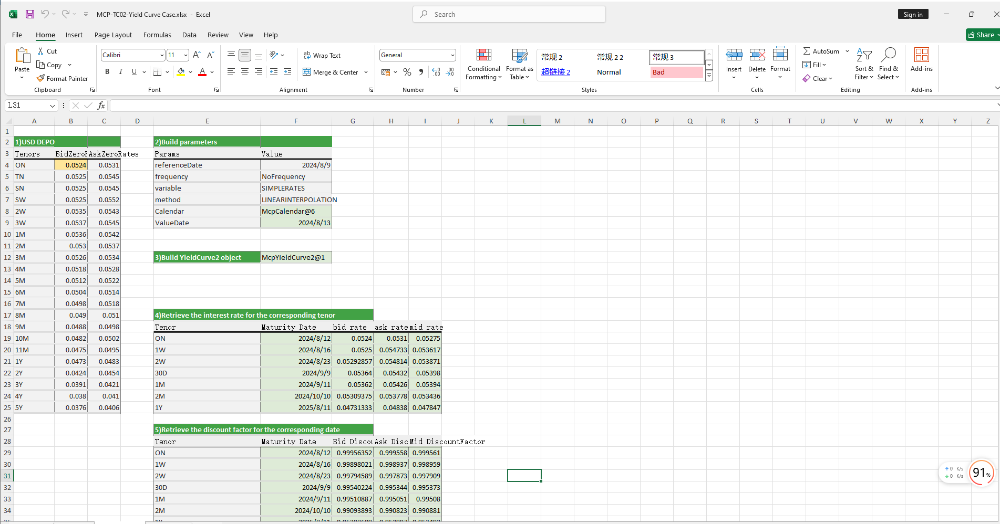

# **YieldCurve_利率曲线案例**

> 访问猛犸期权定价系统，支持外汇期权和结构化产品定价估值！

YieldCurve收益率曲线案例提供单边、双边收益率曲线构造方式及从收益率曲线上取指定到期日的利率、折现因子等。
点击下面图片下载模板：

---

---

## **YieldCurve利率曲线案例模板使用函数说明**

### **1. 节假日构造函数**
   - **[McpCalendar](/zh/latest/api/calendar.html#excel-mcpcalendar-code-dates)**：构造一个或多个货币对的节假日对象。
   - **[McpNCalendar](/zh/latest/api/calendar.html#excel-mcpncalendar-ccys-holidays)**：构造多个货币的节假日对象。

### **2. YieldCurve构造函数**
   - **[McpYieldCurve2](/zh/latest/api/yieldcurve.html#excel-mcpyieldcurve2-args1-args2-args3-args4-args5-fmt-vp-hd)**：构造双边YieldCurve对象。
   - **[McpYieldCurve](/zh/latest/api/yieldcurve.html#excel-mcpyieldcurve-args1-args2-args3-args4-args5-fmt-vp-hd)**：构造单边YieldCurve对象。

### **3. 到期日计算函数**
   - **[CalendarFXOExpiryDateFromTenor](/zh/latest/api/calendar.html#excel-calendarfxoexpirydatefromtenor-cal-referencedate-tenor-spotdate-calendarcodes)**：根据期限计算到期日。

### **4. YieldCurve利率获取函数**
   - **[YieldCurve2ZeroRate](/zh/latest/api/yieldcurve.html#excel-yieldcurve2zerorate-curve-date-bidmidask)**：在双边YieldCurve曲线上取指定到期日的利率。
   - **[YieldCurveZeroRate](/zh/latest/api/yieldcurve.html#excel-yieldcurvezerorate-curve-date)**：在单边YieldCurve曲线上取指定到期日的利率。

### **5. YieldCurve折现因子获取函数**
   - **[YieldCurve2DiscountFactor](/zh/latest/api/yieldcurve.html#excel-yieldcurve2discountfactor-curve-date-bidmidask)**：在双边YieldCurve曲线上取指定到期日的折现因子。
   - **[YieldCurveDiscountFactor](/zh/latest/api/yieldcurve.html#excel-yieldcurvediscountfactor-curve-date)**：在单边YieldCurve曲线上取指定到期日的折现因子。