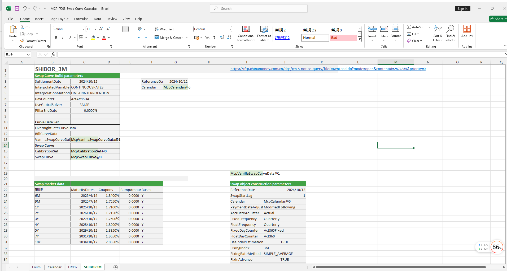

# **SwapCurve_利率曲线案例**


> 访问猛犸期权定价系统，支持外汇期权和结构化产品定价估值！
[](https://fxo.mathema.com.cn)

SwapCurve收益率曲线案例提供FR007、SHIBOR3M等SwapCurve对象的构造及从SwapCurve曲线上取指定到期日的零息利率、折现因子等。
点击下面图片下载模板：

---
[](./MCP-TC03-SwapCurveCase.xlsx)
---

## **SwapCurve利率曲线案例模板使用函数说明**

### **1. 节假日构造函数**
- **[McpCalendar](/zh/latest/api/calendar.html#excel-mcpcalendar-code-dates)**：构造一个或多个货币对的节假日对象。
- **[McpNCalendar](/zh/latest/api/calendar.html#excel-mcpncalendar-ccys-holidays)**：构造多个货币的节假日对象。

### **2. SwapCurve构造函数**
- **[McpVanillaSwapCurveData](/zh/latest/api/yieldcurve.html#excel-mcpvanillaswapcurvedata-args-data)**：构造Vanilla Swap Curve对象。
- **[McpSwapCurve](/zh/latest/api/yieldcurve.html#excel-mcpswapcurve-args1-args2-args3-args4-args5-fmt-vp)**：构造Swap Curve对象。

### **3. 存放不同产品函数**
- **[McpCalibrationSet](/zh/latest/api/bondcurve.html#excel-mcpcalibrationset-args)**：用于在构建利率曲线时，放入不同产品（如Depo、Swap、Bond等）并通过剥息法校准曲线。

### **4. 日期计算函数**
- **[CalendarValueDateTenor](/zh/latest/api/calendar.html#excel-calendarvaluedatetenor-cal-date-tenor-calendarcodes-isfarleg-true)**：计算到期日。

### **5. 折现因子获取函数**
- **[SwapCurveDiscountFactor](/zh/latest/api/yieldcurve.html#excel-swapcurvediscountfactor-curve-date)**：从SwapCurve对象中获取对应到期日的折现因子。

### **6. 利率获取函数**
- **[SwapCurveZeroRate](/zh/latest/api/yieldcurve.html#excel-swapcurvezerorate-curve-date)**：从SwapCurve对象中获取对应到期日的零息利率。
- **[SwapCurveZeroRates](/zh/latest/api/yieldcurve.html#excel-swapcurvezerorates-curve-dates-fmt-v)**：从SwapCurve对象中获取多个到期日的零息利率。

### **7. 远期利率获取函数**
- **[YieldCurveForwardRate](/zh/latest/api/yieldcurve.html#excel-yieldcurveforwardrate-curve-startdate-enddate-daycounter-daycounter-act365fixed-compounding-false-frequency-frequency-nofrequency)**：从YieldCurve对象中获取远期利率。

## **python代码示例**

下面是SwapCurve利率曲线示例

---

### SwapCurve示例

本示例代码展示了如何使用 `mcp` 库来构建和测试 SwapCurve（利率曲线）。代码中包含了两个主要的测试函数：`test_swap_curve_shibor3m` 和 `test_swap_curve_fr007`，分别用于测试基于 SHIBOR3M 和 FR007 的利率曲线。

#### **1. `test_swap_curve_shibor3m`**

该函数测试了基于 SHIBOR 3M 的利率曲线。以下是代码片段：

```python
def test_swap_curve_shibor3m():
    referenceDate = '2024-10-12'
    cal_usd = GetCurrencyCalendar('USD', usd_dates)
    vsc_data_args = {
        "ReferenceDate": referenceDate,
        "SwapStartLag": 1,
        "Calendar": cal_usd,
        "PaymentDateAdjuster": "ModifiedFollowing",
        "AccrDateAdjuster": "Actual",
        "FixedFrequency": "Quarterly",
        "FloatFrequency": "Quarterly",
        "FixedDayCounter": "Act365Fixed",
        "FloatDayCounter": "Act360",
        "UseIndexEstimation": True,
        "FixingIndex": "3M",
        "FixingRateMethod": "SIMPLE_AVERAGE",
        "FixInAdvance": True,
        "FixDaysBackward": 1,
        "Margin": 0,
        "MaturityDates": ['2025-4-14', '2025-7-14', '2025-10-13', '2026-10-12', '2027-10-12', '2028-10-12',
                          '2029-10-12', '2031-10-13', '2034-10-12'],
        "Coupons": [0.0184, 0.01755, 0.0171, 0.01715, 0.0176, 0.0182, 0.01885, 0.01965, 0.02065],
        "BumpAmounts": [0.0000, 0.0000, 0.0000, 0.0000, 0.0000, 0.0000, 0.0000, 0.0000, 0.0000],
        "Buses": [1, 1, 1, 1, 1, 1, 1, 1, 1]
    }
    vsc_data_args_curve: mcp.MVanillaSwapCurveData = McpVanillaSwapCurveData(vsc_data_args)
    c_set = wrapper.McpCalibrationSet()
    c_set.addData(vsc_data_args_curve.getHandler())
    c_set.addEnd()
    fixed_sc_args = {"ReferenceDate": referenceDate,
                     'CalibrationSet': c_set,
                     'InterpolatedVariable': 'CONTINUOUSRATES',
                     'InterpolationMethod': 'LINEARINTERPOLATION',
                     'DayCounter': 'ActActISDA'
                     }

    swap_curve: mcp.MSwapCurve = McpSwapCurve(fixed_sc_args)
```

#### **2. `test_swap_curve_fr007`**

该函数测试了基于 FR007 的利率曲线。以下是代码片段：

```python
def test_swap_curve_fr007():
    referenceDate = '2024-9-21'
    cal_usd = GetCurrencyCalendar('USD', usd_dates)
    vsc_data_args = {
        "ReferenceDate": referenceDate,
        "SwapStartLag": 1,
        "Calendar": cal_usd,
        "PaymentDateAdjuster": "ModifiedFollowing",
        "AccrDateAdjuster": "Actual",
        "FixedFrequency": "Quarterly",
        "FloatFrequency": "Quarterly",
        "FixedDayCounter": "Act365Fixed",
        "FloatDayCounter": "Act365Fixed",
        "UseIndexEstimation": True,
        "FixingIndex": "7D",
        "FixingRateMethod": "COMPOUNDING",
        "FixInAdvance": True,
        "FixDaysBackward": 1,
        "Margin": 0,
        "MaturityDates": ['2025-3-21', '2025-6-23', '2025-9-22', '2026-9-21', '2027-9-21', '2028-9-21', '2029-9-21',
                          '2031-9-22', '2034-9-21'],
        "Coupons": [0.0184, 0.01755, 0.0171, 0.01715, 0.0176, 0.0182, 0.01885, 0.01965, 0.02065],
        "BumpAmounts": [0.0000, 0.0000, 0.0000, 0.0000, 0.0000, 0.0000, 0.0000, 0.0000, 0.0000],
        "Buses": [1, 1, 1, 1, 1, 1, 1, 1, 1]
    }
    vsc_data_args_curve: mcp.MVanillaSwapCurveData = McpVanillaSwapCurveData(vsc_data_args)
    c_set = wrapper.McpCalibrationSet()
    c_set.addData(vsc_data_args_curve.getHandler())
    c_set.addEnd()
    fixed_sc_args = {"ReferenceDate": referenceDate,
                     'CalibrationSet': c_set,
                     'InterpolatedVariable': 'CONTINUOUSRATES',
                     'InterpolationMethod': 'LINEARINTERPOLATION',
                     'DayCounter': 'ActActISDA'
                     }

    swap_curve: mcp.MSwapCurve = McpSwapCurve(fixed_sc_args)
```
