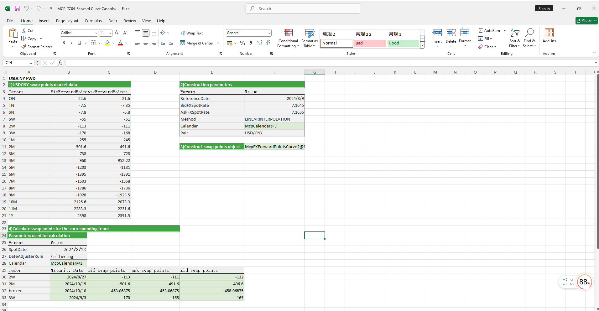

# **远期曲线案例**


> 访问猛犸期权定价系统，支持外汇期权和结构化产品定价估值！
[](https://fxo.mathema.com.cn)

远期曲线案例提供远期曲线对象构造，包括双边和单边两种构造方式及从远期曲线取对应到期日的掉期点和远期价格。
点击下面图片下载模板：

---
[](./MCP-TC04-ForwardCurveCase.xlsx)
---

## **远期曲线案例模板使用函数说明**

### **1. 节假日构造函数**
   - **[McpCalendar](/zh/latest/api/calendar.html#excel-mcpcalendar-code-dates)**：构造一个或多个货币对的节假日对象。
   - **[McpNCalendar](/zh/latest/api/calendar.html#excel-mcpncalendar-ccys-holidays)**：构造多个货币的节假日对象。

### **2. 到期日计算函数**
   - **[CalendarAddPeriod](/zh/latest/api/calendar.html#excel-calendaraddperiod-cal-date-tenor-dateadjustrule-dateadjusterrule-actual-endofmonthrule-false-lastopenday-false-calendarcodes)**：计算到期日。

### **3. 远期曲线构造函数**
   - **[McpFXForwardPointsCurve2](/zh/latest/api/fxforwardratecurve.html#excel-mcpfxforwardpointscurve2-args1-args2-args3-args4-args5-fmt-vp)**：构造双边远期曲线对象。
   - **[McpFXForwardPointsCurve](/zh/latest/api/fxforwardratecurve.html#excel-mcpfxforwardpointscurve-args1-args2-args3-args4-args5-fmt-vp)**：构造单边远期曲线对象。

### **4. 远期曲线数据提取函数**
   - **[Fxfpc2FXForwardPoints](/zh/latest/api/fxforwardratecurve.html#excel-fxfpc2fxforwardpoints-curve-date-bidmidask)**：从双边远期曲线对象上取掉期点。
   - **[Fxfpc2FXForwardOutright](/zh/latest/api/fxforwardratecurve.html#excel-fxfpc2fxforwardoutright-curve-date-bidmidask)**：从双边远期曲线对象上取掉远期价格。
   - **[FxfpcFXForwardPoints](/zh/latest/api/fxforwardratecurve.html#excel-fxfpcfxforwardpoints-curve-date)**：从单边远期曲线对象上取掉期点。
   - **[FxfpcFXForwardOutright](/zh/latest/api/fxforwardratecurve.html#excel-fxfpcfxforwardoutright-curve-date)**：从单边远期曲线对象上取掉远期价格。
   
## **python代码示例**

下面是远期曲线示例

---

### 远期曲线示例

该示例展示了如何使用 `mcp.tool.tools_main` 模块中的 `McpFXForwardPointsCurve2` 类构建远期点曲线。计算了不同期限的远期点和远期价格，并将结果与预期值进行比较。

#### 依赖项

- `pandas`：用于数据操作和比较。
- `example.calendar.calendar_demo`：用于日历相关功能。
- `mcp.enums`：用于日期调整规则。
- `mcp.tool.tools_main`：用于 `McpFXForwardPointsCurve2` 类。

#### 示例概述

 执行以下步骤：

1. **日历初始化**：使用美元（USD）和人民币（CNY）的日期初始化日历。
2. **远期点曲线构建**：使用 `McpFXForwardPointsCurve2` 类构建远期点曲线，并指定相关参数。
3. **远期点和价格计算**：计算指定期限的买入价（Bid）、卖出价（Ask）和中间价（Mid）的远期点及远期价格。
4. **数据比较**：使用 `pandas` 的 `DataFrame` 将计算结果与预期值进行比较。

#### 代码解释

##### 导入语句

```python
import pandas as pd
from pandas._testing import assert_frame_equal
from example.calendar.calendar_demo import McpNCalendar, usd_dates, cny_dates
from mcp.enums import DateAdjusterRule
from mcp.tool.tools_main import McpFXForwardPointsCurve2
```

##### **功能**：**`远期点曲线的构建和计算`**

   该示例测试远期点曲线的构建和计算。

```python
def test_forward_points_curve2_with_bidask():
    cal = McpNCalendar(['USD', 'CNY'], [usd_dates, cny_dates])
    args = {
        'ReferenceDate': '2024-8-9',
        'Tenors': ['ON', 'TN', 'SN', 'SW', '2W', '3W', '1M', '2M', '3M', '4M', '5M', '6M', '7M', '8M', '9M', '10M',
                   '11M', '1Y'],
        'BidForwardPoints': [-22.6, -7.5, -7.8, -55, -113, -170, -255, -501.6, -738, -960, -1203, -1395, -1603, -1786,
                             -1928, -2126.6, -2283.3, -2398],
        'AskForwardPoints': [-21.6, -7.35, -6.8, -51, -111, -168, -245, -491.6, -728, -952.22, -1181, -1391, -1558,
                             -1736, -1923.5, -2073.3, -2231.6, -2391.5],
        "BidFXSpotRate": 7.1645,
        "AskFXSpotRate": 7.1655,
        "Method": 'LINEARINTERPOLATION',
        "Pair": 'USD/CNY',
        'Calendar': cal,
    }
    curve = McpFXForwardPointsCurve2(args)
    spot_date = cal.ValueDate('2024-8-9')
    tenors = ['2W', '2M', 'broken', '3W']
    expire_dates = []
    bid_points = []
    ask_points = []
    mid_points = []
    bid_pxs = []
    ask_pxs = []
    mid_pxs = []
    for tenor in tenors:
        if tenor == 'broken':
            ex_date = '2024-10-10'
        else:
            ex_date = cal.AddPeriod(spot_date, tenor, DateAdjusterRule.Following)
        expire_dates.append(ex_date)
        bid_point = curve.FXForwardPoints(ex_date, 'BID')
        ask_point = curve.FXForwardPoints(ex_date, 'ASK')
        mid_point = curve.FXForwardPoints(ex_date, 'MID')
        bid_points.append(bid_point)
        ask_points.append(ask_point)
        mid_points.append(mid_point)
        bid_px = curve.FXForwardOutright(ex_date, 'BID')
        ask_px = curve.FXForwardOutright(ex_date, 'ASK')
        mid_px = curve.FXForwardOutright(ex_date, 'MID')
        bid_pxs.append(bid_px)
        ask_pxs.append(ask_px)
        mid_pxs.append(mid_px)
    column_names = ['tenor', 'expire_date', 'bidpoints', 'askpoints', 'midpoints', 'bidpx', 'askpx', 'midpx']
    p_data = [tenors, expire_dates, bid_points, ask_points, mid_points, bid_pxs, ask_pxs, mid_pxs]
    r_dic = {}
    for key, val in zip(column_names, p_data):
        r_dic[key] = val
    df = pd.DataFrame(r_dic)
    expected_data = [
        tenors,
        ['2024-08-27', '2024-10-15', '2024-10-10', '2024-09-03'],
        [-113, -501.6, -463.06875, -170],
        [-111, -491.6, -453.06875, -168],
        [-112, -496.6, -458.06875, -169],
        [7.1532, 7.11434, 7.118193125, 7.1475],
        [7.1544, 7.11634, 7.120193125, 7.1487],
        [7.1538, 7.11534, 7.119193125, 7.1481]
    ]
    e_dic = {}
    for key, val in zip(column_names, expected_data):
        e_dic[key] = val
    expected_df = pd.DataFrame(e_dic)
    assert_frame_equal(df, expected_df, check_dtype=True)
```

##### 预期输出

示例将计算出的远期点和价格与以下预期值进行比较：

| 期限  | 到期日期   | 买入远期点 | 卖出远期点 | 中间远期点 | 买入价   | 卖出价   | 中间价   |
|-------|------------|------------|------------|------------|----------|----------|----------|
| 2W    | 2024-08-27 | -113       | -111       | -112       | 7.1532   | 7.1544   | 7.1538   |
| 2M    | 2024-10-15 | -501.6     | -491.6     | -496.6     | 7.11434  | 7.11634  | 7.11534  |
| broken| 2024-10-10 | -463.06875 | -453.06875 | -458.06875 | 7.118193125| 7.120193125| 7.119193125|
| 3W    | 2024-09-03 | -170       | -168       | -169       | 7.1475   | 7.1487   | 7.1481   |


