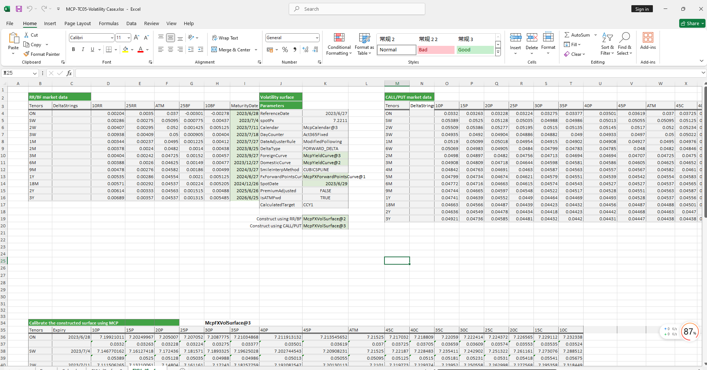

# **波动率案例**


> 访问猛犸期权定价系统，支持外汇期权和结构化产品定价估值！
[](https://fxo.mathema.com.cn)

波动率案例构造波动率对象提供，包括双边和单边两种构造方式及从波动率曲面上取对应到期日的ATMVol、利率、掉期点、远期价格和波动率等。
点击下面图片下载模板：

---
[](./MCP-TC05-VolatilityCase.xlsx)
---

## **波动率案例模板使用函数说明**

### **1. 节假日构造函数**
   - **[McpCalendar](/zh/latest/api/calendar.html#excel-mcpcalendar-code-dates)**：构造一个或多个货币对的节假日对象。
   - **[McpNCalendar](/zh/latest/api/calendar.html#excel-mcpncalendar-ccys-holidays)**：构造多个货币的节假日对象。

### **2. 到期日计算函数**
   - **[CalendarFXOExpiryDateFromTenor](/zh/latest/api/calendar.html#excel-calendarfxoexpirydatefromtenor-cal-referencedate-tenor-spotdate-calendarcodes)**：根据期限计算到期日。

### **3. 双边构造方式**
   - **收益率曲线对象**
     - **[McpYieldCurve2](/zh/latest/api/yieldcurve.html#excel-mcpyieldcurve2-args1-args2-args3-args4-args5-fmt-vp-hd)**：构造收益率曲线对象。
   - **远期曲线对象**
     - **[McpFXForwardPointsCurve2](/zh/latest/api/fxforwardratecurve.html#excel-mcpfxforwardpointscurve2-args1-args2-args3-args4-args5-fmt-vp)**：构造远期曲线对象。
   - **波动率曲面对象**
     - **[McpFXVolSurface2](/zh/latest/api/fxvolsurface.html#excel-mcpfxvolsurface2-args1-args2-args3-args4-args5-fmt-vp)**：构造波动率曲面对象。
   - **波动率曲面数据获取**
     - **[FXVolSurface2GetReferenceDate](/zh/latest/api/fxvolsurface.html#excel-fxvolsurface2getreferencedate-vs)**：获取波动率曲面的参考日期。
     - **[FXVolSurface2GetSpotDate](/zh/latest/api/fxvolsurface.html#excel-fxvolsurface2getspotdate-vs)**：获取波动率曲面的即期日期。
     - **[FXVolSurface2GetSpot](/zh/latest/api/fxvolsurface.html#excel-fxvolsurface2getspot-vs-bidmidask)**：获取波动率曲面的即期价格。
     - **[FXVolSurface2GetStrike](/zh/latest/api/fxvolsurface.html#excel-fxvolsurface2getstrike-vs-deltastring-tenor-bidmidask)**：获取对应期限及DeltaString的strike。
     - **[FXVolSurface2GetVolatility](/zh/latest/api/fxvolsurface.html#excel-fxvolsurface2getvolatility-vs-strike-expirydate-bidmidask-midforward-0-0-bidinputdeltavolpair-askinputdeltavolpair)**：获取对应到期日及strike的波动率。
     - **[FXVolSurface2GetATMVol](/zh/latest/api/fxvolsurface.html#excel-fxvolsurface2getatmvol-vs-expirydate-bidmidask)**：获取对应到期日的ATM波动率。
     - **[FXVolSurface2GetForeignRate](/zh/latest/api/fxvolsurface.html#excel-fxvolsurface2getforeignrate-vs-expiryordeliverydate-isdeliverydate-bidmidask)**：获取对应到期日的CCY1利率。
     - **[FXVolSurface2GetDomesticRate](/zh/latest/api/fxvolsurface.html#excel-fxvolsurface2getdomesticrate-vs-expiryordeliverydate-isdeliverydate-bidmidask)**：获取对应到期日的CCY2利率。
     - **[FXVolSurface2GetForwardPoint](/zh/latest/api/fxvolsurface.html#excel-fxvolsurface2getforwardpoint-vs-expiryordeliverydate-isdeliverydate-bidmidask)**：获取对应到期日的掉期点。
     - **[FXVolSurface2GetForward](/zh/latest/api/fxvolsurface.html#excel-fxvolsurface2getforward-vs-expiryordeliverydate-isdeliverydate-bidmidask)**：获取对应到期日的远期价格。
  
### **4. 单边构造方式**
   - **收益率曲线对象**
     - **[McpYieldCurve](/zh/latest/api/yieldcurve.html#excel-mcpyieldcurve-args1-args2-args3-args4-args5-fmt-vp-hd)**：构造收益率曲线对象。
   - **远期曲线对象**
     - **[McpFXForwardPointsCurve](/zh/latest/api/fxforwardratecurve.html#excel-mcpfxforwardpointscurve-args1-args2-args3-args4-args5-fmt-vp)**：构造远期曲线对象。
   - **波动率曲面对象**
     - **[McpFXVolSurface](/zh/latest/api/fxvolsurface.html#excel-mcpfxvolsurface-args1-args2-args3-args4-args5-fmt-dt-vp-hd)**：构造波动率曲面对象。
   - **波动率曲面数据获取**
     - **[FXVolSurfaceGetStrike](/zh/latest/api/fxvolsurface.html#excel-fxvolsurfacegetstrike-vs-deltastring-tenor)**：获取对应期限及DeltaString的strike。
     - **[FXVolSurfaceGetVolatility](/zh/latest/api/fxvolsurface.html#excel-fxvolsurfacegetvolatility-vs-strike-expirydate-forward-0-0-inputdeltavolpair)**：获取对应到期日及strike的波动率。
     - **[FXVolSurfaceGetReferenceDate](/zh/latest/api/fxvolsurface.html#excel-fxvolsurfacegetreferencedate-vs)**：获取波动率曲面的参考日期。
     - **[FXVolSurfaceGetSpotDate](/zh/latest/api/fxvolsurface.html#excel-fxvolsurfacegetspotdate-vs)**：获取波动率曲面的即期日期。
     - **[FXVolSurfaceGetSpot](/zh/latest/api/fxvolsurface.html#excel-fxvolsurfacegetspot-vs)**：获取波动率曲面的即期价格。
     - **[FXVolSurfaceGetATMVol](/zh/latest/api/fxvolsurface.html#excel-fxvolsurfacegetatmvol-vs-expirydate)**：获取对应到期日的ATM波动率。
     - **[FXVolSurfaceGetForeignRate](/zh/latest/api/fxvolsurface.html#excel-fxvolsurfacegetforeignrate-vs-expiryordeliverydate-isdeliverydate)**：获取对应到期日的CCY1利率。
     - **[FXVolSurfaceGetDomesticRate](/zh/latest/api/fxvolsurface.html#excel-fxvolsurfacegetdomesticrate-vs-expiryordeliverydate-isdeliverydate)**：获取对应到期日的CCY2利率。
     - **[FXVolSurfaceGetForwardPoint](/zh/latest/api/fxvolsurface.html#excel-fxvolsurfacegetforwardpoint-vs-expiryordeliverydate-isdeliverydate)**：获取对应到期日的掉期点。
     - **[FXVolSurfaceGetForward](/zh/latest/api/fxvolsurface.html#excel-fxvolsurfacegetforward-vs-expiryordeliverydate-isdeliverydate)**：获取对应到期日的远期价格。
	 
## **python代码示例**

下面是波动率曲面示例

---
###  波动率曲面示例代码

本示例代码展示了如何使用 `mcp` 库来构建和测试波动率曲面（Volatility Surface）。代码中包含了 `test_mkt_vol_surface2` 函数，用于测试基于美元（USD）和人民币（CNY）的波动率曲面。

#### **1. `test_mkt_vol_surface2`**

该函数测试了基于美元和人民币的波动率曲面。以下是代码的主要步骤：

##### **1.1 创建日历对象**

首先，创建了美元和人民币的日历对象：

```python
cal = McpNCalendar(['USD', 'CNY'], [usd_dates, cny_dates])
cal_usd = GetCurrencyCalendar('USD', 'USD', usd_dates)
cal_cny = GetCurrencyCalendar('CNY', 'CNY', usd_dates)
```

##### **1.2 构建收益率曲线**

接下来，构建了美元和人民币的收益率曲线：

```python
yc_args_usd = {
    'ReferenceDate': '2024-12-13',
    'Tenors': ['ON', 'TN', 'SN', 'SW', '2W', '3W', '1M', '2M', '3M', '4M', '5M', '6M', '7M', '8M', '9M', '10M', '11M', '1Y', '2Y', '3Y', '4Y', '5Y'],
    'BidZeroRates': [0.0458, 0.0439, 0.045, 0.0439, 0.0433, 0.046, 0.0433, 0.0433, 0.0433, 0.0435, 0.0435, 0.0433, 0.0434, 0.0434, 0.0433, 0.0433, 0.0433, 0.0433, 0.044, 0.043, 0.042, 0.042],
    'AskZeroRates': [0.0459, 0.0451, 0.0457, 0.0451, 0.0458, 0.0553, 0.0458, 0.0458, 0.0458, 0.046, 0.046, 0.0458, 0.0459, 0.0459, 0.0458, 0.0458, 0.0458, 0.0458, 0.0465, 0.046, 0.045, 0.045],
    'Calendar': cal_usd,
    'ShortName': 'USDSofrSnapYldCurve',
    'Symbol': 'USD',
    'DayCount': None,
    'Frequency': '-1',
    'Variable': 'SIMPLERATES',
    'InterpolationMethod': None
}

yc_args_cny = {
    'ReferenceDate': '2024-12-13',
    'Tenors': ['ON', '1W', '2W', '1M', '3M', '6M', '9M', '1Y'],
    'BidZeroRates': [0.01404, 0.01758, 0.0187, 0.0171, 0.01735, 0.01744, 0.01759, 0.01774],
    'AskZeroRates': [0.01404, 0.01758, 0.0187, 0.0171, 0.01735, 0.01744, 0.01759, 0.01774],
    'Calendar': cal_cny,
    'ShortName': 'CNYShibor3mSnapYldCurve',
    'Symbol': 'CNY',
    'DayCount': None,
    'Frequency': '-1',
    'Variable': 'SIMPLERATES',
    'InterpolationMethod': None
}

yc1 = McpYieldCurve2(yc_args_usd)
yc2 = McpYieldCurve2(yc_args_cny)
```

##### **1.3 构建远期点曲线**

然后，构建了美元对人民币的远期点曲线：

```python
fw_args = {
    'ReferenceDate': '2024-12-13',
    'Tenors': ['SW', '2W', '3W', '1M', '2M', '3M', '4M', '5M', '6M', '7M', '8M', '9M', '10M', '11M', '1Y', '18M', '2Y', '3Y', '4Y', '5Y'],
    'BidForwardPoints': [-39.5, -77.0, -116.0, -177.0, -360.35, -522.77, -709.23, -922.0, -1124.52, -1328.0, -1531.0, -1749.28, -1940.0, -2145.0, -2388.0, -3450.0, -4330.0, -5696.61, -6000.0, -8050.0],
    'AskForwardPoints': [-35.5, -75.2, -114.0, -167.0, -348.43, -509.23, -704.0, -915.0, -1105.48, -1283.0, -1486.0, -1724.72, -1896.6, -2103.3, -2358.0, -2860.0, -4230.0, -5463.39, -4900.0, -7550.0],
    'BidFXSpotRate': 7.2768,
    'AskFXSpotRate': 7.277,
    'Pair': 'USD/CNY',
    'Calendar': cal,
    'ShortName': 'USDCNYFwdSnapCurve',
    'Symbol': 'USD/CNY',
    'InterpolationMethod': 'LINEARINTERPOLATION'
}

fc = McpFXForwardPointsCurve2(fw_args)
```

##### **1.4 构建波动率曲面**

构建了美元对人民币的波动率曲面：

```python
vol_args = {
    'ShortName': 'USDCNYRSnapVolSurface',
    'Symbol': 'USD/CNY',
    'DayCounter': 'Act365Fixed',
    'DateAdjusterRule': 'ModifiedFollowing',
    'DeltaType': 'FORWARD_DELTA',
    'UndCurve': 'USDSofrSnapYldCurve',
    'AccCurve2': yc2,
    'SmileInterpMethod': 'CUBICSPLINE',
    'FxForwardPointsCurve': 'USDCNYFwdSnapCurve',
    'PremiumAdjusted': 'FALSE',
    'IsATMFwd': 'TRUE',
    'CalculatedTarget': 'CCY1',
    'ReferenceDate': '2024-12-13',
    'DeltaStrings': ['10DPUT', '15DPUT', '20DPUT', '25DPUT', '30DPUT', '35DPUT', '40DPUT', '45DPUT', 'ATM', '45DCAL', '40DCAL', '35DCAL', '30DCAL', '25DCAL', '20DCAL', '15DCAL', '10DCAL'],
    'Tenors': ['SW', '2W', '3W', '1M', '2M', '3M', '4M', '5M', '6M', '9M', '1Y', '18M', '2Y'],
    'BidVolatilities': '0.05131,0.04998,0.04866,0.04734,0.04603,0.04478,0.04361,0.04258,0.04175,0.04108,0.04062,0.04035,0.04026,0.04034,0.04058,0.04092,0.04131;...',
    'AskVolatilities': '0.06631,0.06498,0.06366,0.06234,0.06103,0.05978,0.05861,0.05758,0.05675,0.05608,0.05562,0.05535,0.05526,0.05534,0.05558,0.05592,0.05631;...',
    'FxForwardPointsCurve2': fc,
    'UndCurve2': yc1,
    'Calendar': cal
}

mkt_vol: MMktVolSurface2 = McpMktVolSurface2(vol_args)
```

##### **1.5 获取外汇利率**

最后，获取了指定到期日的外汇利率：

```python
expiryDate = '2024-12-18'
strike = 7
ForeignRate = mkt_vol.GetForeignRate(expiryDate, False, 'BID')
DomesticRate = mkt_vol.GetDomesticRate(expiryDate, False, 'BID')
```	 