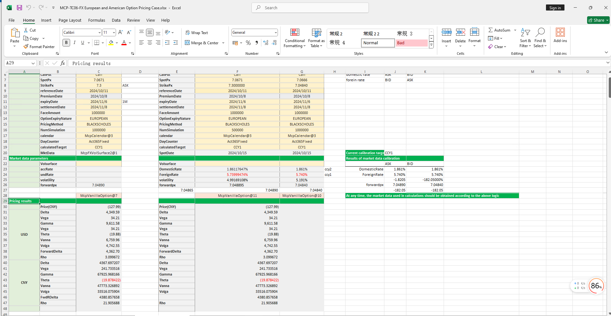

# **外汇欧式美式期权定价案例**


> 访问猛犸期权定价系统，支持外汇期权和结构化产品定价估值！
[](https://fxo.mathema.com.cn/#/optionCalculatorss)

外汇欧式美式期权定价模板使用函数说明提供了从节假日管理、收益率曲线构建、波动率曲面构建、欧式美式期权对象构造、日期计算、期权定价到Greek值计算的全流程功能，用于实现欧式美式期权的精确建模、定价和风险分析。
点击下面图片下载模板：

---
[](./MCP-TC06-FXEuropeanandAmericanOptionPricingCase.xlsx)
---

## **外汇欧式美式期权定价模板使用函数说明**

### **1. 节假日构造函数**
   - **[McpCalendar](/zh/latest/api/calendar.html#excel-mcpcalendar-code-dates)**：构造一个或多个货币对的节假日对象。
   - **[McpNCalendar](/zh/latest/api/calendar.html#excel-mcpncalendar-ccys-holidays)**：构造多个货币的节假日对象。

### **2. 收益率曲线构造函数**
   - **[McpYieldCurve2](/zh/latest/api/yieldcurve.html#excel-mcpyieldcurve2-args1-args2-args3-args4-args5-fmt-vp-hd)**：构造收益率曲线对象。

### **3. 远期曲线构造函数**
   - **[McpFXForwardPointsCurve2](/zh/latest/api/fxforwardratecurve.html#excel-mcpfxforwardpointscurve2-args1-args2-args3-args4-args5-fmt-vp)**：构造远期曲线对象。

### **4. 波动率曲面构造函数**
   - **[McpFXVolSurface2](/zh/latest/api/fxvolsurface.html#excel-mcpfxvolsurface2-args1-args2-args3-args4-args5-fmt-vp)**：构造波动率曲面对象。

### **5. 期权对象构造函数**
   - **[McpVanillaOption](/zh/latest/api/vanillaoption.html#excel-mcpvanillaoption-args1-args2-args3-args4-args5-fmt)**：构造VanillaOption对象。

### **6. 波动率曲面相关函数**
   - **[FXVolSurface2GetForeignRate](/zh/latest/api/fxvolsurface.html#excel-fxvolsurface2getforeignrate-vs-expiryordeliverydate-isdeliverydate-bidmidask)**：从波动率曲面取对应到期日的CCY1的利率。
   - **[FXVolSurface2GetDomesticRate](/zh/latest/api/fxvolsurface.html#excel-fxvolsurface2getdomesticrate-vs-expiryordeliverydate-isdeliverydate-bidmidask)**：从波动率曲面取对应到期日的CCY2的利率。
   - **[FXVolSurface2GetForward](/zh/latest/api/fxvolsurface.html#excel-fxvolsurface2getforward-vs-expiryordeliverydate-isdeliverydate-bidmidask)**：从波动率曲面取对应到期日的远期价格。
   - **[FXVolSurface2GetVolatility](/zh/latest/api/fxvolsurface.html#excel-fxvolsurface2getvolatility-vs-strike-expirydate-bidmidask-midforward-0-0-bidinputdeltavolpair-askinputdeltavolpair)**：从波动率曲面获取对应到期日的波动率。

### **7. 利率计算函数**
   - **[Forward2ImpliedBaseRate](/zh/latest/api/vanillaoption.html#excel-forward2impliedbaserate-pair-forward-spot-termrate-spotdate-deliverydate)**：计算目标是CCY1时计算CCY1的利率。
   - **[Forward2ImpliedTermRate](/zh/latest/api/vanillaoption.html#excel-forward2impliedtermrate-pair-forward-spot-baserate-spotdate-deliverydate)**：计算目标是CCY2时计算CCY2的利率。

### **8. 远期价格和掉期点计算函数**
   - **[ImpliedForward](/zh/latest/api/vanillaoption.html#excel-impliedforward-pair-baserate-termrate-spot-spotdate-deliverydate)**：计算远期价格。
   - **[ImpliedFwdPoints](/zh/latest/api/vanillaoption.html#excel-impliedfwdpoints-pair-baserate-termrate-spot-spotdate-deliverydate)**：计算掉期点。

### **9. 期权费计算函数**
   - **[McpPrice](/zh/latest/api/vanillaoption.html#excel-mcpprice-obj-isamount-true)**：计算期权费。

### **10. Greek值计算函数**
   - **[McpDelta](/zh/latest/api/vanillaoption.html#excel-mcpdelta-obj-isccy2-false-isamount-true-pricingmethod-1-isclosedformmethod-true)**：计算Delta。
   - **[McpVega](/zh/latest/api/vanillaoption.html#excel-mcpvega-obj-isccy2-false-isamount-true-pricingmethod-1-isclosedformmethod-true)**：计算Vega。
   - **[McpGamma](/zh/latest/api/vanillaoption.html#excel-mcpgamma-obj-isccy2-false-isamount-true-pricingmethod-1-isclosedformmethod-true)**：计算Gamma。
   - **[McpTheta](/zh/latest/api/vanillaoption.html#excel-mcptheta-obj-isccy2-false-isamount-true-pricingmethod-1-isclosedformmethod-true)**：计算Theta。
   - **[McpVanna](/zh/latest/api/vanillaoption.html#excel-mcpvanna-obj-isccy2-false-isamount-true-pricingmethod-1-isclosedformmethod-true)**：计算Vanna。
   - **[McpVolga](/zh/latest/api/vanillaoption.html#excel-mcpvolga-obj-isccy2-false-isamount-true-pricingmethod-1-isclosedformmethod-true)**：计算Volga。
   - **[McpForwardDelta](/zh/latest/api/vanillaoption.html#excel-mcpforwarddelta-obj-isccy2-false-isamount-true-pricingmethod-1-isclosedformmethod-true)**：计算Forward Delta。
   - **[McpRho](/zh/latest/api/vanillaoption.html#excel-mcprho-obj-isccy2-false-isamount-true-pricingmethod-1-isclosedformmethod-true)**：计算Rho。
## **python代码示例**

下面是外汇欧式美式期权定价的示例

---
### 外汇欧式美式期权定价示例

该示例展示了如何使用 `McpVanillaOption` 类对香草期权进行定价，使用市场数据（包括收益率曲线、远期点和波动率曲面）。脚本还展示了如何计算期权价格、Delta 值以及其他中间结果。

#### 依赖项

- `pandas`：用于数据操作和显示。
- `mcp.forward.fwd_wrapper`：用于 `McpVanillaOption` 类。
- `example.calendar.calendar_demo`：用于日历相关功能。
- `mcp.mcp`：用于 `MMktVolSurface2` 类。
- `mcp.tool.tools_main`：用于 `McpYieldCurve2`、`McpFXForwardPointsCurve2`、`McpMktVolSurface2` 和 `McpVanillaOption` 类。
- `mcp.wrapper`：用于各种远期曲线相关的计算。

#### 示例概述

 执行以下任务：

1. **市场数据生成**：生成市场数据，包括美元和人民币的收益率曲线、远期点和波动率曲面。
2. **外汇欧式美式期权定价**：使用 `McpVanillaOption` 类对香草期权进行定价。
3. **Delta 计算**：计算期权的 Delta 值（美元和人民币）。
4. **中间结果展示**：展示中间结果，如现货价格、行权价格、到期日期等。

#### 代码解释

##### 市场数据生成

`gen_mkt_vol()` 函数生成市场数据，包括美元和人民币的收益率曲线、远期点和波动率曲面。

```python
def gen_mkt_vol():
    # 美元和人民币的收益率曲线参数
    yc_args_usd = {...}
    yc_args_cny = {...}
    
    # 远期点参数
    fw_args = {...}
    
    # 波动率曲面参数
    vol_args = {...}
    
    # 创建收益率曲线、远期点曲线和波动率曲面
    yc1 = McpYieldCurve2(yc_args_usd)
    yc2 = McpYieldCurve2(yc_args_cny)
    fc = McpFXForwardPointsCurve2(fw_args)
    mkt_vol = McpMktVolSurface2(vol_args)
    
    return mkt_vol
```

##### 外汇欧式美式期权定价

`test_vanilla_option_with_vol_surface()` 函数使用生成的市场数据对外汇欧式美式期权进行定价。

```python
def test_vanilla_option_with_vol_surface():
    mkt_vol = gen_mkt_vol()
    vo_args = {...}
    vo = McpVanillaOption(vo_args)
    
    # 计算期权价格和 Delta 值
    price = vo.Price(True)
    deltaUSD = vo.Delta(False, True, 1)
    deltaCNY = vo.Delta(True, True, 1)
    
    print(f'price = {price}, deltaUSD={deltaUSD}, deltaCNY={deltaCNY}')
    
    # 展示中间结果
    fields = [...]
    legs = vo.legs()
    result = [...]
    print(f'{result}')
```

##### 直接使用利率定价

`test_vanilla_option_with_rate()` 函数使用直接利率对外汇欧式美式期权进行定价，而不是使用市场数据。

```python
def test_vanilla_option_with_rate():
    vo_args = {...}
    vo = McpVanillaOption(vo_args)
    
    # 计算期权价格和 Delta 值
    price = vo.Price(True)
    deltaUSD = vo.Delta(False, True, 1)
    deltaCNY = vo.Delta(True, True, 1)
    
    print(f'price = {price}, deltaUSD={deltaUSD}, deltaCNY={deltaCNY}')
    
    # 展示中间结果
    fields = [...]
    legs = vo.legs()
    result = [...]
    print(f'{result}')
```

##### 市场方向确定

`get_mkt_side()` 函数根据期权的买入/卖出和看涨/看跌属性确定市场方向（BID 或 ASK）。

```python
def get_mkt_side(side, buy_sell, call_put):
    # 根据期权属性确定市场方向
    ...
    return spot_side, vol_side, domestic_rate_side, forein_rate_side
```

##### 求解器测试

`test_slover()` 函数测试求解器，用于计算隐含利率和远期点。

```python
def test_slover():
    client_args = {...}
    und_rates = [...]
    acc_rates = [...]
    fwd_rates = [...]
    spot_rates = [...]
    
    # 确定市场方向
    spot_side, vol_side, domestic_rate_side, forein_rate_side = get_mkt_side(...)
    
    # 计算隐含利率和远期点
    ...
    print(side_raw)
```

   
