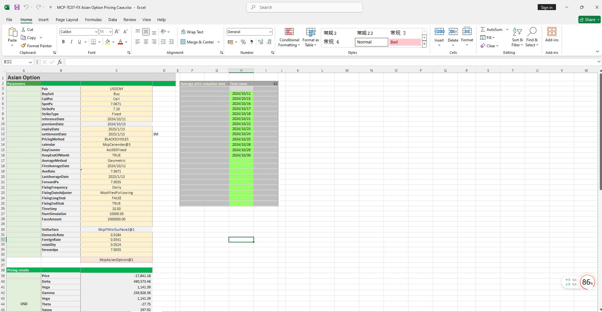

# **外汇亚式期权定价案例**

> 访问猛犸期权定价系统，支持外汇期权和结构化产品定价估值！

外汇亚式期权定价模板使用函数说明提供了从节假日管理、收益率曲线构建、波动率曲面构建、欧式美式期权对象构造、日期计算、期权定价到Greek值计算的全流程功能，用于实现亚式期权的精确建模、定价和风险分析。
点击下面图片下载模板：

---

---

## **外汇亚式期权定价模板使用函数说明**

### **1. 节假日构造函数**
   - **[McpCalendar](/zh/latest/api/calendar.html#excel-mcpcalendar-code-dates)**：构造一个或多个货币对的节假日对象。
   - **[McpNCalendar](/zh/latest/api/calendar.html#excel-mcpncalendar-ccys-holidays)**：构造多个货币的节假日对象。

### **2. 收益率曲线构造函数**
   - **[McpYieldCurve2](/zh/latest/api/yieldcurve.html#excel-mcpyieldcurve2-args1-args2-args3-args4-args5-fmt-vp-hd)**：构造收益率曲线对象。

### **3. 远期曲线构造函数**
   - **[McpFXForwardPointsCurve2](/zh/latest/api/fxforwardratecurve.html#excel-mcpfxforwardpointscurve2-args1-args2-args3-args4-args5-fmt-vp)**：构造远期曲线对象。

### **4. 波动率曲面构造函数**
   - **[McpFXVolSurface2](/zh/latest/api/fxvolsurface.html#excel-mcpfxvolsurface2-args1-args2-args3-args4-args5-fmt-vp)**：构造波动率曲面对象。

### **5. 亚式期权构造函数**
   - **[McpAsianOption](/zh/latest/api/asianoption.html#excel-mcpasianoption-args1-args2-args3-args4-args5-fmt-vp)**：构造亚式期权对象。

### **6. 波动率曲面相关函数**
   - **[FXVolSurface2GetForeignRate](/zh/latest/api/fxvolsurface.html#excel-fxvolsurface2getforeignrate-vs-expiryordeliverydate-isdeliverydate-bidmidask)**：从波动率曲面获取对应到期日的CCY1利率。
   - **[FXVolSurface2GetDomesticRate](/zh/latest/api/fxvolsurface.html#excel-fxvolsurface2getdomesticrate-vs-expiryordeliverydate-isdeliverydate-bidmidask)**：从波动率曲面获取对应到期日的CCY2利率。
   - **[FXVolSurface2GetForward](/zh/latest/api/fxvolsurface.html#excel-fxvolsurface2getforward-vs-expiryordeliverydate-isdeliverydate-bidmidask)**：从波动率曲面获取对应到期日的远期价格。
   - **[FXVolSurface2GetVolatility](/zh/latest/api/fxvolsurface.html#excel-fxvolsurface2getvolatility-vs-strike-expirydate-bidmidask-midforward-0-0-bidinputdeltavolpair-askinputdeltavolpair)**：从波动率曲面获取对应到期日的波动率。

### **7. 日期计算函数**
   - **[CalendarValueDate](/zh/latest/api/calendar.html#excel-calendarvaluedate-cal-date-isfollowing-true-calendarcodes)**：计算期权费支付日期。
   - **[CalendarFXOExpiryDateFromTenor](/zh/latest/api/calendar.html#excel-calendarfxoexpirydatefromtenor-cal-referencedate-tenor-spotdate-calendarcodes)**：计算到期日。
   - **[CalendarFXODeliveryDateFromTenor](/zh/latest/api/calendar.html#excel-calendarfxodeliverydatefromtenor-cal-referencedate-tenor-spotdate-calendarcodes)**：计算交割日。
   - **[AOFixingSchedule](/zh/latest/api/asianoption.html#excel-aofixingschedule-obj-fmt-v)**：获取平均价定价日期。

### **8. 期权费计算函数**
   - **[McpPrice](/zh/latest/api/asianoption.html#excel-mcpprice-obj-isamount)**：计算期权费。

### **9. Greek值计算函数**
   - **[McpDelta](/zh/latest/api/asianoption.html#excel-mcpdelta-obj-isccy2-false-isamount-true-pricingmethod-1-isclosedformmethod-true)**：计算Delta值。
   - **[McpVega](/zh/latest/api/asianoption.html#excel-mcpvega-obj-isccy2-false-isamount-true-pricingmethod-1-isclosedformmethod-true)**：计算Vega值。
   - **[McpGamma](/zh/latest/api/asianoption.html#excel-mcpgamma-obj-isccy2-false-isamount-true-pricingmethod-1-isclosedformmethod-true)**：计算Gamma值。
   - **[McpTheta](/zh/latest/api/asianoption.html#excel-mcptheta-obj-isccy2-false-isamount-true-pricingmethod-1-isclosedformmethod-true)**：计算Theta值。
   - **[McpVanna](/zh/latest/api/asianoption.html#excel-mcpvanna-obj-isccy2-false-isamount-true-pricingmethod-1-isclosedformmethod-true)**：计算Vanna值。
   - **[McpVolga](/zh/latest/api/asianoption.html#excel-mcpvolga-obj-isccy2-false-isamount-true-pricingmethod-1-isclosedformmethod-true)**：计算Volga值。
   - **[McpForwardDelta](/zh/latest/api/asianoption.html#excel-mcpforwarddelta-obj-isccy2-false-isamount-true-pricingmethod-1-isclosedformmethod-true)**：计算Forward Delta值。
   - **[McpRho](/zh/latest/api/asianoption.html#excel-mcprho-obj-isccy2-false-isamount-true-pricingmethod-1-isclosedformmethod-true)**：计算Rho值。

