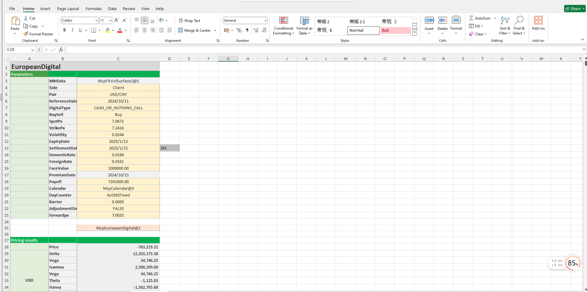

# **外汇数字期权定价案例**


> 访问猛犸期权定价系统，支持外汇期权和结构化产品定价估值！
[](https://fxo.mathema.com.cn)

外汇数字期权定价模板使用函数说明提供了从节假日管理、收益率曲线构建、波动率曲面构建、数字期权对象构造、日期计算、期权定价到Greek值计算的全流程功能，用于实现数字期权的精确建模、定价和风险分析。
点击下面图片下载模板：

---
[](./MCP-TC09-FXDigitalOptionPricingCase.xlsx)
---

## **外汇数字期权定价模板使用函数说明**

### **1. 节假日构造函数**
- **[McpCalendar](/zh/latest/api/calendar.html#excel-mcpcalendar-code-dates)**：构造一个或多个货币对的节假日对象。
- **[McpNCalendar](/zh/latest/api/calendar.html#excel-mcpncalendar-ccys-holidays)**：构造多个货币的节假日对象。

### **2. 收益率曲线构造函数**
- **[McpYieldCurve2](/zh/latest/api/yieldcurve.html#excel-mcpyieldcurve2-args1-args2-args3-args4-args5-fmt-vp-hd)**：构造收益率曲线对象。

### **3. 远期曲线构造函数**
- **[McpFXForwardPointsCurve2](/zh/latest/api/fxforwardratecurve.html#excel-mcpfxforwardpointscurve2-args1-args2-args3-args4-args5-fmt-vp)**：构造远期曲线对象。

### **4. 波动率曲面构造函数**
- **[McpFXVolSurface2](/zh/latest/api/fxvolsurface.html#excel-mcpfxvolsurface2-args1-args2-args3-args4-args5-fmt-vp)**：构造波动率曲面对象。

### **5. 数字期权构造函数**
- **[McpEuropeanDigital](/zh/latest/api/europeandigital.html#excel-mcpeuropeandigital-args1-args2-args3-args4-args5-fmt-vp)**：构造数字期权对象。

### **6. 波动率曲面相关函数**
- **[FXVolSurface2GetForeignRate](/zh/latest/api/fxvolsurface.html#excel-fxvolsurface2getforeignrate-vs-expiryordeliverydate-isdeliverydate-bidmidask)**：从波动率曲面获取对应到期日的货币1（CCY1）的利率。
- **[FXVolSurface2GetDomesticRate](/zh/latest/api/fxvolsurface.html#excel-fxvolsurface2getdomesticrate-vs-expiryordeliverydate-isdeliverydate-bidmidask)**：从波动率曲面获取对应到期日的货币2（CCY2）的利率。
- **[FXVolSurface2GetForward](/zh/latest/api/fxvolsurface.html#excel-fxvolsurface2getforward-vs-expiryordeliverydate-isdeliverydate-bidmidask)**：从波动率曲面获取对应到期日的远期价格。

### **7. 日期计算函数**
- **[CalendarValueDate](/zh/latest/api/calendar.html#excel-calendarvaluedate-cal-date-isfollowing-true-calendarcodes)**：计算期权费支付日期。
- **[CalendarFXOExpiryDateFromTenor](/zh/latest/api/calendar.html#excel-calendarfxoexpirydatefromtenor-cal-referencedate-tenor-spotdate-calendarcodes)**：计算到期日。
- **[CalendarFXODeliveryDateFromTenor](/zh/latest/api/calendar.html#excel-calendarfxodeliverydatefromtenor-cal-referencedate-tenor-spotdate-calendarcodes)**：计算交割日。


### **8. 期权定价函数**
- **[McpPrice](/zh/latest/api/europeandigital.html#excel-mcpprice-obj-isamount)**：计算期权费。

### **9. Greek值计算函数**
- **[McpDelta](/zh/latest/api/europeandigital.html#excel-mcpdelta-obj-isccy2-false-isamount-true-pricingmethod-1-isclosedformmethod-true)**：计算Delta值。
- **[McpVega](/zh/latest/api/europeandigital.html#excel-mcpvega-obj-isccy2-false-isamount-true-pricingmethod-1-isclosedformmethod-true)**：计算Vega值。
- **[McpGamma](/zh/latest/api/europeandigital.html#excel-mcpgamma-obj-isccy2-false-isamount-true-pricingmethod-1-isclosedformmethod-true)**：计算Gamma值。
- **[McpTheta](/zh/latest/api/europeandigital.html#excel-mcptheta-obj-isccy2-false-isamount-true-pricingmethod-1-isclosedformmethod-true)**：计算Theta值。
- **[McpVanna](/zh/latest/api/europeandigital.html#excel-mcpvanna-obj-isccy2-false-isamount-true-pricingmethod-1-isclosedformmethod-true)**：计算Vanna值。
- **[McpVolga](/zh/latest/api/europeandigital.html#excel-mcpvolga-obj-isccy2-false-isamount-true-pricingmethod-1-isclosedformmethod-true)**：计算Volga值。
- **[McpForwardDelta](/zh/latest/api/europeandigital.html#excel-mcpforwarddelta-obj-isccy2-false-isamount-true-pricingmethod-1-isclosedformmethod-true)**：计算Forward Delta值。
- **[McpRho](/zh/latest/api/europeandigital.html#excel-mcprho-obj-isccy2-false-isamount-true-pricingmethod-1-isclosedformmethod-true)**：计算Rho值。

---

## **Python代码示例**
以下是一个简单的 Python 代码示例，用于测试数字期权的定价。假设我们使用 `McpEuropeanDigital` 函数构造数字期权对象，并使用 `McpPrice` 函数计算期权费。代码中会模拟一些参数值，并输出期权费。

---

### **数字期权定价**

```python
# 假设我们已经有一个数字期权定价库，包含 McpEuropeanDigital 和 McpPrice 函数
# 以下代码仅为示例，实际使用时需要替换为真实的库和函数

# 导入假设的定价库
from pricing_library import McpEuropeanDigital, McpPrice

# 定义数字期权的参数
reference_date = "2023-10-01"  # 交易日或估值日
spot_px = 100.0  # 即期价格
strike_px = 105.0  # 行权价
expiry_date = "2023-12-31"  # 到期日
settlement_date = "2024-01-02"  # 交割日
volatility = 0.2  # 波动率
acc_rate = 0.02  # 货币2的利率
und_rate = 0.01  # 货币1的利率
face_value = 1.0  # 本金
payoff = 10.0  # 盈亏
digital_type = "CASH_OR_NOTHING_CALL"  # 数字期权类型

# 构造数字期权对象
digital_option = McpEuropeanDigital(
    reference_date=reference_date,
    spot_px=spot_px,
    strike_px=strike_px,
    expiry_date=expiry_date,
    settlement_date=settlement_date,
    volatility=volatility,
    acc_rate=acc_rate,
    und_rate=und_rate,
    face_value=face_value,
    payoff=payoff,
    digital_type=digital_type
)

# 计算期权费
option_price = McpPrice(digital_option)

# 输出结果
print(f"数字期权的期权费为: {option_price}")
```

---

### **代码说明**
1. **参数定义**：
   - `reference_date`：交易日或估值日。
   - `spot_px`：即期价格。
   - `strike_px`：行权价。
   - `expiry_date`：到期日。
   - `settlement_date`：交割日。
   - `volatility`：波动率。
   - `acc_rate`：货币2的利率。
   - `und_rate`：货币1的利率。
   - `face_value`：本金。
   - `payoff`：盈亏。
   - `digital_type`：数字期权类型（例如现金或无看涨期权）。

2. **构造数字期权对象**：
   - 使用 `McpEuropeanDigital` 函数构造数字期权对象。

3. **计算期权费**：
   - 使用 `McpPrice` 函数计算期权费。

4. **输出结果**：
   - 打印计算得到的期权费。

---

### **运行结果**
假设模拟的 `McpPrice` 函数返回的期权费为 `5.0`，则输出结果为：
```
数字期权的期权费为: 5.0
```

---
