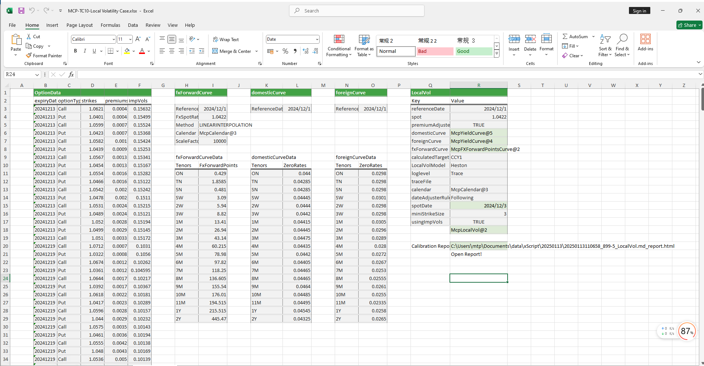

# **本地波动率案例**

> 访问猛犸期权定价系统，支持外汇期权和结构化产品定价估值！

本地波动率模板使用函数说明提供了从节假日管理、收益率曲线构建、远期曲线构建、使用Dupire和Heston定价模型构造本地波动率曲面对象。
点击下面图片下载模板：

---

---

## **本地波动率模板使用函数说明**

### **1. 节假日构造函数**
   - **[McpCalendar](/zh/latest/api/calendar.html#excel-mcpcalendar-code-dates)**：构造一个或多个货币对的节假日对象。
   - **[McpNCalendar](/zh/latest/api/calendar.html#excel-mcpncalendar-ccys-holidays)**：构造多个货币的节假日对象。

### **2. 收益率曲线构造函数**
   - **[McpYieldCurve](/zh/latest/api/yieldcurve.html#excel-mcpyieldcurve-args1-args2-args3-args4-args5-fmt-vp-hd)**：构造收益率曲线对象。

### **3. 远期曲线构造函数**
   - **[McpFXForwardPointsCurve](/zh/latest/api/fxforwardratecurve.html#excel-mcpfxforwardpointscurve-args1-args2-args3-args4-args5-fmt-vp)**：构造远期曲线对象。

### **4. 本地波动率曲面构造函数**
   - **[McpLocalVol](/zh/latest/api/localvol.html#excel-mcplocalvol-args1-args2-args3-args4-args5-fmt-dt-vp-hd)**：构造本地波动率曲面对象。

