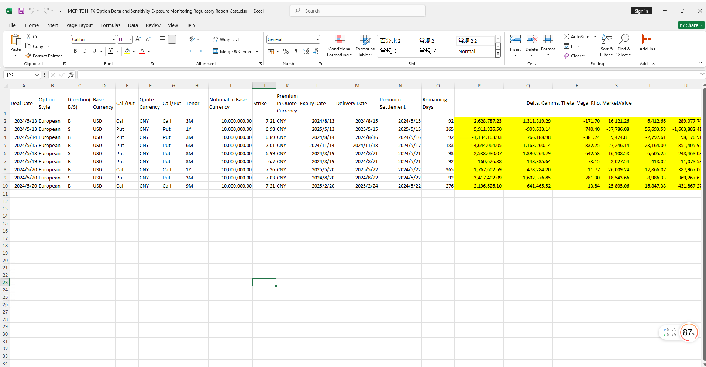

# **外汇期权Delta等敏感性敞口监控监管报表案例**

> 访问猛犸期权定价系统，支持外汇期权和结构化产品定价估值！

外汇期权Delta等敏感性敞口监控监管报表模板使用函数说明提供了从节假日管理、收益率曲线构建、远期曲线构建、外汇波动率曲面对象构建及Greek值计算、生成监管报表等。
点击下面图片下载模板：

---

---

## **外汇期权Delta等敏感性敞口监控监管报表模板使用函数说明**

### **1. 节假日构造函数**
   - **[McpCalendar](/zh/latest/api/calendar.html#excel-mcpcalendar-code-dates)**：构造一个或多个货币对的节假日对象。
   - **[McpNCalendar](/zh/latest/api/calendar.html#excel-mcpncalendar-ccys-holidays)**：构造多个货币的节假日对象。

### **2. 收益率曲线构造函数**
   - **[McpYieldCurve2](/zh/latest/api/yieldcurve.html#excel-mcpyieldcurve2-args1-args2-args3-args4-args5-fmt-vp-hd)**：构造收益率曲线对象。

### **3. 远期曲线构造函数**
   - **[McpFXForwardPointsCurve2](/zh/latest/api/fxforwardratecurve.html#excel-mcpfxforwardpointscurve2-args1-args2-args3-args4-args5-fmt-vp)**：构造远期点曲线对象。

### **4. 波动率曲面构造函数**
   - **[McpFXVolSurface2](/zh/latest/api/fxvolsurface.html#excel-mcpfxvolsurface2-args1-args2-args3-args4-args5-fmt-vp)**：构造外汇波动率曲面对象。

### **5. Greek指标计算函数**
   - **[McpVoGreeks](../abc)**：计算Greek指标。

### **6. 监管报表生成函数**
   - **[McpVoReport4](../abc)**：生成监管报表。