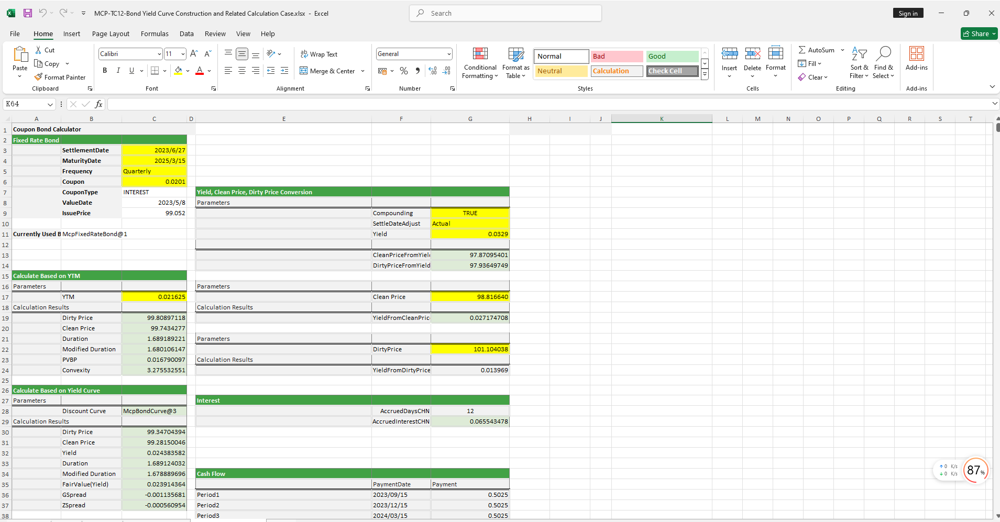

# **债券收益率曲线构造及相关计算案例**

> 访问猛犸期权定价系统，支持外汇期权和结构化产品定价估值！

债券收益率曲线构造及相关计算案例模板使用函数说明提供了从节假日管理、BondCurve曲线构建、FixedRateBondCurve对象构建、参数构造函数、收益率净价全价互换函数、久期、凸性、Spread等指标计算函数。
点击下面图片下载模板：

---

---

## **本地波动率模板使用函数说明**

### **1. 节假日构造函数**
- **[McpCalendar](/zh/latest/api/calendar.html#excel-mcpcalendar-code-dates)**：构造一个或多个货币对的节假日对象。
- **[McpNCalendar](/zh/latest/api/calendar.html#excel-mcpncalendar-ccys-holidays)**：构造多个货币的节假日对象。

### **2. FixedRateBondCurve构造函数**
- **[McpFixedRateBondCurveData](/zh/latest/api/bondcurve.html#excel-mcpfixedratebondcurvedata-args1-args2-args3-args4-args5-fmt-vp-hd)**：构造FixedRateBondCurve对象。

### **3. BondCurve构造函数**
- **[McpBondCurve2](/zh/latest/api/bondcurve.html#excel-mcpbondcurve2-args1-args2-args3-args4-args5)**：构造BondCurve对象。

### **4. 曲线校准构造函数**
- **[McpCalibrationSet](/zh/latest/api/bondcurve.html#excel-mcpcalibrationset-args)**：构造曲线时用于存放不同产品（如Depo、Swap、Bond等利率产品）的校准集合。

### **5. 参数曲线构造函数**
- **[McpParametricCurve](/zh/latest/api/bondcurve.html#excel-mcpparametriccurve-args1-args2-args3-args4-args5-fmt-vp-hd)**：构建NSS、NS、CIR等参数曲线。

### **6. 零息利率函数**
- **[YieldCurveZeroRate](/zh/latest/api/bondcurve.html#excel-yieldcurvezerorate-curve-date)**：从曲线上取对应到期日的零息利率。

### **7. FixedRateBond构造函数**
- **[McpFixedRateBond](/zh/latest/api/fixedratebond.html#excel-mcpfixedratebond-args1-args2-args3-args4-args5-fmt-vp)**：构造FixedRateBond对象。

### **8. 价格计算函数**
- **[FrbCleanPriceFromYieldCHN](/zh/latest/api/fixedratebond.html#excel-frbcleanpricefromyieldchn-bond-yld-compounding-settledateadjust)**：根据FixedRateBond对象和收益率计算净价。
- **[FrbDirtyPriceFromYieldCHN](/zh/latest/api/fixedratebond.html#excel-frbdirtypricefromyieldchn-bond-yld-compounding)**：根据FixedRateBond对象和收益率计算全价。
- **[FrbPrice](/zh/latest/api/fixedratebond.html#excel-frbprice-bond-curve)**：根据FixedRateBond对象和BondCurve对象计算全价。

### **9. 久期与凸性计算函数**
- **[FrbDurationCHN](/zh/latest/api/fixedratebond.html#excel-frbdurationchn-bond-yld)**：根据FixedRateBond对象和收益率计算麦氏久期。
- **[FrbMDurationCHN](/zh/latest/api/fixedratebond.html#excel-frbmdurationchn-bond-yld)**：根据FixedRateBond对象和收益率计算修正久期。
- **[FrbConvexityCHN](/zh/latest/api/fixedratebond.html#excel-frbconvexitychn-bond-yld)**：根据FixedRateBond对象和收益率计算修正凸性。

### **10. PVPB计算函数**
- **[FrbPVBPCHN](/zh/latest/api/fixedratebond.html#excel-frbpvbpchn-bond-yld)**：根据FixedRateBond对象和收益率计算PVPB。

### **11. 收益率计算函数**
- **[FrbYieldFromDirtyPriceCHN](/zh/latest/api/fixedratebond.html#excel-frbyieldfromdirtypricechn-bond-dirtyprice-compounding)**：根据FixedRateBond对象和全价计算收益率。

### **12. 公允价值计算函数**
- **[FrbFairValue](/zh/latest/api/fixedratebond.html#excel-frbfairvalue-bond-curve)**：根据FixedRateBond对象和BondCurve对象计算公允价值（Yield）。

### **13. Spread计算函数**
- **[FrbGSpread](/zh/latest/api/fixedratebond.html#excel-frbgspread-bond-yld-curve)**：计算G-Spread。
- **[FrbZSpread](/zh/latest/api/fixedratebond.html#excel-frbzspread-bond-yld-curve)**：计算Z-Spread。