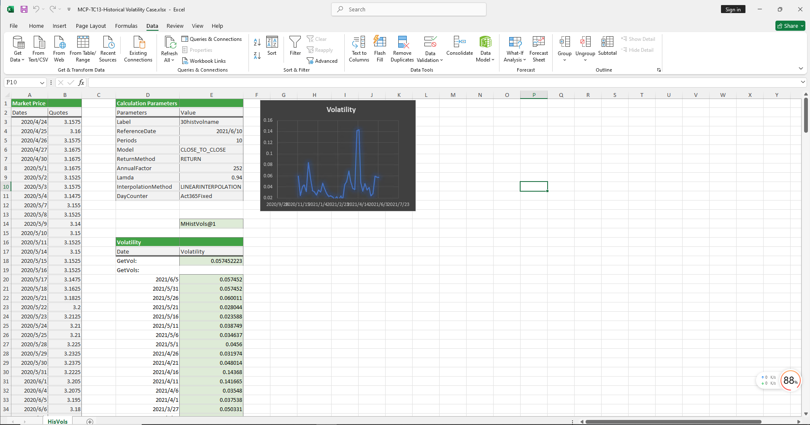

# **历史波动率案例**

> 访问猛犸期权定价系统，支持外汇期权和结构化产品定价估值！

历史波动率案例提供历史波动率对象的构造及从波动率曲面上取指定日期的波动率。历史波动率是评估资产风险、指导投资决策和进行风险管理的重要工具。
点击下面图片下载模板：

---

---

## **历史波动率案例模板使用函数说明**

### **1. 历史波动率构造函数**
- **[McpHistVols](/zh/latest/api/histvol.html#excel-mcphistvols-args1-args2-args3-args4-args5-fmt-vp-hd)**：构造历史波动率对象。

### **2. 波动率获取函数**
- **[HvsGetVol](/zh/latest/api/histvol.html#excel-hvsgetvol-hv-referencedate)**：从历史波动率对象上获取指定日期的波动率。
- **[HvsGetVols](/zh/latest/api/histvol.html#excel-hvsgetvols-hv-referencedates-format-v)**：从历史波动率对象上获取一组日期的波动率。