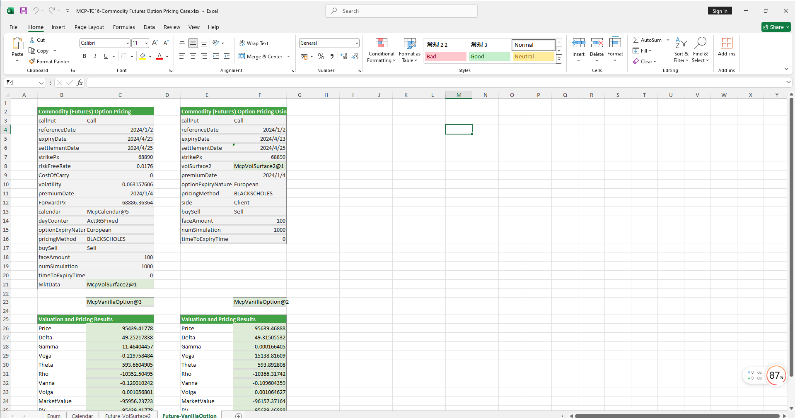

# **商品期货期权定价案例**

> 访问猛犸期权定价系统，支持外汇期权和结构化产品定价估值！

商品期货期权定价模板使用函数说明提供了从节假日管理、无风险利率曲线构建、远期曲线构建、商品期货波动率曲面构建、商品期货期权对象构造、期权定价到Greek值计算的全流程功能，用于实现商品股指期权的精确建模、定价和风险分析。
点击下面图片下载模板：

---

---

## **商品期货期权定价模板使用函数说明**

### **1. 节假日构造函数**
- **[McpCalendar](/zh/latest/api/calendar.html#excel-mcpcalendar-code-dates)**：构造一个或多个货币对的节假日对象。
- **[McpNCalendar](/zh/latest/api/calendar.html#excel-mcpncalendar-ccys-holidays)**：构造多个货币的节假日对象。

### **2. 无风险利率曲线构造函数**
- **[McpYieldCurve2](/zh/latest/api/yieldcurve.html#excel-mcpyieldcurve2-args1-args2-args3-args4-args5-fmt-vp-hd)**：构造无风险利率曲线对象。

### **3. 远期曲线构造函数**
- **[McpForwardCurve2](/zh/latest/api/forwardratecurve.html#excel-mcpforwardcurve2-args1-args2-args3-args4-args5-fmt-vp-hd)**：构造远期曲线对象。

### **4. 商品期货波动率曲面构造函数**
- **[McpVolSurface2](/zh/latest/api/volsurface.html#excel-mcpvolsurface2-args1-args2-args3-args4-args5-fmt-vp)**：构造商品期货波动率曲面对象。

### **5. 波动率曲面信息获取函数**
- **[VolSurface2GetReferenceDate](/zh/latest/api/volsurface.html#excel-volsurface2getreferencedate-vs)**：从波动率曲面上获取ReferenceDate。
- **[VolSurface2GetSpotDate](/zh/latest/api/volsurface.html#excel-volsurface2getspotdate-vs)**：从波动率曲面上获取SpotDate。
- **[VolSurface2GetForward](/zh/latest/api/volsurface.html#excel-volsurface2getforward-vs-expiryordeliverydate-isdeliverydate-bidmidask)**：从波动率曲面上获取指定到期日的Forward。
- **[VolSurface2Strikes](/zh/latest/api/volsurface.html#excel-volsurface2strikes-vs-bidmidask-fmt-v)**：从波动率曲面上获取Strikes。
- **[VolSurface2ExpiryDates](/zh/latest/api/volsurface.html#excel-volsurface2expirydates-vs-bidmidask-fmt-v)**：从波动率曲面上获取ExpiryDates。
- **[VolSurface2GetVolatility](/zh/latest/api/volsurface.html#excel-volsurface2getvolatility-vs-strike-maturitydate-bidmidask-midforward)**：从波动率曲面上获取波动率。

### **6. 期权对象构造函数**
- **[McpVanillaOption](/zh/latest/api/vanillaoption.html#excel-mcpvanillaoption-args1-args2-args3-args4-args5-fmt)**：构造VanillaOption对象。

### **7. 期权费计算函数**
- **[McpPrice](/zh/latest/api/vanillaoption.html#excel-mcpprice-obj-isamount-true)**：计算期权费。

### **8. Greek值计算函数**
- **[McpDelta](/zh/latest/api/vanillaoption.html#excel-mcpdelta-obj-isccy2-false-isamount-true-pricingmethod-1-isclosedformmethod-true)**：计算期权的Delta值。
- **[McpVega](/zh/latest/api/vanillaoption.html#excel-mcpvega-obj-isccy2-false-isamount-true-pricingmethod-1-isclosedformmethod-true)**：计算期权的Vega值。
- **[McpGamma](/zh/latest/api/vanillaoption.html#excel-mcpgamma-obj-isccy2-false-isamount-true-pricingmethod-1-isclosedformmethod-true)**：计算期权的Gamma值。
- **[McpTheta](/zh/latest/api/vanillaoption.html#excel-mcptheta-obj-isccy2-false-isamount-true-pricingmethod-1-isclosedformmethod-true)**：计算期权的Theta值。
- **[McpVanna](/zh/latest/api/vanillaoption.html#excel-mcpvanna-obj-isccy2-false-isamount-true-pricingmethod-1-isclosedformmethod-true)**：计算期权的Vanna值。
- **[McpVolga](/zh/latest/api/vanillaoption.html#excel-mcpvolga-obj-isccy2-false-isamount-true-pricingmethod-1-isclosedformmethod-true)**：计算期权的Volga值。
- **[McpForwardDelta](/zh/latest/api/vanillaoption.html#excel-mcpforwarddelta-obj-isccy2-false-isamount-true-pricingmethod-1-isclosedformmethod-true)**：计算期权的ForwardDelta值。
- **[McpRho](/zh/latest/api/vanillaoption.html#excel-mcprho-obj-isccy2-false-isamount-true-pricingmethod-1-isclosedformmethod-true)**：计算期权的Rho值。

### **9. 市场价值与现值计算函数**
- **[McpMarketValue](/zh/latest/api/vanillaoption.html#excel-mcpmarketvalue-obj-isamount-true)**：计算期权的MarketValue。
- **[McpPV](/zh/latest/api/vanillaoption.html#excel-mcppv-obj-isamount-true)**：计算期权的PV（现值）。