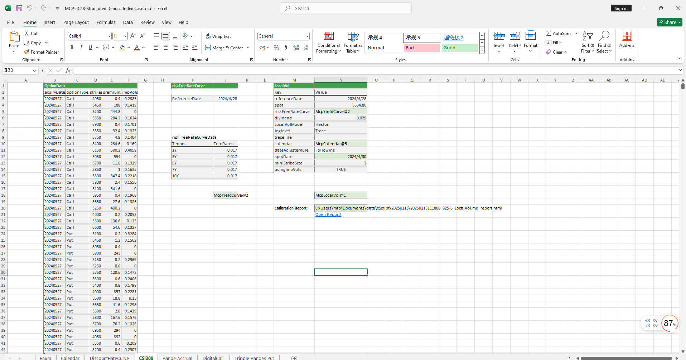

# **结构化存款指数类案例**

> 访问猛犸期权定价系统，支持外汇期权和结构化产品定价估值！

结构化存款指数类案例模板使用函数说明提供了从节假日管理、无风险利率曲线构建、远期曲线构建、波动率曲面构建、结构化产品结构定义、XScrip对象构造、结构化产品定价到Greek值计算等全流程功能，用于实现结构化存款指数类的精确建模、定价和风险分析。
点击下面图片下载模板：

---

---

## **结构化存款指数类案例模板使用函数说明**

### **1. 节假日构造函数**
- **[McpCalendar](/zh/latest/api/calendar.html#excel-mcpcalendar-code-dates)**：构造一个或多个货币对的节假日对象。
- **[McpNCalendar](/zh/latest/api/calendar.html#excel-mcpncalendar-ccys-holidays)**：构造多个货币的节假日对象。

### **2. 无风险利率曲线构造函数**
- **[McpYieldCurve](/zh/latest/api/yieldcurve.html#excel-mcpyieldcurve-args1-args2-args3-args4-args5-fmt-vp-hd)**：构造无风险利率曲线对象。

### **3. 波动率曲面构造函数**
- **[McpLocalVol](/zh/latest/api/localvol.html#excel-mcplocalvol-args1-args2-args3-args4-args5-fmt-dt-vp-hd)**：构造Local波动率曲面对象。

### **4. 报告生成函数**
- **[HmReport](/zh/latest/api/localvol.html#excel-hmreport-obj)**：生成Local报告。

### **5. 产品结构定义函数**
- **[McpStructureDef](/zh/latest/api/xscriptstructure.html#excel-mcpstructuredef-packagename-structure-schedule1-payoff-schedule2)**：定义产品结构。

### **6. XScrip对象构造函数**
- **[McpXScriptStructure](/zh/latest/api/xscriptstructure.html#excel-mcpxscriptstructure-args1-args2-args3-args4-args5-fmt-vp-hd)**：构造XScrip对象。

### **7. 期权费计算函数**
- **[XssPrice](/zh/latest/api/xscriptstructure.html#excel-xssprice-obj-isamount-true)**：计算期权费。

### **8. Greek值计算函数**
- **[XssDelta](/zh/latest/api/xscriptstructure.html#excel-xssdelta-obj-isccy2-true-isamount-true)**：计算Delta值。
- **[XssVega](/zh/latest/api/xscriptstructure.html#excel-xssvega-obj-isccy2-true-isamount-true)**：计算Vega值。
- **[XssGamma](/zh/latest/api/xscriptstructure.html#excel-xssgamma-obj-isccy2-true-isamount-true)**：计算Gamma值。
- **[XssTheta](/zh/latest/api/xscriptstructure.html#excel-xsstheta-obj-isccy2-true-isamount-true)**：计算Theta值。
- **[XssVanna](/zh/latest/api/xscriptstructure.html#excel-xssvanna-obj-isccy2-true-isamount-true)**：计算Vanna值。
- **[XssVolga](/zh/latest/api/xscriptstructure.html#excel-xssvolga-obj-isccy2-true-isamount-true)**：计算Volga值。
- **[XssForwardDelta](/zh/latest/api/xscriptstructure.html#excel-xssforwarddelta-obj-isccy2-true-isamount-true)**：计算Forward Delta值。
- **[XssRho](/zh/latest/api/xscriptstructure.html#excel-xssrho-obj-isccy2-true-isamount-true)**：计算Rho值。

### **9. 市场价值与现值计算函数**
- **[XssMarketValue](/zh/latest/api/xscriptstructure.html#excel-xssmarketvalue-obj-isamount-true)**：计算MarketValue。
- **[XssPV](/zh/latest/api/xscriptstructure.html#excel-xsspv-obj-isamount-true)**：计算PV。

### **10. 收益率计算函数**
- **[XssAnnualizedPrice](/zh/latest/api/xscriptstructure.html#excel-xssannualizedprice-obj)**：计算Return%。

### **11. Payoff事件输出函数**
- **[McpProductEvents](/zh/latest/api/xscriptstructure.html#excel-mcpproductevents-prod)**：输出Payoff事件。

### **12. 期权费反算函数**
- **[SolverFromPremium](/zh/latest/api/xscriptstructure.html#excel-solverfrompremium-priceobj-premium-targetfield-x0-1-0-bracket-100-100-method-bisect-options-maxiter-50-xtol-1e-6-isannualized-false)**：根据期权费反算。