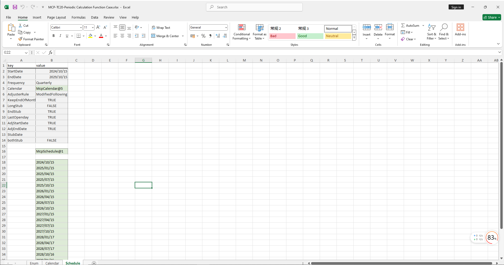

# **周期计算函数案例**

> 访问猛犸期权定价系统，支持外汇期权和结构化产品定价估值！

周期计算函数案例模板使用函数说明提供了从节假日管理、Schedule对象构建、从Schedule对象上获取对应的Dates等。
点击下面图片下载模板：

---

---

## **周期计算函数案例模板使用函数说明**

### **1. 节假日构造函数**
- **[McpCalendar](/zh/latest/api/calendar.html#excel-mcpcalendar-code-dates)**：构造一个或多个货币对的节假日对象。
- **[McpNCalendar](/zh/latest/api/calendar.html#excel-mcpncalendar-ccys-holidays)**：构造多个货币的节假日对象。

### **2. Schedule构造函数**
- **[McpSchedule](/zh/latest/api/schedule.html#excel-mcpschedule-args1-args2-args3-args4-args5-fmt-vp)**：构造Schedule对象。

### **3. Schedule对象操作函数**
- **[ScheduleDates](/zh/latest/api/schedule.html#excel-scheduledates-obj)**：从Schedule对象上获取对应的Dates。