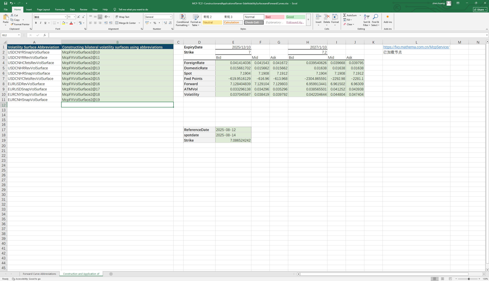

# **服务器端构造远期曲线和波动率曲面对象案例**

> 访问猛犸期权定价系统，支持外汇期权和结构化产品定价估值！

服务器端通过远期曲线简称和波动率曲面简称构造对象，从远期曲线取对应到期日的掉期点和远期价格、从波动率曲面上取对应到期日的ATMVol、利率、掉期点、远期价格和波动率等。
点击下面图片下载模板：

---

---

## **服务器端通过远期曲线简称和波动率曲面简称构造对象及应用使用函数说明**

### **1. 服务器端远期曲线构造函数**
   - **[McpFXForwardPointsCurves2](/zh/latest/api/fxforwardratecurve.html#excel-mcpfxforwardpointscurves2-identifiers-refdate)**：服务器端通过远期曲线简称构造双边远期曲线对象。

### **2. 远期曲线数据提取函数**
   - **[Fxfpc2FXForwardPoints](/zh/latest/api/fxforwardratecurve.html#excel-fxfpc2fxforwardpoints-curve-date-bidmidask)**：从双边远期曲线对象上取掉期点。
   - **[Fxfpc2FXForwardOutright](/zh/latest/api/fxforwardratecurve.html#excel-fxfpc2fxforwardoutright-curve-date-bidmidask)**：从双边远期曲线对象上取掉远期价格。

### **3. 服务器端波动率曲面构造函数**
   - **[McpVolSurfaces](/zh/latest/api/fxvolsurface.html#excel-mcpvolsurfaces-identifiers)**：服务器端通过波动率曲面简称构造双边波动率曲面对象。

### **4. 波动率曲面数据获取**
   - **[FXVolSurface2GetReferenceDate](/zh/latest/api/fxvolsurface.html#excel-fxvolsurface2getreferencedate-vs)**：获取波动率曲面的参考日期。
   - **[FXVolSurface2GetSpotDate](/zh/latest/api/fxvolsurface.html#excel-fxvolsurface2getspotdate-vs)**：获取波动率曲面的即期日期。
   - **[FXVolSurface2GetSpot](/zh/latest/api/fxvolsurface.html#excel-fxvolsurface2getspot-vs-bidmidask)**：获取波动率曲面的即期价格。
   - **[FXVolSurface2GetStrike](/zh/latest/api/fxvolsurface.html#excel-fxvolsurface2getstrike-vs-deltastring-tenor-bidmidask)**：获取对应期限及DeltaString的strike。
   - **[FXVolSurface2GetVolatility](/zh/latest/api/fxvolsurface.html#excel-fxvolsurface2getvolatility-vs-strike-expirydate-bidmidask-midforward-0-0-bidinputdeltavolpair-askinputdeltavolpair)**：获取对应到期日及strike的波动率。
   - **[FXVolSurface2GetATMVol](/zh/latest/api/fxvolsurface.html#excel-fxvolsurface2getatmvol-vs-expirydate-bidmidask)**：获取对应到期日的ATM波动率。
   - **[FXVolSurface2GetForeignRate](/zh/latest/api/fxvolsurface.html#excel-fxvolsurface2getforeignrate-vs-expiryordeliverydate-isdeliverydate-bidmidask)**：获取对应到期日的CCY1利率。
   - **[FXVolSurface2GetDomesticRate](/zh/latest/api/fxvolsurface.html#excel-fxvolsurface2getdomesticrate-vs-expiryordeliverydate-isdeliverydate-bidmidask)**：获取对应到期日的CCY2利率。
   - **[FXVolSurface2GetForwardPoint](/zh/latest/api/fxvolsurface.html#excel-fxvolsurface2getforwardpoint-vs-expiryordeliverydate-isdeliverydate-bidmidask)**：获取对应到期日的掉期点。
   - **[FXVolSurface2GetForward](/zh/latest/api/fxvolsurface.html#excel-fxvolsurface2getforward-vs-expiryordeliverydate-isdeliverydate-bidmidask)**：获取对应到期日的远期价格。

  
