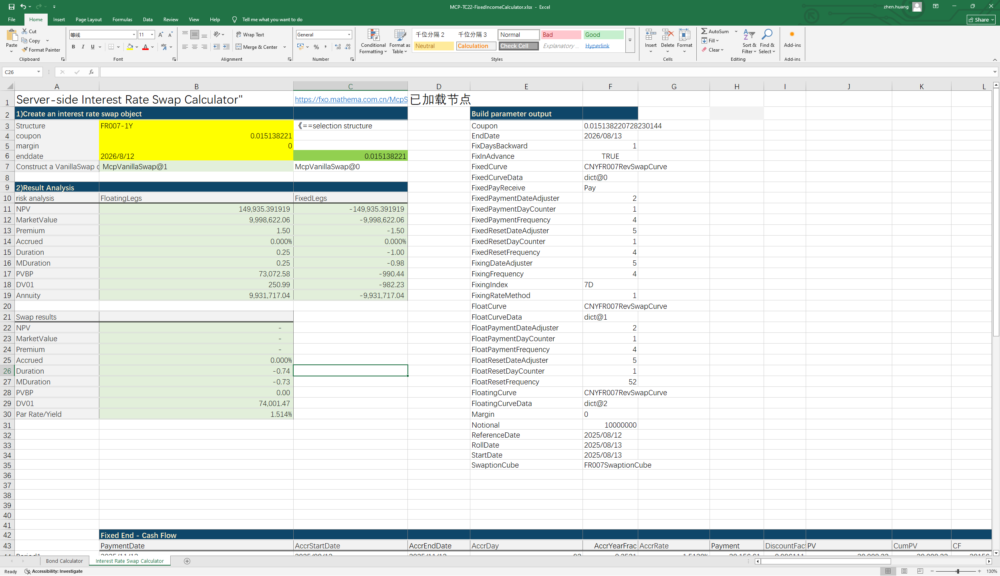

# **服务器端债券计算器和利率互换计算器案例**

> 访问猛犸期权定价系统，支持外汇期权和结构化产品定价估值！

服务器端债券对象构造及相关收益率、净价、全价互换函数、久期、凸性、Spread等指标计算函数；服务器端利率互换对象构造，固定端分析、浮动端分析及互换结果分析等。
点击下面图片下载模板：

---

---

## **服务器端通过债券代码和结构简称构造债券对象和利率互换对象及应用使用函数说明**

### **1. 服务器端债券对象构造及取最新成交价的函数**
   - **[McpFixedRateBonds2](/zh/latest/api/fixedratebond.html#excel-mcpfixedratebonds2-identifiers-settlement-date)**：服务器端债券对象的构建函数。
   - **[McpGet1](/zh/latest/api/fixedratebond.html#excel-mcpget1-identifiers-key)**：服务器端获取指定债券代码的最新成交价。

### **2. 价格计算函数**
- **[FrbCleanPriceFromYieldCHN](/zh/latest/api/fixedratebond.html#excel-frbcleanpricefromyieldchn-bond-yld-compounding-settledateadjust)**：根据FixedRateBond对象和收益率计算净价。
- **[FrbDirtyPriceFromYieldCHN](/zh/latest/api/fixedratebond.html#excel-frbdirtypricefromyieldchn-bond-yld-compounding)**：根据FixedRateBond对象和收益率计算全价。
- **[FrbPrice](/zh/latest/api/fixedratebond.html#excel-frbprice-bond-curve)**：根据FixedRateBond对象和BondCurve对象计算全价。

### **3. 久期与凸性计算函数**
- **[FrbDurationCHN](/zh/latest/api/fixedratebond.html#excel-frbdurationchn-bond-yld)**：根据FixedRateBond对象和收益率计算麦氏久期。
- **[FrbMDurationCHN](/zh/latest/api/fixedratebond.html#excel-frbmdurationchn-bond-yld)**：根据FixedRateBond对象和收益率计算修正久期。
- **[FrbConvexityCHN](/zh/latest/api/fixedratebond.html#excel-frbconvexitychn-bond-yld)**：根据FixedRateBond对象和收益率计算修正凸性。

### **4. PVPB计算函数**
- **[FrbPVBPCHN](/zh/latest/api/fixedratebond.html#excel-frbpvbpchn-bond-yld)**：根据FixedRateBond对象和收益率计算PVPB。

### **5. 收益率计算函数**
- **[FrbYieldFromDirtyPriceCHN](/zh/latest/api/fixedratebond.html#excel-frbyieldfromdirtypricechn-bond-dirtyprice-compounding)**：根据FixedRateBond对象和全价计算收益率。

### **6. 服务器端利率互换对象构造函数**
   - **[McpVanillaSwaps2](/zh/latest/api/vanillaswap.html#excel-mcpvanillaswaps2-identifiers-enddate-swaprate-point)**：服务器端通过利率互换结构构造VanillaSwap对象

### **7. 固定端分析函数**
- **[SwapFixedLegAnnuity](/zh/latest/api/vanillaswap.html#excel-swapfixedlegannuity-vanillaswap)**：计算年金。
- **[SwapFixedLegDuration](/zh/latest/api/vanillaswap.html#excel-swapfixedlegduration-vanillaswap)**：计算久期。
- **[SwapFixedLegMDuration](/zh/latest/api/vanillaswap.html#excel-swapfixedlegmduration-vanillaswap)**：计算修正久期。
- **[SwapFixedLegNPV](/zh/latest/api/vanillaswap.html#excel-swapfixedlegnpv-vanillaswap)**：计算净现值。
- **[SwapFixedLegDV01](/zh/latest/api/vanillaswap.html#excel-swapfixedlegdv01-vanillaswap)**：计算DV01。
- **[SwapFixedLegPremium](/zh/latest/api/vanillaswap.html#excel-swapfixedlegpremium-vanillaswap)**：计算费率。
- **[SwapFixedLegAccrued](/zh/latest/api/vanillaswap.html#excel-swapfixedlegaccrued-vanillaswap)**：计算应计利息。
- **[SwapFixedLegMarketValue](/zh/latest/api/vanillaswap.html#excel-swapfixedlegmarketvalue-vanillaswap)**：计算市场价值。

### **8. 浮动端分析函数**
- **[SwapFloatingLegAnnuity](/zh/latest/api/vanillaswap.html#excel-swapfloatinglegannuity-vanillaswap)**：计算年金。
- **[SwapFloatingLegDuration](/zh/latest/api/vanillaswap.html#excel-swapfloatinglegduration-vanillaswap)**：计算久期。
- **[SwapFloatingLegMDuration](/zh/latest/api/vanillaswap.html#excel-swapfloatinglegmduration-vanillaswap)**：计算修正久期。
- **[SwapFloatingLegNPV](/zh/latest/api/vanillaswap.html#excel-swapfloatinglegnpv-vanillaswap)**：计算净现值。
- **[SwapFloatingLegDV01](/zh/latest/api/vanillaswap.html#excel-swapfloatinglegdv01-vanillaswap)**：计算DV01。
- **[SwapFloatingLegPremium](/zh/latest/api/vanillaswap.html#excel-swapfloatinglegpremium-vanillaswap)**：计算费率。
- **[SwapFloatingLegAccrued](/zh/latest/api/vanillaswap.html#excel-swapfloatinglegaccrued-vanillaswap)**：计算应计利息。
- **[SwapFloatingLegMarketValue](/zh/latest/api/vanillaswap.html#excel-swapfloatinglegmarketvalue-vanillaswap)**：计算市场价值。

### **9. 互换结果函数**
- **[SwapNPV](/zh/latest/api/vanillaswap.html#excel-swapnpv-vanillaswap)**：计算净现值。
- **[SwapMarketParRate](/zh/latest/api/vanillaswap.html#excel-swapmarketparrate-vanillaswap)**：计算Par Rate/Yield。
- **[SwapDuration](/zh/latest/api/vanillaswap.html#excel-swapduration-vanillaswap)**：计算久期。
- **[SwapMDuration](/zh/latest/api/vanillaswap.html#excel-swapmduration-vanillaswap)**：计算修正久期。
- **[SwapPV01](/zh/latest/api/vanillaswap.html#excel-swappv01-vanillaswap)**：计算PVBP。
- **[SwapDV01](/zh/latest/api/vanillaswap.html#excel-swapdv01-vanillaswap)**：计算DV01。
- **[SwapMarketValue](/zh/latest/api/vanillaswap.html#excel-swapmarketvalue-vanillaswap)**：计算市场价值。
- **[SwapAccrued](/zh/latest/api/vanillaswap.html#excel-swapaccrued-vanillaswap)**：计算应计利息。

### **10. 定价函数**
- **[SwapFixedLegs](/zh/latest/api/vanillaswap.html#excel-swapfixedlegs-vanillaswap-fields)**：计算固定端现金流。
- **[SwapFloatingLegs](/zh/latest/api/vanillaswap.html#excel-swapfloatinglegs-vanillaswap-fields)**：计算浮动端现金流。

### **11. 定息频率和定息价格函数**
- **[SwapFloatingQuotes](/zh/latest/api/vanillaswap.html#excel-swapfloatingquotes-vanillaswap-fields)**：计算浮动端定息频率和定息价格。
- **[SwapFloatingQuoteLegs](/zh/latest/api/vanillaswap.html#excel-swapfloatingquotelegs-vanillaswap-fields)**：计算浮动端定息频率和定息价格。

  
