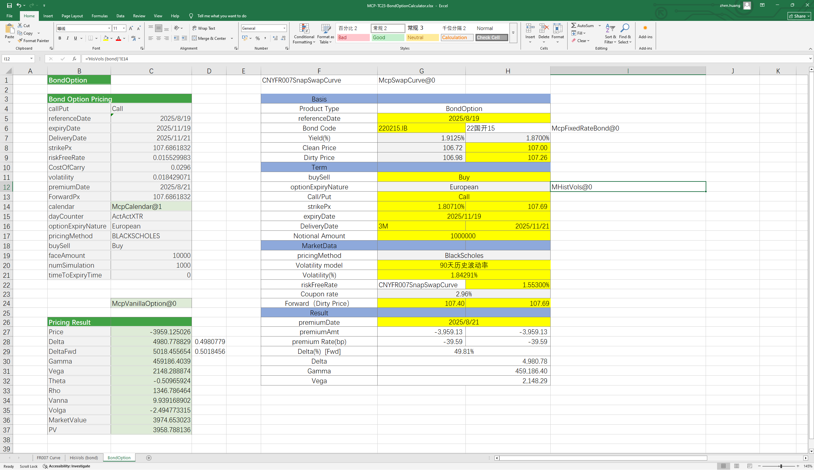

# **债券期权计算器案例**

> 访问猛犸期权定价系统，支持外汇期权和结构化产品定价估值！

债券期权计算器：提供债券定价及greeks指标的计算、历史波动率（使用债券的净价构造的波动率）的分析、payoff图标的计算、收益率净价全价的互算等功能。
点击下面图片下载模板：

---

---

## **债券期权计算器案例模板使用函数说明**

### **1. 节假日构造函数**
- **[McpCalenders](/zh/latest/api/calendar.html#excel-mcpcalenders-ccy)**：构造一个或多个货币对的节假日对象。

### **2. SwapCurve构造函数**
- **[McpVanillaSwapCurveData](/zh/latest/api/yieldcurve.html#excel-mcpvanillaswapcurvedata-args-data)**：构造Vanilla Swap Curve对象。
- **[McpSwapCurve](/zh/latest/api/yieldcurve.html#excel-mcpswapcurve-args1-args2-args3-args4-args5-fmt-vp)**：构造Swap Curve对象。

### **3. 存放不同产品函数**
- **[McpCalibrationSet](/zh/latest/api/bondcurve.html#excel-mcpcalibrationset-args)**：用于在构建利率曲线时，放入不同产品（如Depo、Swap、Bond等）并通过剥息法校准曲线。

### **4. 历史波动率构造函数**
- **[McpHistVols](/zh/latest/api/histvol.html#excel-mcphistvols-args1-args2-args3-args4-args5-fmt-vp-hd)**：构造历史波动率对象。

### **5. 期权对象构造函数**
   - **[McpVanillaOption](/zh/latest/api/vanillaoption.html#excel-mcpvanillaoption-args1-args2-args3-args4-args5-fmt)**：构造VanillaOption对象。

### **6. 期权费计算函数**
   - **[McpPrice](/zh/latest/api/vanillaoption.html#excel-mcpprice-obj-isamount-true)**：计算期权费。

### **7. Greek值计算函数**
   - **[McpDelta](/zh/latest/api/vanillaoption.html#excel-mcpdelta-obj-isccy2-false-isamount-true-pricingmethod-1-isclosedformmethod-true)**：计算Delta。
   - **[McpVega](/zh/latest/api/vanillaoption.html#excel-mcpvega-obj-isccy2-false-isamount-true-pricingmethod-1-isclosedformmethod-true)**：计算Vega。
   - **[McpGamma](/zh/latest/api/vanillaoption.html#excel-mcpgamma-obj-isccy2-false-isamount-true-pricingmethod-1-isclosedformmethod-true)**：计算Gamma。
   - **[McpTheta](/zh/latest/api/vanillaoption.html#excel-mcptheta-obj-isccy2-false-isamount-true-pricingmethod-1-isclosedformmethod-true)**：计算Theta。
   - **[McpVanna](/zh/latest/api/vanillaoption.html#excel-mcpvanna-obj-isccy2-false-isamount-true-pricingmethod-1-isclosedformmethod-true)**：计算Vanna。
   - **[McpVolga](/zh/latest/api/vanillaoption.html#excel-mcpvolga-obj-isccy2-false-isamount-true-pricingmethod-1-isclosedformmethod-true)**：计算Volga。
   - **[McpForwardDelta](/zh/latest/api/vanillaoption.html#excel-mcpforwarddelta-obj-isccy2-false-isamount-true-pricingmethod-1-isclosedformmethod-true)**：计算Forward Delta。
   - **[McpMarketValue](/zh/latest/api/vanillaoption.html#excel-mcpmarketvalue-obj-isamount-true)**：计算MarketValue。
   - **[McpPV](/zh/latest/api/vanillaoption.html#excel-mcppv-obj-isamount-true)**：计算PV。

