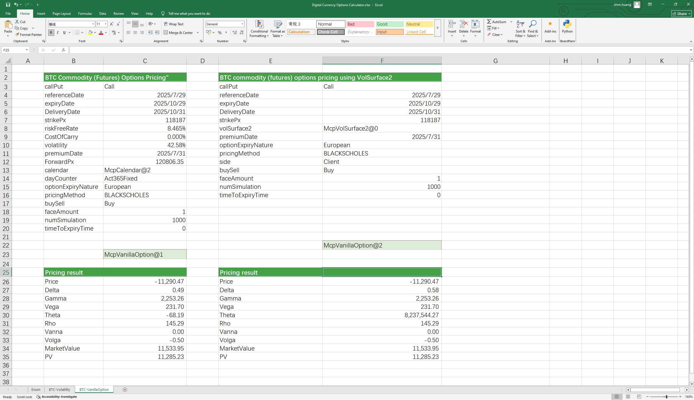

# **数字货币期权定价案例**

> 访问猛犸期权定价系统，支持外汇期权和结构化产品定价估值！

数字货币期权计算器：提供BTC/ETH等主流币种的简单欧式、美式期权、亚式期权、障碍期权、普通组合期权（风险逆转期权组合、蝶式期权组合、跨式期权组合、看涨看跌期权、海鸥期权等）的定价，包括期权费及greeks计算等，采用不同的定价模型如BlackScholes、MonteCarlo等使得定价更精准。
点击下面图片下载模板：

---

---

## **数字货币期权定价模板使用函数说明**

### **1. 节假日构造函数**
- **[McpCalendar](/zh/latest/api/calendar.html#excel-mcpcalendar-code-dates)**：构造一个或多个货币对的节假日对象。

### **2. 无风险利率曲线构造函数**
- **[McpYieldCurve2](/zh/latest/api/yieldcurve.html#excel-mcpyieldcurve2-args1-args2-args3-args4-args5-fmt-vp-hd)**：构造无风险利率曲线对象。

### **3. 远期曲线构造函数**
- **[McpForwardCurve2](/zh/latest/api/forwardratecurve.html#excel-mcpforwardcurve2-args1-args2-args3-args4-args5-fmt-vp-hd)**：构造远期曲线对象。

### **4. 商品期货波动率曲面构造函数**
- **[McpVolSurface2](/zh/latest/api/volsurface.html#excel-mcpvolsurface2-args1-args2-args3-args4-args5-fmt-vp)**：构造商品期货波动率曲面对象。

### **5. 期权对象构造函数**
- **[McpVanillaOption](/zh/latest/api/vanillaoption.html#excel-mcpvanillaoption-args1-args2-args3-args4-args5-fmt)**：构造VanillaOption对象。

### **6. 期权费计算函数**
- **[McpPrice](/zh/latest/api/vanillaoption.html#excel-mcpprice-obj-isamount-true)**：计算期权费。

### **7. Greek值计算函数**
- **[McpDelta](/zh/latest/api/vanillaoption.html#excel-mcpdelta-obj-isccy2-false-isamount-true-pricingmethod-1-isclosedformmethod-true)**：计算期权的Delta值。
- **[McpVega](/zh/latest/api/vanillaoption.html#excel-mcpvega-obj-isccy2-false-isamount-true-pricingmethod-1-isclosedformmethod-true)**：计算期权的Vega值。
- **[McpGamma](/zh/latest/api/vanillaoption.html#excel-mcpgamma-obj-isccy2-false-isamount-true-pricingmethod-1-isclosedformmethod-true)**：计算期权的Gamma值。
- **[McpTheta](/zh/latest/api/vanillaoption.html#excel-mcptheta-obj-isccy2-false-isamount-true-pricingmethod-1-isclosedformmethod-true)**：计算期权的Theta值。
- **[McpVanna](/zh/latest/api/vanillaoption.html#excel-mcpvanna-obj-isccy2-false-isamount-true-pricingmethod-1-isclosedformmethod-true)**：计算期权的Vanna值。
- **[McpVolga](/zh/latest/api/vanillaoption.html#excel-mcpvolga-obj-isccy2-false-isamount-true-pricingmethod-1-isclosedformmethod-true)**：计算期权的Volga值。
- **[McpForwardDelta](/zh/latest/api/vanillaoption.html#excel-mcpforwarddelta-obj-isccy2-false-isamount-true-pricingmethod-1-isclosedformmethod-true)**：计算期权的ForwardDelta值。
- **[McpRho](/zh/latest/api/vanillaoption.html#excel-mcprho-obj-isccy2-false-isamount-true-pricingmethod-1-isclosedformmethod-true)**：计算期权的Rho值。

### **8. 市场价值与现值计算函数**
- **[McpMarketValue](/zh/latest/api/vanillaoption.html#excel-mcpmarketvalue-obj-isamount-true)**：计算期权的MarketValue。
- **[McpPV](/zh/latest/api/vanillaoption.html#excel-mcppv-obj-isamount-true)**：计算期权的PV（现值）。