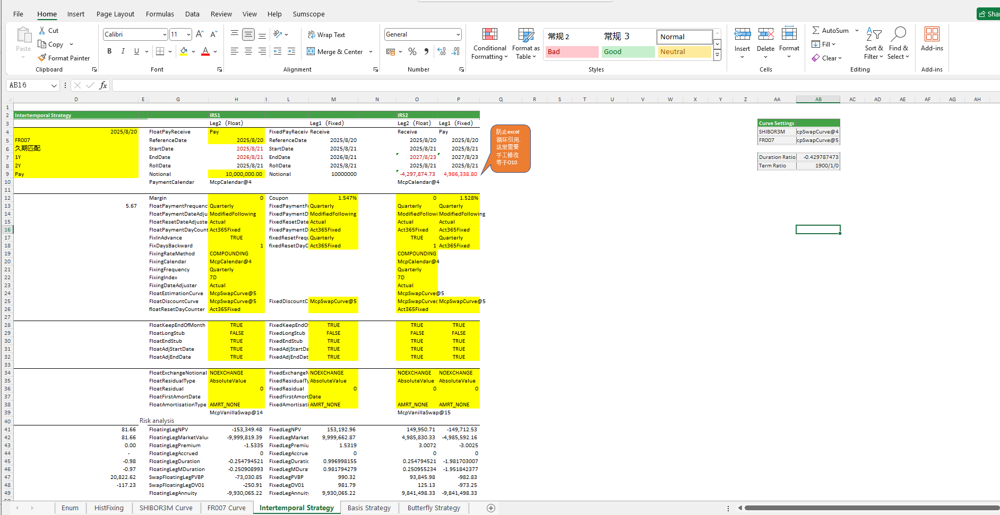

# **互换策略案例**

> 访问猛犸期权定价系统，支持外汇期权和结构化产品定价估值！

互换策略提供FROO7、SHIBOR3M等相关结构的跨期策略、基差策略、碟式策略的现金流分析、风险指标（如NPV、久期、市场价值等）分析及曲线分析等功能
点击下面图片下载模板：

---

---

## **互换策略案例模板使用函数说明**

### **1. 节假日构造函数**
- **[McpCalenders](/zh/latest/api/calendar.html#excel-mcpcalenders-ccy)**：构造一个或多个货币对的节假日对象。

### **2. SwapCurve构造函数**
- **[McpVanillaSwapCurveData](/zh/latest/api/yieldcurve.html#excel-mcpvanillaswapcurvedata-args-data)**：构造Vanilla Swap Curve对象。
- **[McpSwapCurve](/zh/latest/api/yieldcurve.html#excel-mcpswapcurve-args1-args2-args3-args4-args5-fmt-vp)**：构造Swap Curve对象。

### **3. IRS构造函数**
- **[McpVanillaSwap](/zh/latest/api/vanillaswap.html#excel-mcpvanillaswap-args1-args2-args3-args4-args5-fmt-vp)**：构造IRS对象。

### **4. 固定端分析函数**
- **[SwapFixedLegAnnuity](/zh/latest/api/vanillaswap.html#excel-swapfixedlegannuity-vanillaswap)**：计算年金。
- **[SwapFixedLegDuration](/zh/latest/api/vanillaswap.html#excel-swapfixedlegduration-vanillaswap)**：计算久期。
- **[SwapFixedLegMDuration](/zh/latest/api/vanillaswap.html#excel-swapfixedlegmduration-vanillaswap)**：计算修正久期。
- **[SwapFixedLegCumPV](/zh/latest/api/vanillaswap.html#excel-swapfixedlegcumpv-vanillaswap)**：计算累计现值。
- **[SwapFixedLegCumCF](/zh/latest/api/vanillaswap.html#excel-swapfixedlegcumcf-vanillaswap)**：计算累计现金流。
- **[SwapFixedLegNPV](/zh/latest/api/vanillaswap.html#excel-swapfixedlegnpv-vanillaswap)**：计算净现值。
- **[SwapFixedLegDV01](/zh/latest/api/vanillaswap.html#excel-swapfixedlegdv01-vanillaswap)**：计算DV01。
- **[SwapFixedLegPremium](/zh/latest/api/vanillaswap.html#excel-swapfixedlegpremium-vanillaswap)**：计算费率。
- **[SwapFixedLegAccrued](/zh/latest/api/vanillaswap.html#excel-swapfixedlegaccrued-vanillaswap)**：计算应计利息。
- **[SwapFixedLegMarketValue](/zh/latest/api/vanillaswap.html#excel-swapfixedlegmarketvalue-vanillaswap)**：计算市场价值。

### **5. 浮动端分析函数**
- **[SwapFloatingLegAnnuity](/zh/latest/api/vanillaswap.html#excel-swapfloatinglegannuity-vanillaswap)**：计算年金。
- **[SwapFloatingLegDuration](/zh/latest/api/vanillaswap.html#excel-swapfloatinglegduration-vanillaswap)**：计算久期。
- **[SwapFloatingLegMDuration](/zh/latest/api/vanillaswap.html#excel-swapfloatinglegmduration-vanillaswap)**：计算修正久期。
- **[SwapFloatingLegCumPV](/zh/latest/api/vanillaswap.html#excel-swapfloatinglegcumpv-vanillaswap)**：计算累计现值。
- **[SwapFloatingLegCumCF](/zh/latest/api/vanillaswap.html#excel-swapfloatinglegcumcf-vanillaswap)**：计算累计现金流。
- **[SwapFloatingLegNPV](/zh/latest/api/vanillaswap.html#excel-swapfloatinglegnpv-vanillaswap)**：计算净现值。
- **[SwapFloatingLegDV01](/zh/latest/api/vanillaswap.html#excel-swapfloatinglegdv01-vanillaswap)**：计算DV01。
- **[SwapFloatingLegPremium](/zh/latest/api/vanillaswap.html#excel-swapfloatinglegpremium-vanillaswap)**：计算费率。
- **[SwapFloatingLegAccrued](/zh/latest/api/vanillaswap.html#excel-swapfloatinglegaccrued-vanillaswap)**：计算应计利息。
- **[SwapFloatingLegMarketValue](/zh/latest/api/vanillaswap.html#excel-swapfloatinglegmarketvalue-vanillaswap)**：计算市场价值。

### **6. 互换结果函数**
- **[SwapNPV](/zh/latest/api/vanillaswap.html#excel-swapnpv-vanillaswap)**：计算净现值。
- **[SwapMarketParRate](/zh/latest/api/vanillaswap.html#excel-swapmarketparrate-vanillaswap)**：计算Par Rate/Yield。
- **[SwapDuration](/zh/latest/api/vanillaswap.html#excel-swapduration-vanillaswap)**：计算久期。
- **[SwapMDuration](/zh/latest/api/vanillaswap.html#excel-swapmduration-vanillaswap)**：计算修正久期。
- **[SwapPV01](/zh/latest/api/vanillaswap.html#excel-swappv01-vanillaswap)**：计算PVBP。
- **[SwapDV01](/zh/latest/api/vanillaswap.html#excel-swapdv01-vanillaswap)**：计算DV01。
- **[SwapCF](/zh/latest/api/vanillaswap.html#excel-swapcf-vanillaswap)**：计算现金流。
- **[SwapValuationDayCF](/zh/latest/api/vanillaswap.html#excel-swapvaluationdaycf-vanillaswap)**：计算估值日现金流。
- **[SwapMarketValue](/zh/latest/api/vanillaswap.html#excel-swapmarketvalue-vanillaswap)**：计算市场价值。
- **[SwapAccrued](/zh/latest/api/vanillaswap.html#excel-swapaccrued-vanillaswap)**：计算应计利息。
- **[SwapPNL](/zh/latest/api/vanillaswap.html#excel-swappnl-vanillaswap-start-end)**：计算PNL。

