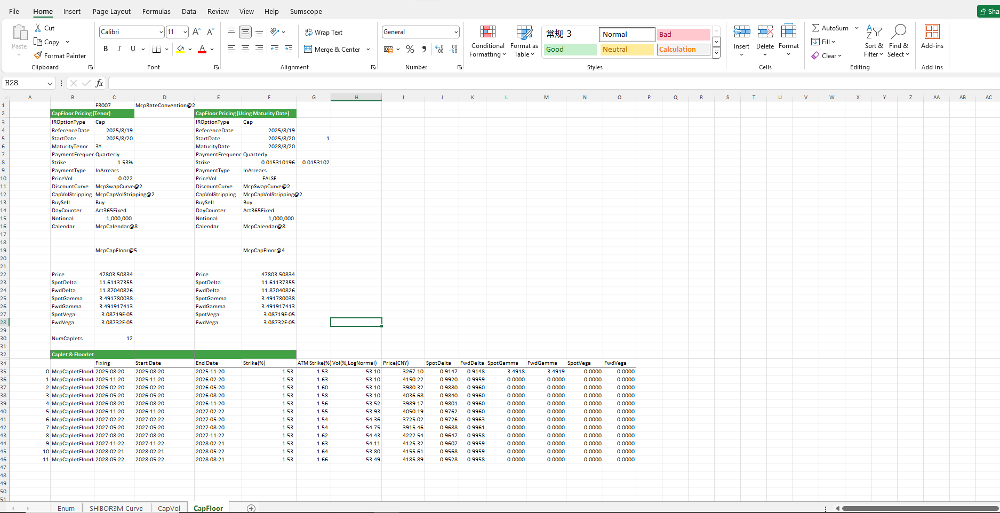

# **利率上限和利率下限期权案例**

> 访问猛犸期权定价系统，支持外汇期权和结构化产品定价估值！

利率期权计算器：提供FROO7、SHIBOR3M等相关结构的利率上限期权、利率下限期权、利率互换期权期权费及greeks计算功能，其中利率上限期权和利率下限期权中提供Caplet & Floorlet的分析及曲线的分析功能。
点击下面图片下载模板：

---

---

## **利率上限和利率下限期权案例模板使用函数说明**

### **1. 节假日构造函数**
- **[McpCalenders](/zh/latest/api/calendar.html#excel-mcpcalenders-ccy)**：构造一个或多个货币对的节假日对象。

### **2. SwapCurve构造函数**
- **[McpVanillaSwapCurveData](/zh/latest/api/yieldcurve.html#excel-mcpvanillaswapcurvedata-args-data)**：构造Vanilla Swap Curve对象。
- **[McpSwapCurve](/zh/latest/api/yieldcurve.html#excel-mcpswapcurve-args1-args2-args3-args4-args5-fmt-vp)**：构造Swap Curve对象。

### **3. 相关的构造函数**
- **[McpCapVolStripping](/zh/latest/api/Interestrateoption.html#excel-mcpcapvolstripping-marketquotes-args)**：构造CapVol对象。
- **[McpRateConvention](/zh/latest/api/vanillaswap.html#excel-mcprateconvention-conventionname)**：获取结构相关的参数。
- **[McpCapFloor](/zh/latest/api/Interestrateoption.html#excel-mcpcapfloor-args1-args2-args3-args4-args5-fmt-vp)**：构造CapFloor对象。
- **[CvsATMRate](/zh/latest/api/Interestrateoption.html#excel-cvsatmrate-cvs-expirydate)**：计算ATMRate。
- **[CvsYieldVolAtTandK](/zh/latest/api/Interestrateoption.html#excel-cvsyieldvolattandk-cvs-capletexpiry-strike)**：计算Vol。

### **4. 计算相关的函数**
- **[CapFloorPrice](/zh/latest/api/Interestrateoption.html#excel-capfloorprice-obj)**：计算Price。
- **[CapFloorSpotDelta](/zh/latest/api/Interestrateoption.html#excel-capfloorspotdelta-obj)**：计算SpotDelta。
- **[CapFloorFwdDelta](/zh/latest/api/Interestrateoption.html#excel-capfloorfwddelta-obj)**：计算FwdDelta。
- **[CapFloorSpotGamma](/zh/latest/api/Interestrateoption.html#excel-capfloorspotgamma-obj)**：计算SpotGamma。
- **[CapFloorFwdGamma](/zh/latest/api/Interestrateoption.html#excel-capfloorfwdgamma-obj)**：计算FwdGamma。
- **[CapFloorSpotVega](/zh/latest/api/Interestrateoption.html#excel-capfloorspotvega-obj)**：计算SpotVega。
- **[CapFloorFwdVega](/zh/latest/api/Interestrateoption.html#excel-capfloorfwdvega-obj)**：计算FwdVega。
- **[CapFloorGetCaplet](/zh/latest/api/Interestrateoption.html#excel-capfloorgetcaplet-obj-idx)**：从一个完整的利率上限（Cap）或利率下限（Floor）合约中，提取出其中某一个特定的Caplet（或Floorlet）的定价信息或相关参数。
- **[CapfloorletFixingDate](/zh/latest/api/Interestrateoption.html#excel-capfloorletfixingdate-obj)**：获取定息日。
- **[CapfloorletCalcStartDate](/zh/latest/api/Interestrateoption.html#excel-capfloorletcalcstartdate-obj)**：获取开始日期。
- **[CapfloorletCalcEndDate](/zh/latest/api/Interestrateoption.html#excel-capfloorletcalcenddate-obj)**：获取结束日期。
- **[CapfloorletPrice](/zh/latest/api/Interestrateoption.html#excel-capfloorletprice-obj)**：计算Price。
- **[CapFloorletSpotDelta](/zh/latest/api/Interestrateoption.html#excel-capfloorletspotdelta-obj)**：计算SpotDelta。
- **[CapFloorletFwdDelta](/zh/latest/api/Interestrateoption.html#excel-capfloorletfwddelta-obj)**：计算FwdDelta。
- **[CapFloorletSpotGamma](/zh/latest/api/Interestrateoption.html#excel-capfloorletspotgamma-obj)**：计算SpotGamma。
- **[CapFloorletFwdGamma](/zh/latest/api/Interestrateoption.html#excel-capfloorletfwdgamma-obj)**：计算FwdGamma。
- **[CapFloorletSpotVega](/zh/latest/api/Interestrateoption.html#excel-capfloorletspotvega-obj)**：计算SpotVega。
- **[CapFloorletFwdVega](/zh/latest/api/Interestrateoption.html#excel-capfloorletfwdvega-obj)**：计算FwdVega。

