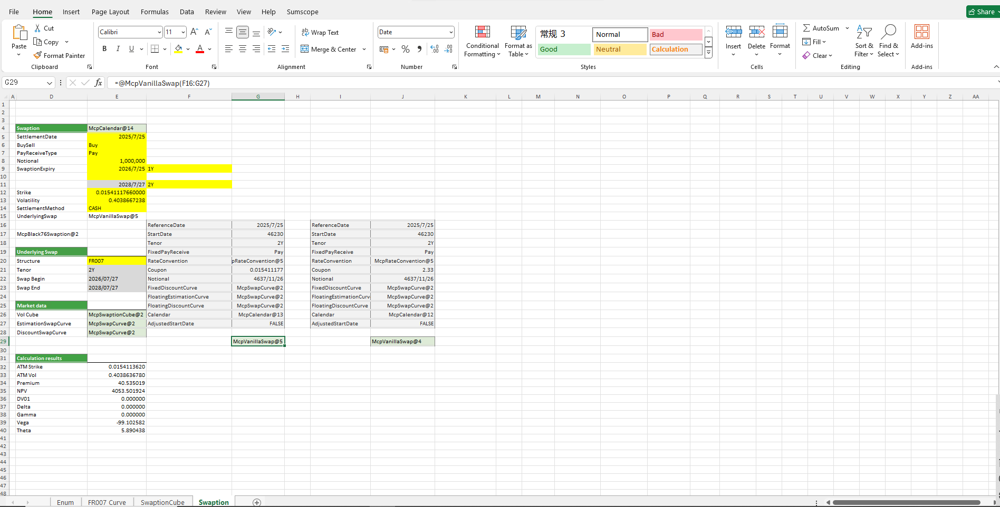

# **利率互换期权案例**

> 访问猛犸期权定价系统，支持外汇期权和结构化产品定价估值！

利率期权计算器：提供FROO7、SHIBOR3M等相关结构的利率上限期权、利率下限期权、利率互换期权期权费及greeks计算功能，其中利率上限期权和利率下限期权中提供Caplet & Floorlet的分析及曲线的分析功能。
点击下面图片下载模板：

---

---

## **利率互换期权案例模板使用函数说明**

### **1. 节假日构造函数**
- **[McpCalenders](/zh/latest/api/calendar.html#excel-mcpcalenders-ccy)**：构造一个或多个货币对的节假日对象。

### **2. SwapCurve构造函数**
- **[McpVanillaSwapCurveData](/zh/latest/api/yieldcurve.html#excel-mcpvanillaswapcurvedata-args-data)**：构造Vanilla Swap Curve对象。
- **[McpSwapCurve](/zh/latest/api/yieldcurve.html#excel-mcpswapcurve-args1-args2-args3-args4-args5-fmt-vp)**：构造Swap Curve对象。

### **3. IRS构造函数**
- **[McpVanillaSwap](/zh/latest/api/vanillaswap.html#excel-mcpvanillaswap-args1-args2-args3-args4-args5-fmt-vp)**：构造IRS对象。

### **4. 相关的构造函数**
- **[McpSwaptionCube1](/zh/latest/api/Interestrateoption.html#excel-mcpswaptioncube1-strikeorspreads-atmvols-args)**：构造SwaptionCube1对象。
- **[McpSwaption](/zh/latest/api/Interestrateoption.html#excel-mcpswaption-args1-args2-args3-args4-args5-fmt-vp)**：构造Swaption对象。

### **5. 计算相关的函数**
- **[McpGetStartDate](/zh/latest/api/vanillaswap.html#excel-mcpgetstartdate-obj)**：获取利率互换的开始日期。
- **[McpGetEndDate](/zh/latest/api/vanillaswap.html#excel-mcpgetenddate-obj)**：获取利率互换的结束日期。
- **[ScAtmStrike](/zh/latest/api/Interestrateoption.html#excel-scatmstrike-sc-expirydate-maturity)**：计算AtmStrike。
- **[ScAtmVol](/zh/latest/api/Interestrateoption.html#excel-scatmvol-sc-expirydate-maturity)**：计算ATM Vol。
- **[SwaptionPrice1](/zh/latest/api/Interestrateoption.html#excel-swaptionprice1-obj)**：计算Price。
- **[SwaptionNPV](/zh/latest/api/Interestrateoption.html#excel-swaptionnpv-obj)**：计算NPV。
- **[SwaptionDV01](/zh/latest/api/Interestrateoption.html#excel-swaptiondv01-obj)**：计算DV01。
- **[SwaptionDelta](/zh/latest/api/Interestrateoption.html#excel-swaptiondelta-obj)**：计算Delta。
- **[SwaptionGamma](/zh/latest/api/Interestrateoption.html#excel-swaptiongamma-obj)**：计算Gamma。
- **[SwaptionVega](/zh/latest/api/Interestrateoption.html#excel-swaptionvega-obj)**：计算Vega。
- **[SwaptionTheta](/zh/latest/api/Interestrateoption.html#excel-swaptiontheta-obj)**：计算Theta。

