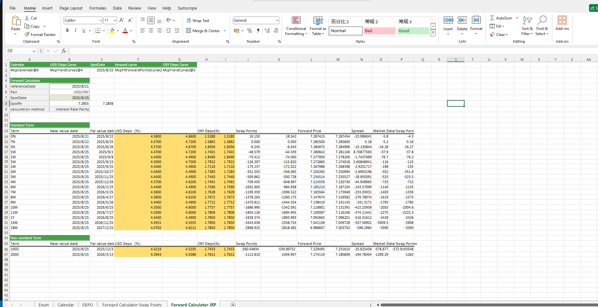

# **外汇利率平价计算器案例**

> 访问猛犸期权定价系统，支持外汇期权和结构化产品定价估值！

提供掉期点和利率平价两种不同的方式批量计算标准期限和非标准期限的掉期点、远期价格的功能及择期期限内分别计算出最差的bid、ask价格及对应的日期
点击下面图片下载模板：

---

---

## **汇利率平价计算器案例模板使用函数说明**

### **1. 节假日构造函数**
   - **[McpCalendar](/zh/latest/api/calendar.html#excel-mcpcalendar-code-dates)**：构造一个或多个货币对的节假日对象。
   - **[McpNCalendar](/zh/latest/api/calendar.html#excel-mcpncalendar-ccys-holidays)**：构造多个货币的节假日对象。

### **3. 利率曲线和远期曲线构造函数**
   - **[McpYieldCurve2](/zh/latest/api/yieldcurve.html#excel-mcpyieldcurve2-args1-args2-args3-args4-args5-fmt-vp-hd)**：构造双边YieldCurve对象。
   - **[McpFXForwardPointsCurve2](/zh/latest/api/fxforwardratecurve.html#excel-mcpfxforwardpointscurve2-args1-args2-args3-args4-args5-fmt-vp)**：构造双边远期曲线对象。

### **4. 计算相关的函数**
   - **[YieldCurve2ZeroRate](/zh/latest/api/yieldcurve.html#excel-yieldcurve2zerorate-curve-date-bidmidask)**：在双边YieldCurve曲线上取指定到期日的利率。
   - **[Fxfpc2FXForwardPoints](/zh/latest/api/fxforwardratecurve.html#excel-fxfpc2fxforwardpoints-curve-date-bidmidask)**：从双边远期曲线对象上取掉期点。
   - **[Fxfpc2FXForwardOutright](/zh/latest/api/fxforwardratecurve.html#excel-fxfpc2fxforwardoutright-curve-date-bidmidask)**：从双边远期曲线对象上取掉远期价格。
   - **[Fxfpc2TOForwardOutright](/zh/latest/api/fxforwardratecurve.html#excel-fxfpc2toforwardoutright-curve-startdate-enddate-findmax-bidmidask)**：计算择期内最差的价格。
   - **[Fxfpc2TimeOptionDate](/zh/latest/api/fxforwardratecurve.html#excel-fxfpc2timeoptiondate-curve-startdate-enddate-findmax-bidmidask)**：计算择期内最差价格对应的日期。
   - **[ImpliedFwdPoints](/zh/latest/api/fxforwardratecurve.html#excel-impliedfwdpoints-pair-baserate-termrate-spot-spotdate-deliverydate)**：通过利率计算掉期点。
   - **[ImpliedForward](/zh/latest/api/fxforwardratecurve.html#excel-impliedforward-pair-baserate-termrate-spot-spotdate-deliverydate)**：通过利率计算远期价格。
 
 
