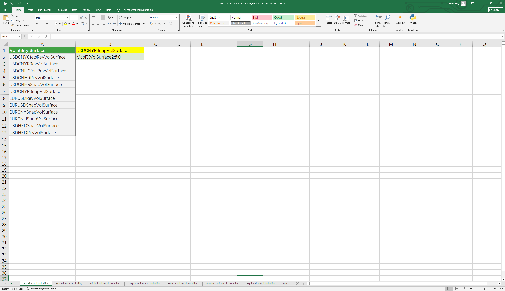

# **服务器端波动率构造相关的函数案例**

> 访问猛犸期权定价系统，支持外汇期权和结构化产品定价估值！

服务器端提供外汇、期货、指数、数字期权、利率波动率、CapFloor波动率等相关波动率的构造函数。
点击下面图片下载模板：

---

---

## **服务器端通过远期曲线简称和波动率曲面简称构造对象及应用使用函数说明**

### **1. 服务器端外汇波动率构造函数**
   - **[McpFXVolSurface2ByName](/zh/latest/api/Serverside.html#excel-mcpfxvolsurface2byname-identifiers)**：服务器端通过波动率曲面简称构造双边波动率。
   - **[McpFXVolSurfaceByName](/zh/latest/api/Serverside.html#excel-mcpfxvolsurfacebyname-identifiers)**：服务器端通过波动率曲面简称构造单边波动率。

### **2. 服务器端期货、数字货币波动率构造函数**
   - **[McpVolSurface2ByName](/zh/latest/api/Serverside.html#excel-mcpvolsurface2byname-identifiers-flag-false)**：服务器端通过UNDERLYING构造双边波动率。
   - **[McpVolSurfaceByName](/zh/latest/api/Serverside.html#excel-mcpvolsurface2byname-identifiers-flag-false)**：服务器端通过UNDERLYING构造单边波动率。

### **3. 服务器端商品指数类波动率曲面构造函数**
   - **[McpVolSurface2Equity](/zh/latest/api/Serverside.html#excel-mcpvolsurface2equity-identifiers)**：服务器端通过UNDERLYING构造双边波动率。

### **4. 服务器端利率波动率和CapFloor波动率构造函数**
   - **[McpSwaptionCubes](/zh/latest/api/Serverside.html#excel-mcpswaptioncubes-identifiers)**：服务器端通过波动率简称构造利率波动率。
   - **[McpCapVolSurface](/zh/latest/api/Serverside.html#excel-mcpcapvolsurface-identifiers)**：服务器端通过波动率简称构造CapFloor波动率。
  
